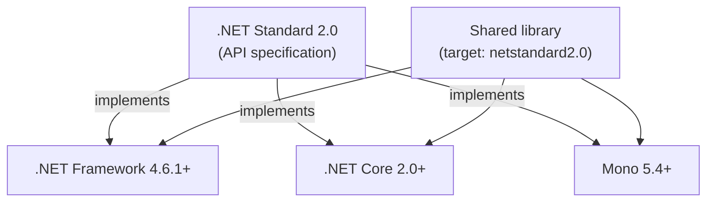

# 01. .NET Platform & Evolution

## Table of Contents

1. [What .NET Is](#1-what-net-is)
2. [.NET Framework, .NET Core, and Unified .NET](#2-net-framework-net-core-and-unified-net)
3. [Evolution Timeline](#3-evolution-timeline)
4. [.NET Standard](#4-net-standard)
5. [Application Frameworks on .NET Framework](#5-application-frameworks-on-net-framework)
6. [Application Frameworks on Modern .NET](#6-application-frameworks-on-modern-net)
7. [Modular Architecture](#7-modular-architecture)

---

## 1. What .NET Is

.NET is a free, open-source, cross-platform developer platform. Think of it as four layers working together to turn your source code into running software on Windows, Linux, macOS, and mobile:

| Layer | What it does |
|---|---|
| **Runtime** | Executes your compiled code — handles memory, threads, type safety |
| **Base Class Library (BCL)** | Everything you need out of the box: strings, collections, I/O, networking, JSON, threading |
| **SDK and toolchain** | Compilers, MSBuild, and the `dotnet` CLI |
| **Application frameworks** | Domain-specific stacks — ASP.NET Core, WPF, MAUI, etc. |

All .NET languages (C#, F#, VB.NET) compile to the same intermediate format, so libraries and types work across languages without any translation layer.

---

## 2. .NET Framework, .NET Core, and Unified .NET

Three names, three eras of the same product family. You need to know these differences when you're maintaining legacy apps or picking a target for new work.

### .NET Framework

The original, Windows-only runtime from 2002. It installs machine-wide, ties deeply into Win32, COM, and IIS, and ships as one big monolithic library.

| Aspect | .NET Framework |
|---|---|
| **Platform** | Windows only |
| **Deployment** | Machine-wide install; Global Assembly Cache (GAC) for shared libraries |
| **Status** | Maintenance mode — security fixes only, no new features |
| **Typical use today** | Long-lived enterprise apps, Web Forms, WCF services, WinForms/WPF on Windows |

You can't run Framework apps in Linux containers — the runtime needs the Windows kernel.

### .NET Core

A ground-up rewrite (2016–2019) designed for cross-platform deployment, modular packages, and containers. It rebuilt the base library (CoreFX) for portability and removed all the Windows-only dependencies from the core runtime.

| Aspect | .NET Core |
|---|---|
| **Platform** | Windows, Linux, macOS |
| **Deployment** | Framework-dependent or self-contained; per-app runtime versions |
| **Status** | Superseded by unified .NET starting with .NET 5 |
| **Typical use today** | Legacy Core 2.x/3.x codebases awaiting migration |

.NET Core introduced Kestrel (the cross-platform web server), the middleware pipeline, and the `dotnet` CLI.

### Unified .NET (.NET 5 and later)

Starting with **.NET 5** (2020), Microsoft merged .NET Core into a single product simply called **.NET** — dropping the "Core" suffix. Version numbers skipped 4.x deliberately to avoid confusion with .NET Framework 4.x.

| Aspect | Unified .NET (.NET 5+) |
|---|---|
| **Platform** | Windows, Linux, macOS; mobile via MAUI |
| **Release cadence** | Annual releases in November; even-numbered are Long-Term Support (LTS) |
| **Status** | Active — all new projects should target a current LTS release |
| **Typical use today** | Web APIs, cloud services, cross-platform tools, modern desktop and mobile |

### Side-by-Side Comparison

| Dimension | .NET Framework | .NET Core | Unified .NET |
|---|---|---|---|
| Cross-platform | No | Yes | Yes |
| Open source | Partial (reference source) | Yes | Yes |
| Docker / Linux containers | No | Yes | Yes |
| Side-by-side runtime versions | Limited | Yes | Yes |
| CLI-first workflow | No | Yes | Yes |
| Web stack | System.Web + IIS | Kestrel + middleware | Kestrel + middleware |
| Native AOT | No | No (until late Core) | Yes (.NET 7+) |
| New feature development | Stopped | Stopped (after 3.1) | Ongoing |

---

## 3. Evolution Timeline

```
2002  .NET Framework 1.0 — CLR, BCL, C#, ASP.NET, WinForms (Windows-only)
2005  .NET Framework 2.0 — Generics at IL level
2006  .NET Framework 3.0 — WPF, WCF, Windows Workflow Foundation (WF)
2007  .NET Framework 3.5 — LINQ, lambdas, extension methods
2014  .NET Core announced — cross-platform rewrite begins
2016  .NET Core 1.0 — Linux and macOS support, modular NuGet packages
2017  .NET Core 2.0 — .NET Standard 2.0 bridges Framework and Core libraries
2019  .NET Core 3.1 LTS — WPF and WinForms on Core; last "Core" branding
2020  .NET 5 — Framework and Core unified; skips 4 to avoid Framework 4.x confusion
2021  .NET 6 LTS — MAUI preview, minimal APIs, hot reload
2022  .NET 7 — Native AOT expansion (STS)
2023  .NET 8 LTS — AOT improvements, Blazor updates
2024+ .NET 9 (STS), .NET 10 (LTS) — continued annual cadence
```

### The Three Turning Points Worth Remembering

**.NET Framework** established managed code on Windows but became hard to evolve independently — its monolithic install, GAC, and `System.Web` coupling made container-native and microservice deployments impossible.

**.NET Core** proved a portable, open runtime could match or beat Framework performance (especially ASP.NET Core on Kestrel) while supporting Linux containers.

**.NET 5+** is the single forward path. Even-numbered releases are LTS (3-year support); odd-numbered releases are Standard Term Support (STS, 18 months) for teams that want the latest features faster.

---

## 4. .NET Standard

**.NET Standard is not a runtime** — it's a **versioned API specification**. Think of it as a contract: any runtime that implements .NET Standard 2.0 is guaranteed to expose a specific set of APIs.

### Why It Was Needed

Between 2016 and 2020, teams often had .NET Framework apps and new .NET Core services side by side. The two runtimes had similar but not identical base libraries, which caused compatibility headaches. A library compiled for .NET Framework 4.6 might fail to load from a Core project.

.NET Standard solved this: target `netstandard2.0` once, and your library runs on any conforming runtime — .NET Framework 4.6.1+, .NET Core 2.0+, and Mono.



### Version Quick Reference

| .NET Standard | Who implements it |
|---|---|
| 1.x | Early Core and Framework 4.5+ subsets |
| **2.0** | .NET Framework 4.6.1+, .NET Core 2.0+ — the sweet spot for migration libraries |
| 2.1 | .NET Core 3.0+, unified .NET 5+ — **not** implemented by .NET Framework 4.8 |

**When to use it today:** Only target .NET Standard if your library must support .NET Framework 4.x alongside modern .NET. Otherwise, just target `net8.0` or `net10.0` directly — you get the full modern API surface without the indirection.

After .NET 5 unified everything, .NET Standard is a legacy bridge, not the primary way to target new libraries.

---

## 5. Application Frameworks on .NET Framework

These frameworks shipped as part of the monolithic .NET Framework install. They're still maintained for compatibility but get no major new features.

| Framework | Purpose | Status |
|---|---|---|
| **ASP.NET Web Forms** | Server-rendered web UI with postback model | No path to modern .NET |
| **ASP.NET MVC** | MVC web apps on Framework | Replaced by ASP.NET Core MVC |
| **ASP.NET Web API** | REST HTTP services on Framework | Superseded by ASP.NET Core Web API |
| **WCF** | SOAP and binary RPC services | Full server stack on Framework only |
| **WPF** | XAML-based rich desktop UI | Also available on modern .NET (Windows only) |
| **WinForms** | Event-driven desktop UI | Also available on modern .NET (Windows only) |
| **Windows Workflow Foundation** | Visual workflow engine | Framework-only |
| **Entity Framework (classic)** | ORM for .NET Framework | Successor is EF Core |

### Why These Couldn't Simply Be "Ported"

Framework-era web apps depended on **System.Web** — a single assembly tightly wired to IIS and Windows. HTTP modules, session state, and the Web Forms pipeline all lived in one monolith. You couldn't unit-test HTTP code easily, and you definitely couldn't run it outside Windows IIS.

That's why cross-platform required new stacks (Kestrel, ASP.NET Core) rather than patching System.Web.

---

## 6. Application Frameworks on Modern .NET

Modern .NET ships the runtime and BCL as a shared foundation; application stacks come in as NuGet packages or SDK workloads on top.

| Framework | Purpose | Platform |
|---|---|---|
| **ASP.NET Core** | Web APIs, MVC, Razor Pages, minimal APIs, gRPC | Cross-platform |
| **Blazor** | Component-based web UI (Server, WebAssembly, Hybrid) | Browser and native hosts |
| **Worker Services** | Long-running background processes | Cross-platform, container-friendly |
| **.NET MAUI** | Cross-platform mobile and desktop UI | Windows, macOS, iOS, Android |
| **WPF** | Rich Windows desktop (XAML) | Windows only |
| **WinForms** | Traditional Windows desktop | Windows only |
| **Console apps** | CLI tools and scripts | Cross-platform |

### What Modern Stacks Changed

**ASP.NET Core** replaced System.Web with Kestrel and a composable **middleware pipeline**. Each middleware inspects or modifies `HttpContext`, calls the next component, or short-circuits. Authentication, routing, and static files are now independent, testable packages.

**Blazor** brings a component model to the browser (WebAssembly) or server (via SignalR), enabling full-stack C# for many web scenarios.

**Worker Services** use the same generic host infrastructure as ASP.NET Core (`IHost`, DI, logging, configuration) — just without HTTP.

**.NET MAUI** succeeded Xamarin.Forms for new cross-platform UI, mapping abstractions to native controls per platform.

---

## 7. Modular Architecture

### Why Modularity Matters

.NET Core and unified .NET were deliberately designed around **modularity** — your app should reference only what it needs, version things independently, and deploy without a machine-wide monolithic install.

| Goal | Practical benefit |
|---|---|
| **Smaller deployments** | A Web API only needs ASP.NET Core and JSON — not WPF |
| **Independent versioning** | Update a package without waiting for a full framework service pack |
| **Side-by-side runtimes** | Two services on one server can safely use different .NET versions |
| **Container fit** | Lean images for cloud and Kubernetes |
| **Open contribution** | Runtime and libraries evolve on GitHub (`dotnet/runtime`, `dotnet/aspnetcore`) |

### How It Works in Practice

Everything beyond the shared runtime and BCL ships as **NuGet packages** — versioned archives with assemblies, dependencies, and optional MSBuild integration. Your project file declares what it needs; restore resolves the dependency graph.

**Framework-dependent deployment** — app DLLs only; shared runtime already installed on the machine (smaller output).
**Self-contained deployment** — bundles the runtime with your app (larger, but no separate install needed).

### Monolith vs. Modular at a Glance

```
.NET Framework era:
  One large Windows install → GAC → shared System.Web, WCF, WPF assemblies
  Your app pulls in the entire surface whether you use it or not

Modern .NET era:
  Shared runtime + BCL (machine or bundled)
  + explicit NuGet references per application
  + optional app framework packages (ASP.NET Core, MAUI, etc.)
```

When migrating from Framework, the typical approach is: extract domain logic into portable class libraries (often targeting .NET Standard 2.0 during transition), stand up new ASP.NET Core hosts, and retire System.Web-dependent code incrementally rather than a big-bang rewrite.

---

**Previous →** [README — Module overview](./README.md)

**Next →** [02. CLI, Architecture, and Components](./02.%20CLI%2C%20Architecture%2C%20and%20Components.md)
