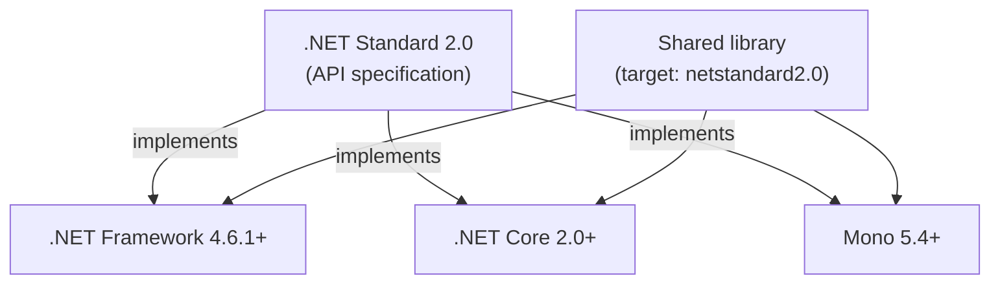

# 01. .NET Platform & Evolution

## Table of Contents

1. [What .NET Is](#1-what-net-is)
2. [.NET Framework, .NET Core, and Unified .NET](#2-net-framework-net-core-and-unified-net)
3. [Evolution Timeline](#3-evolution-timeline)
4. [.NET Standard](#4-net-standard)
5. [Application Frameworks on .NET Framework](#5-application-frameworks-on-net-framework)
6. [Application Frameworks on Modern .NET](#6-application-frameworks-on-modern-net)
7. [Modular Architecture](#7-modular-architecture)

---

## 1. What .NET Is

.NET is a free, open-source, cross-platform developer platform. It is not a single product: it combines a managed runtime, a standard library, build tooling, and optional application frameworks that together turn source code into running software on Windows, Linux, macOS, and mobile targets.

At runtime, all .NET languages compile to the same intermediate format, so libraries and types can be shared across languages without a translation layer. The platform handles memory through automatic garbage collection, enforces type safety, and provides structured exception handling consistently regardless of which language produced the code.

Four layers describe the platform at a high level:

| Layer | Role |
|---|---|
| **Runtime** | Executes compiled assemblies — memory, threads, type system, security boundaries |
| **Base Class Library (BCL)** | Universal types for strings, collections, I/O, networking, JSON, threading, and reflection |
| **SDK and toolchain** | Compilers, MSBuild, and the `dotnet` command-line interface |
| **Application frameworks** | Domain-specific stacks such as ASP.NET Core, WPF, and MAUI |

Detailed treatment of runtime mechanics, IL, and type-system rules appears in later chapters; this chapter establishes *which* .NET platforms exist, *how* they evolved, and *what* you build on each.

---

## 2. .NET Framework, .NET Core, and Unified .NET

Three names represent three eras of the same product family. Understanding their differences is essential when maintaining legacy systems or choosing a target for new work.

### .NET Framework

**.NET Framework** is the original Windows-centric runtime, first shipped in 2002. It installs as part of or alongside Windows, couples deeply to Win32, COM, and IIS, and ships a large monolithic class library that includes web, desktop, and communication stacks in fixed versions tied to the framework release.

Key characteristics:

| Aspect | .NET Framework |
|---|---|
| **Platform** | Windows only |
| **Deployment** | Machine-wide install; Global Assembly Cache (GAC) for shared libraries |
| **Status** | Maintenance mode — security and reliability fixes only; no new features |
| **Typical use today** | Long-lived enterprise apps, Web Forms, WCF services, WinForms/WPF on Windows |

Framework applications cannot run in Linux containers because the runtime requires the Windows kernel and Windows-specific subsystems.

### .NET Core

**.NET Core** (2016–2019) was a ground-up rewrite designed for cross-platform deployment, modular packages, side-by-side runtime versions, and container-first workflows. It removed Windows-only dependencies from the core runtime and rebuilt the base library (CoreFX) for portability.

Key characteristics:

| Aspect | .NET Core |
|---|---|
| **Platform** | Windows, Linux, macOS |
| **Deployment** | Framework-dependent or self-contained; runtime version per application |
| **Status** | Superseded by unified .NET starting with .NET 5 |
| **Typical use today** | Legacy Core 2.x/3.x codebases awaiting migration to .NET 6+ |

.NET Core introduced Kestrel (cross-platform web server), the middleware pipeline, and the `dotnet` CLI as the primary developer entry point.

### Unified .NET (.NET 5 and later)

Starting with **.NET 5** (2020), Microsoft merged the .NET Core codebase and roadmap into a single product simply called **.NET**. The "Core" suffix was dropped. Version numbers skipped 4.x to avoid confusion with .NET Framework 4.x.

Key characteristics:

| Aspect | Unified .NET (.NET 5+) |
|---|---|
| **Platform** | Windows, Linux, macOS; mobile via MAUI |
| **Release cadence** | Annual releases in November; even-numbered releases are Long-Term Support (LTS) |
| **Status** | Active development — all new projects should target a current LTS or supported release |
| **Typical use today** | Web APIs, cloud services, cross-platform tools, modern desktop and mobile |

### Side-by-Side Comparison

| Dimension | .NET Framework | .NET Core | Unified .NET |
|---|---|---|---|
| Cross-platform | No | Yes | Yes |
| Open source | Partial (reference source) | Yes | Yes |
| Docker / Linux containers | No | Yes | Yes |
| Side-by-side runtime versions | Limited | Yes | Yes |
| CLI-first workflow | No (Visual Studio / MSBuild centric) | Yes | Yes |
| Web stack | System.Web + IIS | Kestrel + middleware | Kestrel + middleware |
| Native AOT | No (NGEN only) | No (until late Core) | Yes (.NET 7+) |
| New feature development | Stopped | Stopped (after 3.1) | Ongoing |

Mono remains a separate community runtime used historically by Unity and Xamarin; modern mobile and cross-platform UI converge on unified .NET via MAUI.

---

## 3. Evolution Timeline

The platform evolved in response to cloud deployment, open-source expectations, and the need to escape Windows-only coupling.

```
2002  .NET Framework 1.0 — CLR, BCL, C#, ASP.NET, WinForms (Windows-only)
2005  .NET Framework 2.0 — Generics at IL level (reified, not erased)
2006  .NET Framework 3.0 — WPF, WCF, Windows Workflow Foundation (WF)
2007  .NET Framework 3.5 — LINQ, lambda expressions, extension methods
2014  .NET Core project announced — cross-platform rewrite begins
2016  .NET Core 1.0 — Linux and macOS support, modular NuGet packages
2017  .NET Core 2.0 — .NET Standard 2.0 bridges Framework and Core libraries
2019  .NET Core 3.1 LTS — WPF and WinForms on Core; last "Core" branding
2020  .NET 5 — Framework and Core unified; version skips 4 to avoid Framework 4.x confusion
2021  .NET 6 LTS — MAUI preview, minimal APIs, hot reload
2022  .NET 7 — Native AOT expansion, performance-focused release (STS)
2023  .NET 8 LTS — AOT improvements, Blazor updates, three-year support window
2024+ .NET 9 (STS), .NET 10 (LTS) — continued annual cadence
```

### Turning Points

**.NET Framework (2002–present)** established managed code on Windows but became difficult to evolve independently of the operating system. Its monolithic install, GAC, and System.Web coupling blocked container-native and microservice-style deployment.

**.NET Core (2016–2019)** proved that a portable, open runtime could match or exceed Framework performance — especially ASP.NET Core on Kestrel — while supporting Linux containers and side-by-side versions.

**.NET 5+ (2020–present)** is the single forward path. Both "Framework" and "Core" names are retired for new work. Even-numbered releases receive extended support; odd-numbered releases are shorter-term Standard Term Support (STS) releases for teams that want the latest features sooner.

---

## 4. .NET Standard

**.NET Standard** is not a runtime and not a NuGet library you install. It is a **versioned specification** — a contract listing which APIs any conforming implementation must provide.

### Why It Was Introduced

Between 2016 and 2020, many teams maintained applications on **.NET Framework** while building new services on **.NET Core**. The two runtimes exposed similar but not identical base libraries (`mscorlib` versus `System.Runtime` identity mismatches were common). A class library compiled for Framework 4.6 might fail to load or behave incorrectly when referenced from a Core project.

.NET Standard solved this by defining a portable API surface. A library targeting `netstandard2.0` ships once and runs on any runtime that implements that standard version — including .NET Framework 4.6.1+, .NET Core 2.0+, and Mono.



### Version Highlights

| .NET Standard | Implemented by (examples) |
|---|---|
| 1.x | Early Core and Framework 4.5+ subsets |
| **2.0** | .NET Framework 4.6.1+, .NET Core 2.0+ — the practical migration sweet spot |
| 2.1 | .NET Core 3.0+, unified .NET 5+ — **not** implemented by .NET Framework 4.8 |

.NET Standard 2.0 remains relevant when a library must support .NET Framework 4.x **and** modern .NET. If Framework support is not required, target a modern TFM such as `net8.0` or `net10.0` directly — you gain the full contemporary API surface without the indirection of the standard contract.

After .NET 5 unified the runtimes, .NET Standard became less central: there is no longer a fragmented "Core versus Framework" runtime landscape for new libraries. It persists as a **bridge for legacy consumption**, not as the primary targeting model for greenfield development.

---

## 5. Application Frameworks on .NET Framework

.NET Framework shipped application stacks as part of its monolithic installation. These frameworks are still maintained for compatibility but receive no major new capabilities.

| Framework | Purpose | Notes |
|---|---|---|
| **ASP.NET Web Forms** | Server-rendered web UI with postback model | Page lifecycle, ViewState; no path to modern .NET |
| **ASP.NET MVC** | Model–view–controller web apps on Framework | Replaced by ASP.NET Core MVC for new work |
| **ASP.NET Web API** | REST-style HTTP services on Framework | Superseded by ASP.NET Core Web API |
| **WCF (Windows Communication Foundation)** | SOAP and binary RPC services | Full server stack on Framework; limited on modern .NET |
| **WPF (Windows Presentation Foundation)** | XAML-based rich desktop UI | Available on modern .NET for Windows only |
| **WinForms** | Event-driven desktop UI with designer support | Available on modern .NET for Windows only |
| **Windows Workflow Foundation (WF)** | Visual workflow engine | Framework-only for new development |
| **Entity Framework (classic)** | ORM for .NET Framework | Successor is Entity Framework Core |

### Architectural Coupling

Framework-era web applications depended on **System.Web** — a single assembly tightly integrated with IIS and the ISAPI extension model. HTTP modules, session state, and the Web Forms pipeline lived in one monolith, which made unit testing HTTP code difficult and prevented running the stack outside Windows IIS.

Desktop frameworks (WPF, WinForms) call into GDI+, the Win32 message loop, and DirectX. Communication frameworks (WCF) exposed bindings such as NetTcpBinding and NetNamedPipeBinding that rely on Windows kernel transports.

These coupling points are why cross-platform rewrite required new stacks (Kestrel, ASP.NET Core, CoreWCF community port) rather than incremental patches to System.Web.

---

## 6. Application Frameworks on Modern .NET

Unified .NET ships core runtime and BCL as shared frameworks; application stacks are layered on top as NuGet packages or optional SDK workloads.

| Framework | Purpose | Platform scope |
|---|---|---|
| **ASP.NET Core** | Web APIs, MVC, Razor Pages, minimal APIs, gRPC | Cross-platform; Kestrel built in |
| **Blazor** | Component-based web UI (Server, WebAssembly, Hybrid) | Browser and native hosts |
| **Worker Services** | Long-running background processes with generic host | Cross-platform; container-friendly |
| **.NET MAUI** | Cross-platform mobile and desktop UI | Windows, macOS, iOS, Android |
| **WPF** | Rich Windows desktop (XAML) | Windows only |
| **WinForms** | Traditional Windows desktop | Windows only |
| **Console applications** | CLI tools and scripts | Cross-platform |

### What Modern Stacks Add

**ASP.NET Core** replaces System.Web with Kestrel (managed cross-platform web server) and a composable **middleware pipeline**. Each middleware inspects or modifies `HttpContext`, calls the next component, or short-circuits the response. Authentication, routing, and static files are independent, testable packages.

**Blazor** brings a component model to the browser (WebAssembly) or server (SignalR circuit), enabling full-stack C# for many web scenarios.

**Worker Services** extend the generic host (`IHost`) with hosted services, configuration, logging, and dependency injection — the same infrastructure ASP.NET Core uses, without HTTP.

**.NET MAUI** unifies mobile and desktop UI abstractions, mapping to native controls per platform; it succeeds Xamarin.Forms for new cross-platform UI.

Console and worker projects use only the BCL; web and desktop projects add framework packages through SDK imports (for example `Microsoft.NET.Sdk.Web` for ASP.NET Core).

---

## 7. Modular Architecture

### Goals of Modularity

.NET Core and unified .NET were designed around **modularity** — the principle that an application should reference only the components it needs, version them independently, and deploy without a machine-wide monolithic framework install.

| Goal | Benefit |
|---|---|
| **Smaller deployments** | Web API might need ASP.NET Core and JSON — not WPF or WinForms |
| **Independent versioning** | Update a library package without waiting for a full framework service pack |
| **Side-by-side runtimes** | Two services on one server can use different .NET patch versions safely |
| **Container fit** | Self-contained or framework-dependent images stay lean for cloud and Kubernetes |
| **Open contribution** | Runtime and libraries evolve on GitHub (`dotnet/runtime`, `dotnet/aspnetcore`) |

### How Modularity Is Delivered

Everything beyond the shared runtime and BCL is delivered through **NuGet packages** — versioned archives containing assemblies, dependencies, and optional MSBuild integration. Project files declare package references; restore resolves a dependency graph and caches packages locally.

The SDK layers defaults through `Sdk="Microsoft.NET.Sdk"` imports so most projects stay minimal while MSBuild supplies compile, test, and publish targets.

Framework-dependent deployment references the shared runtime installed on the machine (small application output). Self-contained deployment bundles the runtime with the application (larger, no separate runtime install required).

Modularity at the package level pairs with modularity at the architectural level: CoreCLR, BCL, SDK, and app frameworks are distinct layers with clear boundaries, as described in chapter 02.

### Monolith Versus Modular — Summary

```
.NET Framework era:
  One large Windows install → GAC → shared System.Web, WCF, WPF assemblies
  Application pulls in entire surface whether used or not

Modern .NET era:
  Shared runtime + BCL (machine or bundled)
  + explicit NuGet references per application
  + optional app framework packages (ASP.NET Core, MAUI, etc.)
```

For organizations migrating from Framework, modularity means extracting domain logic into portable class libraries (often targeting .NET Standard 2.0 during transition), standing up new ASP.NET Core hosts, and retiring System.Web-dependent code paths incrementally rather than in a single big-bang rewrite.

---

**Previous →** [README — Module overview](./README.md)

**Next →** [02. CLI, Architecture, and Components](./02.%20CLI%2C%20Architecture%2C%20and%20Components.md)
