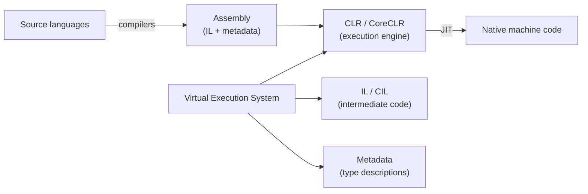
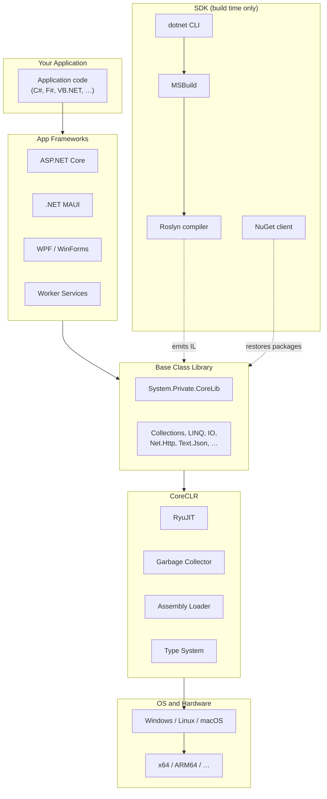

# 02. CLI, Architecture, & Components

## Table of Contents

1. [Common Language Infrastructure (CLI) and ECMA-335](#1-common-language-infrastructure-and-ecma-335)
2. [Virtual Execution System](#2-virtual-execution-system)
3. [Layered Architecture of Modern .NET](#3-layered-architecture-of-modern-net)
4. [CoreCLR — The Runtime Layer](#4-coreclr--the-runtime-layer)
5. [Base Class Library and FCL](#5-base-class-library-and-fcl)
6. [SDK, Toolchain, and App Frameworks](#6-sdk-toolchain-and-app-frameworks)
7. [NuGet and Modularity](#7-nuget-and-modularity)
8. [Runtime vs. SDK in Deployment](#8-runtime-vs-sdk-in-deployment)

---

## 1. Common Language Infrastructure and ECMA-335

The **Common Language Infrastructure (CLI)** is the formal standard (ECMA-335) that defines how .NET-compatible languages compile, how assemblies are structured, and how a conforming runtime executes them. CoreCLR and the classic .NET Framework CLR are both implementations of this standard. Mono is another independent implementation.

The key thing to know: **IL and metadata are not Microsoft-proprietary**. Any compiler that emits valid CLI assemblies can target any compliant runtime. That's what enables C#, F#, and VB.NET to all share types and libraries without friction — the runtime only sees IL and metadata, not which language produced them.

The CLI specification covers several areas:

| Area | What it defines |
|---|---|
| **Virtual Execution System (VES)** | Runtime behavior — loading, JIT, memory management |
| **Metadata and IL** | Binary format for types, members, and method bodies |
| **Common Type System (CTS)** | Rules all types must follow |
| **Common Language Specification (CLS)** | Cross-language API subset |

---

## 2. Virtual Execution System

The **Virtual Execution System (VES)** is the CLI's term for the runtime environment. In practice, it's three things working together:

### CLR (Common Language Runtime)

The **CLR** is the managed execution engine. It loads assemblies, JIT-compiles IL to native code, manages the garbage-collected heap, schedules threads, and handles exceptions. The modern open-source implementation is **CoreCLR**.

### IL (Intermediate Language)

**IL** (also called CIL or MSIL) is CPU-independent, stack-based bytecode. Compilers emit IL; the JIT translates it to x64, ARM64, or other architectures at runtime. IL is what makes portability possible — the same assembly runs on any OS where the runtime is supported.

### Metadata

**Metadata** is the self-describing catalog embedded in every assembly: type definitions, method signatures, fields, properties, attributes, and assembly references. The CLR uses it for loading and JIT; frameworks use it for reflection, serialization, and dependency injection.

Together, IL + metadata in a **Portable Executable (PE)** file is the deployable unit the VES consumes.

---

## 3. Layered Architecture of Modern .NET

Think of .NET as a strict stack — each layer depends only on the layer below. This is what allows the same app to run on Windows, Linux, or macOS without recompiling.

### The Key Distinction: SDK is Not the Runtime

Build machines need the SDK (compilers, MSBuild). Production machines only need the **runtime**, BCL, and your compiled assemblies. This is why Docker production images use runtime bases (`mcr.microsoft.com/dotnet/aspnet`), not SDK images.

SDK version and runtime version are **independently versioned** — you can build with SDK 8.0.300 while targeting runtime 8.0.5 on the server.

| Layer | Open-source repo | Ships as |
|---|---|---|
| CoreCLR + core BCL | `dotnet/runtime` | Shared runtime packages |
| Roslyn | `dotnet/roslyn` | Part of SDK |
| MSBuild | `dotnet/msbuild` | Part of SDK |
| ASP.NET Core | `dotnet/aspnetcore` | Framework packages |
| WPF / WinForms | `dotnet/wpf`, `dotnet/winforms` | Windows packages |
| MAUI | `dotnet/maui` | Cross-platform workload |

---

## 4. CoreCLR — The Runtime Layer

**CoreCLR** is the cross-platform CLR implementation. It's a JIT-compiling runtime — IL is not interpreted line by line. When a method is first called, **RyuJIT** compiles that method's IL to native instructions and caches the result. All subsequent calls run native code directly.

Major subsystems inside CoreCLR:

| Subsystem | What it does |
|---|---|
| **Execution Engine** | Stack frames, virtual dispatch, managed/unmanaged transitions |
| **RyuJIT** | Compiles IL → native code; handles tiered optimization |
| **Garbage Collector** | Generational, compacting heap management |
| **Type system** | Method tables, reflection, interface dispatch maps |
| **Assembly loader** | Resolves dependencies via `.deps.json`, shared framework, NuGet cache |
| **Interop layer** | P/Invoke, COM (Windows), marshaling |
| **Thread pool** | Worker and I/O completion threads; `Task` scheduling |

CoreCLR source lives in `dotnet/runtime`, alongside most of the BCL assemblies.

---

## 5. Base Class Library and FCL

### Base Class Library (BCL)

The **BCL** is the standard library every .NET app uses — fundamental types (`Object`, `String`, primitives), collections, LINQ, I/O, networking, threading, JSON, and reflection. It ships with the runtime as a **shared framework** installed once per machine and referenced by all apps targeting that runtime version.

For framework-dependent deployments, your app doesn't copy BCL assemblies into its output — the runtime finds them via the dependency manifest generated at build time.

| Namespace area | What you get |
|---|---|
| `System` | `Console`, `Math`, `DateTime`, `Exception`, `GC` |
| `System.Collections.Generic` | `List<T>`, `Dictionary<K,V>`, `HashSet<T>` |
| `System.Linq` | Deferred query operators over `IEnumerable<T>` |
| `System.IO` | Files, directories, streams |
| `System.Threading.Tasks` | `Task`, async infrastructure, cancellation |
| `System.Net.Http` | HTTP client |
| `System.Text.Json` | High-performance JSON serialization |
| `System.Reflection` | Runtime type and member inspection |

### FCL — Historical Term Worth Knowing

On **.NET Framework**, the **FCL (Framework Class Library)** meant the entire library surface: BCL **plus** ASP.NET (`System.Web`), WinForms, WPF, WCF, and all the other vertical stacks. It was monolithic — installed with Windows, updated only with framework releases.

On **modern .NET**, FCL is obsolete as a concept:

| Term | Era | What it means today |
|---|---|---|
| **BCL** | All eras | Core runtime library in `dotnet/runtime` |
| **FCL** | .NET Framework only | Historical label for BCL + all Framework-era app libraries |
| **Modern library model** | .NET Core / unified .NET | BCL in shared framework; ASP.NET Core, MAUI, WPF ship as separate packages |

One-liner: **FCL was the Framework-era "everything in the library install"; BCL is the portable core that remains; the app frameworks that were bundled in FCL are now modular packages.**

---

## 6. SDK, Toolchain, and App Frameworks

### The SDK

The SDK transforms source into assemblies at build time — it never ships to production for typical deployments.

| Component | Role |
|---|---|
| **Roslyn** | Parses, binds, and emits IL and metadata from source |
| **MSBuild** | Evaluates project files, runs targets, incremental build |
| **`dotnet` CLI** | Your entry point — `new`, `build`, `test`, `publish`, `restore` |

Roslyn's flow: source → syntax trees → semantic model → lowered tree (desugaring `async`, `yield`, lambdas, records) → emit IL + metadata + PDB symbols. Analyzers and source generators plug into this same pipeline.

Modern `.csproj` files are short because `Microsoft.NET.Sdk` imports sensible defaults for target framework, output type, and references automatically.

### App Frameworks

App frameworks add domain abstractions on top of the BCL. They're optional and picked per project type:

| Framework | What it adds |
|---|---|
| **ASP.NET Core** | HTTP pipeline, routing, middleware, DI, Kestrel, Razor |
| **WPF** | XAML UI, dependency properties, data binding |
| **WinForms** | Designer-oriented control model, GDI+ rendering |
| **.NET MAUI** | Cross-platform UI mapped to native controls |
| **Worker Services** | `IHostedService`, generic host lifecycle |
| **Blazor** | Component model, render tree, JS interop |

ASP.NET Core references the `Microsoft.AspNetCore.App` shared framework — a separate shared install alongside `Microsoft.NETCore.App` on servers.

Console applications use only the BCL — no app framework package needed.

---

## 7. NuGet and Modularity

**NuGet** is .NET's package manager. A `.nupkg` file is a zip archive containing compiled assemblies for specific target frameworks, dependency metadata, and optional MSBuild props/targets.

### How Package Resolution Works

When restore runs, the NuGet client builds a **dependency graph** from all direct and transitive references. It uses **Minimum Version Selection (MVS)**: for each package, it picks the **lowest version that satisfies all constraints** — deterministic, but not automatically "latest."

| Scenario | Outcome |
|---|---|
| Package A needs Lib ≥ 1.5; Package B needs Lib ≥ 1.6 | Lib 1.6 is selected |
| Exact version conflicts | Restore error — you need to align references |
| Direct reference vs. transitive | Your explicit `PackageReference` wins |

### Keeping Builds Reproducible

- **Lock files** (`packages.lock.json`) freeze the resolved graph for repeatable CI builds.
- **Central Package Management** (`Directory.Packages.props`) declares all versions once for large solutions.
- **Vulnerability auditing** (`dotnet list package --vulnerable`) flags known CVEs in your dependency graph.

### Why Modularity Matters in Practice

- Features ship as packages (SignalR, EF Core, Polly) rather than fixed framework installs.
- Your app declares only what it needs — smaller attack surface and deployment size.
- Teams can upgrade subsystems independently (e.g., patch the JSON library without retargeting the runtime).
- Plugin architectures can use isolated `AssemblyLoadContext` instances for loading code side-by-side.

---

## 8. Runtime vs. SDK in Deployment

| Aspect | Runtime (CoreCLR + BCL) | SDK |
|---|---|---|
| Purpose | Execute IL assemblies | Compile source to IL |
| Production servers | Required | Should NOT be installed |
| Versioning | `8.0.x` runtime band | `8.0.xxx` SDK band |
| Key artifacts | `coreclr.dll`, shared framework folders | Roslyn, MSBuild, `dotnet` host |
| Container image | `mcr.microsoft.com/dotnet/runtime` or `aspnet` | `mcr.microsoft.com/dotnet/sdk` |

**Framework-dependent deployment** — outputs app DLLs plus `runtimeconfig.json` and `deps.json`; the host finds the installed shared framework at runtime.

**Self-contained deployment** — bundles the runtime with your app for machines without a shared install.

**Multi-stage Docker builds** — compile in an SDK stage, copy publish output into a lean runtime stage. This keeps production images small and free of compilers.

---

**Previous →** [01. .NET Platform and Evolution](./01.%20.NET%20Platform%20and%20Evolution.md)

**Next →** [03. CLR, JIT, AOT, and Execution Flow](./03.%20CLR%2C%20JIT%2C%20AOT%2C%20and%20Execution%20Flow.md)
