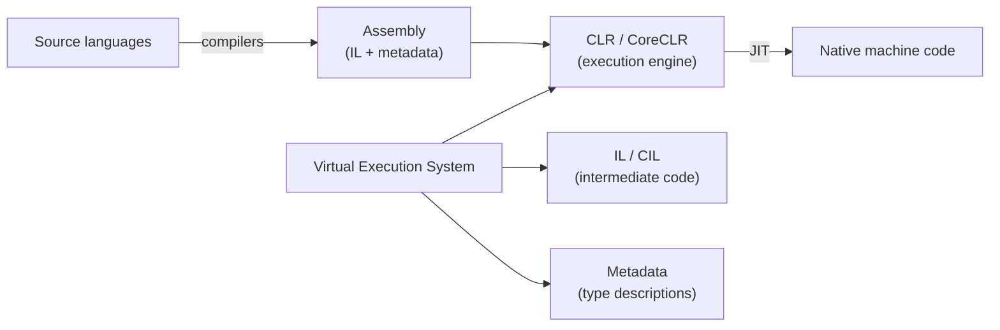
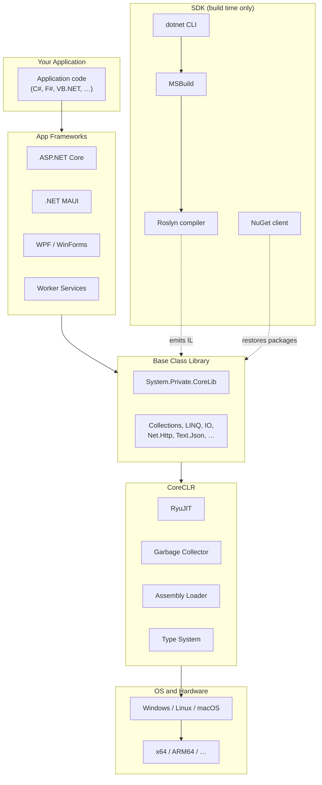

# 02. CLI, Architecture, & Components

## Table of Contents

1. [Common Language Infrastructure and ECMA-335](#1-common-language-infrastructure-and-ecma-335)
2. [Virtual Execution System](#2-virtual-execution-system)
3. [Layered Architecture of Modern .NET](#3-layered-architecture-of-modern-net)
4. [CoreCLR — The Runtime Layer](#4-coreclr--the-runtime-layer)
5. [Base Class Library and FCL](#5-base-class-library-and-fcl)
6. [SDK, Toolchain, and App Frameworks](#6-sdk-toolchain-and-app-frameworks)
7. [NuGet and Modularity](#7-nuget-and-modularity)
8. [Runtime Versus SDK in Deployment](#8-runtime-versus-sdk-in-deployment)

---

## 1. Common Language Infrastructure and ECMA-335

The **Common Language Infrastructure (CLI)** is the formal standard (ECMA-335 and ISO/IEC 23271) that defines how .NET-compatible languages compile, how assemblies are structured, and how a conforming runtime executes them. Microsoft’s CoreCLR and the historical .NET Framework CLR are implementations of this standard; Mono is another independent implementation.

The CLI specification partitions the platform into several conceptual partitions:

| Partition | What it defines |
|---|---|
| **Conceptual architecture** | Layers from source languages through IL to execution |
| **Virtual Execution System (VES)** | Runtime behavior — loading, verification, JIT, memory |
| **Metadata and IL** | Binary format for types, members, and method bodies |
| **Framework library design** | Conventions for the base class library surface |
| **Common Type System (CTS)** | Rules for all types — see chapter 05 |
| **Common Language Specification (CLS)** | Cross-language API subset — see chapter 05 |

ECMA-335 matters because IL and metadata are **not Microsoft-proprietary**. Any compiler that emits valid CLI assemblies can target any compliant runtime. It also gives third-party tool vendors (decompilers, analyzers, profilers) a stable contract for reading assembly contents.

Languages such as C#, F#, and VB.NET are **CLI languages**: their compilers are front ends that produce CLI assemblies. The runtime does not distinguish which language authored a type — only the IL and metadata in the assembly matter.

---

## 2. Virtual Execution System

The **Virtual Execution System (VES)** is the CLI term for the environment that manages execution of CLI code. In practice, the VES is realized by three inseparable pillars:

### CLR (Common Language Runtime)

The **CLR** is the managed execution engine: it loads assemblies, verifies or type-checks IL, JIT-compiles methods to native code, manages the garbage-collected heap, schedules threads, and handles exceptions. Modern open-source implementations are branded **CoreCLR**. Chapter 03 covers CLR startup, JIT tiers, and the full execution pipeline.

### IL (Intermediate Language)

**IL** (also CIL or MSIL) is CPU-independent, stack-based bytecode stored in assembly method bodies. Compilers emit IL; the JIT translates it to x64, ARM64, or other ISAs at runtime. Chapter 04 explains IL semantics, key instruction categories, and why IL enables portability.

### Metadata

**Metadata** is the self-describing catalog embedded in every assembly: type definitions, method signatures, fields, properties, attributes, and assembly references. The CLR uses metadata for loading, verification, and JIT code generation; application frameworks use it for reflection, serialization, and dependency injection. Chapter 04 treats metadata in depth; physical layout of metadata inside the PE file is covered in chapter 07 (Assemblies, DLL, and EXE).

Together, IL plus metadata in a **Portable Executable (PE)** file form the deployable unit the VES consumes. The compiler’s contract with the runtime is: produce valid, typed IL with complete metadata; the VES will execute it safely on any supported platform.

---

## 3. Layered Architecture of Modern .NET

.NET is best understood as a strict stack. Each layer depends only on the layer below, which enables swapping operating systems and CPU architectures without recompiling application source.

### Why Layering Matters

The **SDK is not the runtime**. Build machines need compilers and MSBuild; production machines need only the runtime, BCL, and your compiled assemblies. Docker production images use runtime bases (`mcr.microsoft.com/dotnet/aspnet`); SDK images are for CI build stages only.

Runtime version and SDK version are **independently versioned**. A project can build with SDK 8.0.300 while targeting runtime 8.0.5 installed on the server.

| Layer | Primary repository (open source) | Ships as |
|---|---|---|
| CoreCLR + core BCL | `dotnet/runtime` | Shared runtime packages |
| Roslyn | `dotnet/roslyn` | Part of SDK |
| MSBuild | `dotnet/msbuild` | Part of SDK |
| ASP.NET Core | `dotnet/aspnetcore` | Framework packages |
| WPF / WinForms | `dotnet/wpf`, `dotnet/winforms` | Windows packages |
| MAUI | `dotnet/maui` | Cross-platform workload |

---

## 4. CoreCLR — The Runtime Layer

**CoreCLR** is the cross-platform CLR implementation that executes IL. It is a JIT-compiling runtime — IL is not interpreted line by line. On first invocation of a method, RyuJIT compiles that method’s IL to native instructions and caches the result.

Major subsystems inside CoreCLR:

| Subsystem | Responsibility |
|---|---|
| **Execution Engine** | Stack frames, virtual dispatch, managed/unmanaged transitions |
| **RyuJIT** | IL → native compilation; tiered optimization — see chapter 03 |
| **Garbage Collector** | Generational, compacting heap management — see chapter 10 |
| **Type system / metadata engine** | Method tables, reflection, interface maps |
| **Assembly loader** | Resolves dependencies via `.deps.json`, shared framework, NuGet cache |
| **Interop layer** | P/Invoke, COM (Windows), marshaling |
| **Thread pool** | Worker and I/O completion threads; `Task` scheduling infrastructure |

CoreCLR source lives in `dotnet/runtime`. The same repository builds most of the BCL assemblies that ship alongside the runtime.

---

## 5. Base Class Library and FCL

### Base Class Library (BCL)

The **Base Class Library** is the standard library every .NET application uses: fundamental types (`Object`, `String`, numeric primitives), collections, LINQ, I/O, networking, threading, JSON, and reflection. It ships with the runtime as a **shared framework** installed once per machine at a well-known path and referenced by all applications targeting that runtime version.

Applications do not copy BCL assemblies into their publish output for framework-dependent deployments — the runtime locates them via the dependency manifest generated at build time.

Core namespaces and their roles:

| Namespace area | Typical types and concerns |
|---|---|
| `System` | Root types, `Console`, `Math`, `DateTime`, `Exception`, `GC` |
| `System.Collections.Generic` | `List<T>`, `Dictionary<K,V>`, `HashSet<T>`, queues and stacks |
| `System.Linq` | Deferred query operators over `IEnumerable<T>` |
| `System.IO` | Files, directories, streams, path manipulation |
| `System.Threading.Tasks` | `Task`, async infrastructure, cancellation |
| `System.Net.Http` | HTTP client for service calls |
| `System.Text.Json` | High-performance JSON serialization |
| `System.Reflection` | Runtime type and member inspection |

### Framework Class Library (FCL) — Historical Term

On **.NET Framework**, **FCL (Framework Class Library)** meant the entire library surface Microsoft shipped with the framework: BCL **plus** ASP.NET (System.Web), WinForms, WPF, WCF, WF, and other vertical stacks. The FCL was monolithic — installed with Windows, updated only with framework releases, and not decomposable into optional parts.

On **modern .NET**, the term FCL is largely obsolete:

| Term | Era | Meaning today |
|---|---|---|
| **BCL** | All eras | Core runtime library in `dotnet/runtime` |
| **FCL** | .NET Framework only | Historical label for BCL + all Framework-era application libraries |
| **Modern library model** | .NET Core / unified .NET | BCL in shared framework; ASP.NET Core, MAUI, WPF ship as separate packages |

Relationship in one sentence: **FCL was the Framework-era name for “everything in the class library install”; BCL is the portable core that remains; app frameworks that were bundled inside FCL are now modular NuGet/shared-framework packages.**

When reading older documentation, “BCL” often meant only `mscorlib` / core types; “FCL” meant the full Framework library including UI and web stacks. Modern docs use **BCL** for `System.*` runtime libraries and name specific frameworks (ASP.NET Core, etc.) separately.

---

## 6. SDK, Toolchain, and App Frameworks

### SDK Layer

The **SDK** transforms source into assemblies at build time and never ships to production for typical deployments. Its pillars:

| Component | Role |
|---|---|
| **Roslyn** | Parses, binds, lowers, and emits IL and metadata |
| **MSBuild** | Evaluates project files, runs targets, incremental build |
| **`dotnet` CLI** | Developer entry point — new, build, test, publish, package restore |

Roslyn’s pipeline: source text → syntax trees → semantic model (binding) → lowered tree (desugaring `async`, `yield`, lambdas, records) → emit IL + metadata + optional PDB symbols. Analyzers and source generators plug into the same pipeline.

MSBuild modern projects import `Sdk.props` and `Sdk.targets` from `Microsoft.NET.Sdk`, which is why `.csproj` files are short — defaults for target framework, output type, and references are implicit.

### App Frameworks Layer

App frameworks add domain abstractions above the BCL. They are optional and selected per project type:

| Framework | Adds over BCL |
|---|---|
| **ASP.NET Core** | HTTP pipeline, routing, middleware, DI, Kestrel, Razor |
| **WPF** | XAML UI, dependency properties, data binding, visual tree |
| **WinForms** | Designer-oriented control model, GDI+ rendering |
| **.NET MAUI** | Cross-platform UI mapped to native controls |
| **Worker Services** | `IHostedService`, generic host lifecycle |
| **Blazor** | Component model, render tree, JS interop |

ASP.NET Core references the `Microsoft.AspNetCore.App` shared framework — a second shared install alongside `Microsoft.NETCore.App` on servers.

Console applications use only the BCL; no app framework package is required.

---

## 7. NuGet and Modularity

**NuGet** is .NET’s package manager. A package (`.nupkg`) is a zip archive containing compiled assemblies for specific target frameworks, dependency metadata, and optional MSBuild props/targets that integrate into consuming projects.

### Package Resolution

When restore runs, the NuGet client builds a **dependency graph** from direct and transitive references. It applies **Minimum Version Selection (MVS)**: for each package identity, it chooses the **lowest version that satisfies all constraints** across the graph — deterministic but not automatically “latest.”

| Scenario | Typical outcome |
|---|---|
| Package A needs Lib ≥ 1.5; Package B needs Lib ≥ 1.6 | Lib 1.6 selected |
| Exact version conflicts | Restore error — must align references |
| Direct reference vs transitive | Explicit project reference wins |

Transitive dependencies resolve automatically; explicit `PackageReference` entries override transitive versions when needed.

### Reproducibility and Governance

**Lock files** (`packages.lock.json`) freeze the resolved graph for repeatable CI builds. **Central Package Management** (`Directory.Packages.props`) declares all package versions once for large solutions. **Vulnerability auditing** (`dotnet list package --vulnerable`, `NuGetAudit` MSBuild properties) flags known CVEs in the dependency graph.

### Modularity in Practice

Modularity means:

- Features ship as packages (SignalR, EF Core, Polly integrations) rather than as fixed framework installs.
- Applications declare only required dependencies — smaller attack surface and deployment size.
- Teams upgrade subsystems independently (e.g., JSON library patch without retargeting runtime).
- Plugin architectures can use isolated `AssemblyLoadContext` instances — described in chapter 03.

Chapter 01 explains why modularity motivated .NET Core’s design; this chapter shows the mechanism (NuGet + shared framework + SDK) that delivers it.

---

## 8. Runtime Versus SDK in Deployment

| Aspect | Runtime (CoreCLR + BCL) | SDK |
|---|---|---|
| Purpose | Execute IL assemblies | Compile source to IL |
| Production servers | Required | Should not be installed |
| Versioning | `8.0.x` runtime band | `8.0.xxx` SDK band |
| Key artifacts | `coreclr.dll`, shared framework folders | Roslyn, MSBuild, `dotnet` host |
| Container image | `mcr.microsoft.com/dotnet/runtime` or `aspnet` | `mcr.microsoft.com/dotnet/sdk` |

**Framework-dependent deployment** outputs application DLLs plus `runtimeconfig.json` and `deps.json`; the host finds the installed shared framework.

**Self-contained deployment** bundles the runtime with the application for machines without a shared install.

Multi-stage container builds compile in an SDK stage and copy publish output into a runtime stage — the pattern that keeps production images small and free of compilers.

Configuration files generated at build (`runtimeconfig.json`, `deps.json`, lock files) connect the SDK’s view of dependencies to the runtime host’s loading policy; chapter 03 walks through how the host consumes them before `Main` executes.

---

**Previous →** [01. .NET Platform and Evolution](./01.%20.NET%20Platform%20and%20Evolution.md)

**Next →** [03. CLR, JIT, AOT, and Execution Flow](./03.%20CLR%2C%20JIT%2C%20AOT%2C%20and%20Execution%20Flow.md)
