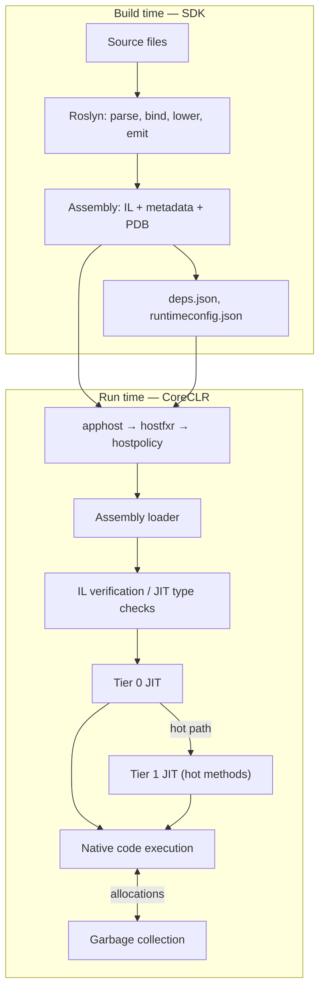

# 03. CLR, JIT, AOT, & Execution Flow

## Table of Contents

1. [What the CLR Is](#1-what-the-clr-is)
2. [Managed vs. Native Code](#2-managed-vs-native-code)
3. [JIT Compilation and IL](#3-jit-compilation-and-il)
4. [Tiered JIT, ReadyToRun, and Native AOT](#4-tiered-jit-readytorun-and-native-aot)
5. [CLR Startup and the Host Chain](#5-clr-startup-and-the-host-chain)
6. [End-to-End Execution Flow](#6-end-to-end-execution-flow)
7. [Code Access Security and the Modern Trust Model](#7-code-access-security-and-the-modern-trust-model)

---

## 1. What the CLR Is

The **Common Language Runtime (CLR)** — implemented as **CoreCLR** on modern .NET — is the managed execution engine that sits between your compiled code and the OS.

The word *managed* means the runtime handles things that native code leaves to the developer: heap allocation and cleanup, type safety enforcement, structured exceptions, thread-pool scheduling, and assembly loading.

**Important:** The CLR is not an interpreter. It's a **JIT-compiling virtual machine** — method bodies start as IL, and on first call, the JIT compiles each method to native machine code and caches it. Every subsequent call runs native instructions directly.

| Area | What the CLR does |
|---|---|
| **Execution** | Invokes methods, maintains stack frames, dispatches virtual and interface calls |
| **JIT** | Translates IL to CPU-specific native code (RyuJIT) |
| **Memory** | Allocates on the managed heap; reclaims unreachable objects via GC |
| **Type safety** | Verifies IL; prevents arbitrary memory corruption |
| **Exceptions** | Implements structured exception handling across language boundaries |
| **Loading** | Resolves assembly dependencies from manifests and probe paths |
| **Interop** | Transitions between managed and unmanaged code (P/Invoke, COM) |
| **Concurrency** | Thread pool, `Task` scheduling, async continuation infrastructure |

---

## 2. Managed vs. Native Code

| Aspect | Managed (CLR) | Native (C/C++) |
|---|---|---|
| Memory | Automatic GC | Manual allocate/free |
| Type safety | Enforced | Not enforced by platform |
| Array bounds | Checked — `IndexOutOfRangeException` | Undefined behavior |
| Null dereference | `NullReferenceException` | Crash / segfault |
| Exceptions | Structured across call stacks | Platform-specific |
| Cross-language types | Shared via IL and CTS | ABI-level conventions only |
| Startup | Host + CLR init + JIT warmup | Direct entry to native code |

The tradeoff is intentional: the small JIT and GC overhead buys you safety, productivity, and portability. Tiered JIT brings steady-state performance close to hand-written native code for most server and desktop workloads.

---

## 3. JIT Compilation and IL

**IL** (Intermediate Language) is stack-based, CPU-independent bytecode stored in each method body. **RyuJIT** in CoreCLR compiles it **per method**, on **first call** — not upfront for the entire assembly.

### How Lazy Compilation Works

Before a method is JIT-compiled, calls go through a **pre-stub** — a small thunk that triggers compilation and then redirects to the generated native code. Methods that are never called never get JIT-compiled, which keeps startup fast for large assemblies where only a fraction of methods run during initialization.

This lazy model is why your app can start quickly even with thousands of types loaded — only the code paths actually exercised get compiled.

---

## 4. Tiered JIT, ReadyToRun, and Native AOT

Modern .NET gives you three strategies that trade startup time, peak throughput, and deployment shape.

### Tiered JIT (Default)

**Tiered compilation** solves the conflict between a fast first compile and heavily optimized steady-state code.

| Tier | When | What happens |
|---|---|---|
| **Tier 0** | First calls to a method | Fast JIT, minimal optimization; call counter tracks hotness |
| **Tier 1** | Method exceeds call threshold (~30 calls) | Full optimization on background thread; code pointer atomically swapped |
| **Tier 1 + PGO** (.NET 6+) | Profile data from Tier 0 | Better devirtualization and inlining using real runtime profile data |

Cold paths stay snappy; hot paths eventually run fully optimized native code — all without restarting the process. Profile-Guided Optimization (PGO) uses real branch and dispatch statistics that static compilation can't know ahead of time.

### ReadyToRun (R2R)

**ReadyToRun** pre-compiles IL to native code at **publish time** and embeds that native code alongside the IL in the assembly. At runtime, the CLR executes the precompiled bodies, skipping Tier 0 JIT for those methods. IL stays in the assembly for debugging, fallback, and Tier 1 re-JIT of hot paths.

| Property | ReadyToRun |
|---|---|
| IL present | Yes |
| JIT required | Yes (fallback and Tier 1 re-JIT) |
| Target | Publish-time platform (e.g., linux-x64) |
| Best for | Faster startup on apps that use reflection, EF Core, or dynamic loading |

R2R is the pragmatic middle ground for ASP.NET Core services that can't use Native AOT due to reflection dependencies.

### Native AOT

**Native AOT** compiles your entire app — including runtime stubs — into a **standalone native binary** at **build time**. No CoreCLR install needed on the target machine; no JIT at runtime.

| Property | Native AOT |
|---|---|
| IL / JIT | Neither present at runtime |
| Startup | Near-instant — no warmup |
| Reflection | Restricted; requires trimming and annotations |
| Dynamic loading | Limited |
| Best for | CLI tools, serverless cold start, constrained containers |

Native AOT trades flexibility (full reflection, dynamic assembly loading) for the fastest possible startup and single-file deployment.

### Comparison Summary

| Approach | When compiled | Runtime needed | Reflection | Startup |
|---|---|---|---|---|
| **JIT (default)** | First method call | Yes | Full | Slower warmup |
| **ReadyToRun** | Publish time | Yes | Full | Improved |
| **Native AOT** | Build time | No | Restricted | Fastest |

---

## 5. CLR Startup and the Host Chain

Before your `Main` runs, a chain of native host components initializes CoreCLR. Knowing this helps you diagnose deployment failures and understand what `runtimeconfig.json` and `deps.json` are actually for.

```mermaid
sequenceDiagram
    participant OS as OS / shell
    participant AH as apphost
    participant FXR as hostfxr
    participant HP as hostpolicy
    participant CLR as CoreCLR
    participant APP as Application entry

    OS->>AH: Launch executable or dotnet app.dll
    AH->>FXR: Locate hostfxr
    FXR->>FXR: Read runtimeconfig.json\n(resolve framework version)
    FXR->>HP: Load hostpolicy
    HP->>HP: Read deps.json\n(assembly probe paths)
    HP->>CLR: Initialize CoreCLR
    CLR->>CLR: Load System.Private.CoreLib\nInit GC, JIT, thread pool
    CLR->>APP: Load entry assembly;\nJIT and invoke Main
```

| Stage | Component | Role |
|---|---|---|
| 1 | **apphost** | Native stub that locates the runtime install root |
| 2 | **hostfxr** | Reads `runtimeconfig.json`; applies roll-forward policy; selects framework version |
| 3 | **hostpolicy** | Reads `deps.json`; registers assembly search paths; calls CoreCLR initialize |
| 4 | **CoreCLR** | Creates the default `AssemblyLoadContext`; loads core library; prepares heap and JIT |
| 5 | **Entry point** | Loader finds `Main` (or top-level statements entry); pre-stub triggers first JIT |

**Roll-forward policy** (in `runtimeconfig.json`) controls what happens if an exact runtime patch isn't installed — whether to fail or roll forward to a compatible newer patch.

**Quick note on AppDomains:** .NET Framework used AppDomains for in-process isolation. Modern .NET has a single default AppDomain; isolation uses process boundaries, containers, or collectible `AssemblyLoadContext` instances instead.

---

## 6. End-to-End Execution Flow

Here's the full journey from source code to CPU:



### Phase Summary

| Phase | Who does it | Input | Output |
|---|---|---|---|
| Compile | Roslyn | Source files | PE assembly with IL + metadata |
| Restore | NuGet | Project references | Resolved package graph, lock file |
| Host | hostfxr / hostpolicy | Exe, runtimeconfig, deps | Initialized CLR |
| Load | Assembly loader | Assembly names | Types and methods in memory |
| JIT | RyuJIT | IL per method | Cached native code |
| Execute | CPU | Native instructions | Application behavior |
| Collect | GC | Managed heap | Reclaimed memory |

**The short version:** write source → compiler emits IL + metadata → host starts CLR → loader brings assemblies in → JIT compiles methods on demand → CPU runs native code while GC manages the heap.

---

## 7. Code Access Security and the Modern Trust Model

### Code Access Security (CAS) — Historical Context

In **.NET Framework**, **Code Access Security** tried to grant permissions based on code origin (internet zone, local intranet, etc.). Sensitive BCL methods *demanded* permissions; the runtime walked the call stack to ensure every caller had the required grant. **Partial trust** scenarios ran plugins in sandboxed AppDomains with reduced rights.

### Why CAS Was Removed

CAS is gone in .NET Core and modern .NET — only compatibility stubs remain. Reasons:

- Stack-walk permission checks were bypassable via reflection and delegate tricks.
- Configuration was error-prone for both developers and administrators.
- Per-call permission walks added measurable overhead.
- Process-level isolation provides a stronger boundary for untrusted code.

### How Security Works Now

Modern .NET assumes **full trust for all managed code in a process**. You draw security boundaries at:

| Layer | Mechanism |
|---|---|
| **Process / container** | Separate OS processes or containers for untrusted workloads |
| **OS access control** | File ACLs, user accounts, network policies |
| **Application code** | Input validation, parameterized queries, safe deserialization |
| **Compile-time analysis** | Security analyzers flag common vulnerability patterns |

Attributes like `SecurityPermission` and `SecurityCritical` are no-ops on modern runtimes.

### Role-Based Security (Still Relevant)

**.NET role-based security** (principal/identity on `Thread.CurrentPrincipal`) is still available for application-level authorization — especially in Framework-era enterprise apps. ASP.NET Core replaces most of this with policy-based authorization (`IAuthorizationService`, roles and claims on `ClaimsPrincipal`) wired into authentication middleware.

The underlying idea persists: **identity and role checks belong in application code**, not CAS stack walks at the BCL layer. For new services, enforce authorization in your application code and isolate risky components in separate processes rather than relying on deprecated CAS.

---

**Previous →** [02. CLI, Architecture, and Components](./02.%20CLI%2C%20Architecture%2C%20and%20Components.md)

**Next →** [04. IL and Metadata](./04.%20IL%20and%20Metadata.md)
