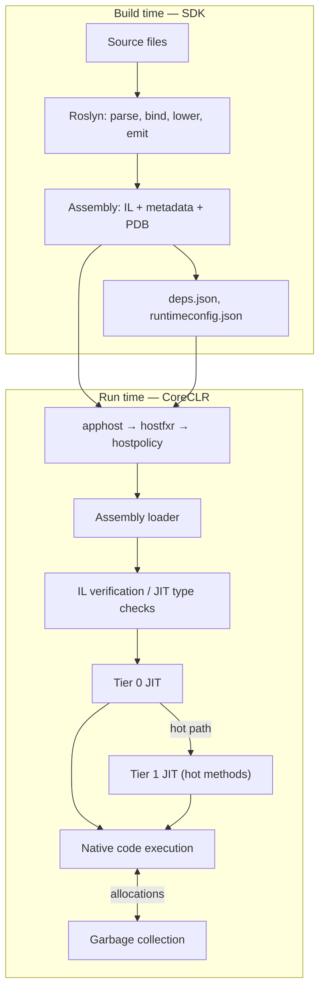

# 03. CLR, JIT, AOT, & Execution Flow

## Table of Contents

1. [What the CLR Is](#1-what-the-clr-is)
2. [Managed Execution Versus Native Code](#2-managed-execution-versus-native-code)
3. [JIT Compilation and IL](#3-jit-compilation-and-il)
4. [Tiered JIT, ReadyToRun, and Native AOT](#4-tiered-jit-readytorun-and-native-aot)
5. [CLR Startup and the Host Chain](#5-clr-startup-and-the-host-chain)
6. [End-to-End Execution Flow](#6-end-to-end-execution-flow)
7. [Code Access Security and the Modern Trust Model](#7-code-access-security-and-the-modern-trust-model)

---

## 1. What the CLR Is

The **Common Language Runtime (CLR)** — implemented as **CoreCLR** on modern .NET — is the managed execution engine that sits between CLI assemblies and the operating system. The word *managed* means the runtime owns infrastructure that native code leaves to the developer: heap allocation and reclamation, type safety enforcement, structured exceptions, thread-pool scheduling, and assembly loading.

The CLR is **not an interpreter**. It is a **JIT-compiling virtual machine**: method bodies start as IL; the first time a method runs, the JIT compiles it to native machine code and caches that code for subsequent calls. Later invocations execute native instructions directly.

Core responsibilities:

| Area | What the CLR does |
|---|---|
| **Execution** | Invokes methods, maintains stack frames, dispatches virtual and interface calls |
| **JIT** | Translates IL to CPU-specific native code (RyuJIT) |
| **Memory** | Allocates on the managed heap; reclaims unreachable objects via GC |
| **Type safety** | Verifies or JIT-checks IL; prevents arbitrary memory corruption |
| **Exceptions** | Implements two-pass structured exception handling across languages |
| **Loading** | Resolves assembly dependencies from manifests and probe paths |
| **Interop** | Transitions between managed and unmanaged code (P/Invoke, COM) |
| **Concurrency** | Thread pool, `Task` scheduling, async continuation infrastructure |

The compiler emits IL and metadata; the CLR’s contract is to execute that output safely on any supported platform. IL semantics and metadata structure are covered in chapter 04; garbage collection details appear in chapter 10.

---

## 2. Managed Execution Versus Native Code

| Aspect | Managed (CLR) | Native (C/C++) |
|---|---|---|
| Memory | Automatic GC | Manual allocate/free |
| Type safety | Enforced (verifiable IL) | Not enforced by platform |
| Array bounds | Checked — `IndexOutOfRangeException` | Undefined behavior / overflow risk |
| Null dereference | `NullReferenceException` | Crash / segfault |
| Exceptions | Structured across call stacks | Platform-specific mechanisms |
| Cross-language types | Shared via IL and CTS | ABI-level conventions only |
| Startup | Host + CLR init + JIT warmup | Direct entry to native code |

The tradeoff is intentional: small JIT and GC overhead buys safety, productivity, and portability. Tiered JIT and tuning bring steady-state performance close to hand-written native code for most server and desktop workloads.

---

## 3. JIT Compilation and IL

**IL** (Intermediate Language) is stack-based, CPU-independent bytecode in each method body. The JIT (**RyuJIT** in CoreCLR) runs **per method**, typically on **first call**, not upfront for the entire assembly.

### JIT Pipeline (Conceptual)

When RyuJIT compiles a method:

1. **Import** — Read IL opcodes into an internal representation (GenTree nodes).
2. **Morph** — Normalize and simplify the IR; identify inlining candidates.
3. **Flow analysis** — Build control-flow graph; eliminate unreachable blocks.
4. **Optimization** (tier-dependent) — Inlining, constant folding, bounds-check elimination, loop optimizations.
5. **Register allocation** — Map virtual stack slots to CPU registers or frame locations.
6. **Code emission** — Emit x64/ARM64 instructions plus unwind tables and GC maps (which stack slots hold object references at safe points).

IL’s stack model exists at compile time inside the JIT; at runtime the method runs as native register/machine code. Chapter 04 explains why IL uses a stack-based VM and how instructions like `callvirt` relate to C# behavior.

### Pre-stubs and Lazy Compilation

Before any method is JIT-compiled, calls go through a **pre-stub** — a small thunk that triggers compilation and then redirects to the generated code. Methods that are never called incur no JIT cost. This lazy model keeps application startup fast for large assemblies where only a fraction of methods run during initialization.

---

## 4. Tiered JIT, ReadyToRun, and Native AOT

.NET offers three complementary strategies balancing **startup time**, **peak throughput**, and **deployment shape**.

### Tiered JIT

**Tiered compilation** addresses the conflict between fast first compile and heavily optimized steady state.

| Tier | When | Characteristics |
|---|---|---|
| **Tier 0** | First calls to a method | Fast JIT, minimal optimization; call counter tracks hotness |
| **Tier 1** | Method exceeds call threshold (~30 calls, configurable) | Full optimization on background thread; code pointer swapped atomically |
| **Tier 1 + PGO** (.NET 6+) | Profile data collected at Tier 0 | Devirtualization, better inlining, branch layout from runtime profile |

Tier 0 keeps cold startup and initialization paths snappy; hot paths eventually run fully optimized native code without restarting the process. Profile-Guided Optimization uses real branch and dispatch statistics that static compilation cannot know.

Tiered JIT can be disabled via runtime configuration for microbenchmarking baseline consistency; production services should leave it enabled.

### ReadyToRun (R2R)

**ReadyToRun** pre-compiles IL to native code at **publish time** (Crossgen2) and embeds that native code **alongside IL** in the assembly. At runtime the CLR executes precompiled bodies when available, skipping Tier 0 JIT for those methods. IL remains for debugging, fallback, and Tier 1 recompilation of hot paths.

| Property | ReadyToRun |
|---|---|
| IL present | Yes |
| JIT required | Yes (fallback and tier-1 re-JIT) |
| Target machine | Publish-time RID (e.g., linux-x64) |
| Best for | Faster startup on reflection-heavy apps without AOT restrictions |

R2R is a pragmatic middle ground for ASP.NET Core services that depend on reflection, EF Core, and dynamic loading.

### Native AOT

**Native AOT** compiles the application — including runtime stubs — into a **standalone native binary** at **build time**. No CoreCLR install is required on the target; there is no JIT at runtime.

| Property | Native AOT |
|---|---|
| IL / JIT | Neither present at runtime |
| Startup | Near-instant — no warmup |
| Reflection | Restricted; requires trimming and annotations |
| Dynamic loading | Limited |
| Best for | CLI tools, serverless cold start, constrained containers |

Native AOT trades flexibility (unconstrained reflection, dynamic assembly load) for minimum startup latency and single-file deployment.

### Comparison Summary

| Approach | When compiled | Runtime needed | Reflection | Startup |
|---|---|---|---|---|
| **JIT (default)** | First method call | Yes | Full | Slower warmup |
| **ReadyToRun** | Publish time | Yes | Full | Improved |
| **Native AOT** | Build time | No | Restricted | Fastest |

---

## 5. CLR Startup and the Host Chain

Before application `Main` executes, a chain of native host components initializes CoreCLR. Understanding this sequence helps diagnose deployment failures and design custom hosts.

```mermaid
sequenceDiagram
    participant OS as OS / shell
    participant AH as apphost
    participant FXR as hostfxr
    participant HP as hostpolicy
    participant CLR as CoreCLR
    participant APP as Application entry

    OS->>AH: Launch executable or dotnet app.dll
    AH->>FXR: Locate hostfxr
    FXR->>FXR: Read runtimeconfig.json\n(resolve framework version)
    FXR->>HP: Load hostpolicy
    HP->>HP: Read deps.json\n(assembly probe paths)
    HP->>CLR: Initialize CoreCLR
    CLR->>CLR: Load System.Private.CoreLib\nInit GC, JIT, thread pool
    CLR->>APP: Load entry assembly;\nJIT and invoke Main
```

| Stage | Component | Role |
|---|---|---|
| 1 | **apphost** | Native stub (framework-dependent exe or `dotnet` driver) locates the install root |
| 2 | **hostfxr** | Reads `runtimeconfig.json`; applies roll-forward policy; selects shared framework version |
| 3 | **hostpolicy** | Reads `deps.json`; registers assembly search paths; calls into CoreCLR initialize |
| 4 | **CoreCLR** | Creates default `AssemblyLoadContext`; loads core library; prepares heap and JIT |
| 5 | **Entry point** | Loader finds `Main` (or top-level statements entry); pre-stub triggers first JIT |

**Roll-forward policy** (in `runtimeconfig.json`) controls behavior when an exact runtime patch is missing — from strict failure to latest patch/minor within the band.

Historical note: .NET Framework used **AppDomains** for isolation within one process. Modern .NET has a single default AppDomain; isolation uses process boundaries, containers, or collectible `AssemblyLoadContext` instances (chapter 11 covers AppDomains historically).

---

## 6. End-to-End Execution Flow

The full journey from source to CPU spans build time (SDK) and run time (CLR).



### Phase Summary

| Phase | Actor | Input | Output |
|---|---|---|---|
| Compile | Roslyn | Source | PE assembly with IL and metadata |
| Restore | NuGet | Project references | Resolved package graph, lock file |
| Host | hostfxr / hostpolicy | Exe, runtimeconfig, deps | Initialized CLR |
| Load | Assembly loader | Assembly names | Types and methods in memory |
| JIT | RyuJIT | IL per method | Cached native code |
| Execute | CPU | Native instructions | Application behavior |
| Collect | GC | Managed heap | Reclaimed memory |

At a high level: **write source → compiler emits IL + metadata → host starts CLR → loader brings assemblies in → JIT compiles methods on demand → CPU runs native code while GC manages the heap.**

Assembly loading rules, strong names, and `AssemblyLoadContext` plugin patterns are detailed in chapter 07 (Assemblies, DLL, and EXE) and chapter 08 (Managed and Unmanaged Code) for interop boundaries.

---

## 7. Code Access Security and the Modern Trust Model

### Code Access Security (CAS) — Historical

In **.NET Framework**, **Code Access Security** attempted to grant permissions based on code origin (internet zone, local intranet, etc.). Sensitive BCL methods **demanded** permissions; the runtime walked the call stack to ensure every caller held the required grant. **Partial trust** scenarios ran plugins in sandboxed AppDomains with reduced rights.

CAS also interacted with **IL verification**: partially trusted assemblies often had to contain verifiable IL.

### Why CAS Was Removed

CAS was removed from .NET Core and is absent from modern .NET (compatibility stubs only). Reasons include:

- Stack-walk checks were bypassable via reflection and delegate tricks.
- Configuration was error-prone for administrators and developers.
- Per-call permission walks added measurable overhead.
- Process-level isolation provides stronger boundaries for untrusted code.

### Modern Trust Model

Modern .NET assumes **full trust for all managed code in a process**. Security boundaries are drawn at:

| Layer | Mechanism |
|---|---|
| **Process / container** | Separate OS processes or containers for untrusted workloads |
| **OS access control** | File ACLs, user accounts, network policies |
| **Application design** | Input validation, parameterized queries, safe deserialization |
| **Compile-time analysis** | Security analyzers flag common vulnerability patterns |

Attributes such as `SecurityPermission` and `SecurityCritical` are no-ops on modern runtimes.

### Role-Based Security (Brief)

**.NET role-based security** (principal/identity on `Thread.CurrentPrincipal`, `PrincipalPermission` demands) remains available for application-level authorization patterns, especially in Framework-era enterprise apps. ASP.NET Core replaces much of this with policy-based authorization (`IAuthorizationService`, roles and claims on `ClaimsPrincipal`) integrated with authentication middleware — but the underlying idea persists: **identity and role checks at the application layer**, not CAS stack walks at the BCL layer.

For new services, treat the runtime as fully trusted; enforce authorization in application code and isolate risky components in separate processes or containers rather than relying on deprecated CAS or partial-trust AppDomains.

---

**Previous →** [02. CLI, Architecture, and Components](./02.%20CLI%2C%20Architecture%2C%20and%20Components.md)

**Next →** [04. IL and Metadata](./04.%20IL%20and%20Metadata.md)
