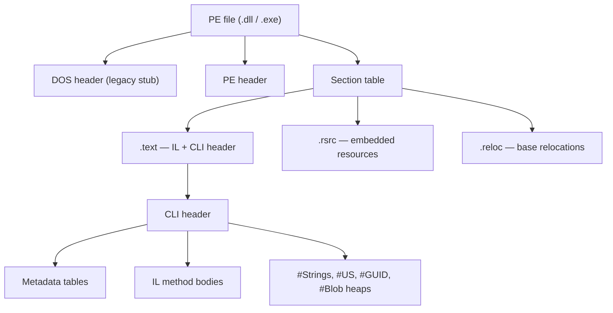

# 04. IL & Metadata

## Table of Contents

1. [What IL Is](#1-what-il-is)
2. [IL as a Stack-Based Virtual Machine](#2-il-as-a-stack-based-virtual-machine)
3. [Why IL Is CPU-Independent](#3-why-il-is-cpu-independent)
4. [Key IL Concepts](#4-key-il-concepts)
5. [Metadata in Assemblies](#5-metadata-in-assemblies)
6. [PE File Structure](#6-pe-file-structure)
7. [Inspecting IL](#7-inspecting-il)

---

## 1. What IL Is

**Common Intermediate Language (CIL)** — also called **IL** or **MSIL** — is the CPU-independent bytecode that every .NET compiler produces. When you build a C# project, the compiler doesn't target x64 or ARM64 directly. Instead, it writes IL instructions plus rich type information (metadata) into an assembly file (`.dll` or `.exe`).

The runtime then JIT-compiles that IL into native code for whatever machine your app runs on. This is what makes one NuGet package work on both an x64 Windows server and an ARM64 Mac.

### How It Fits in the Pipeline

```
Source code (C#, F#, VB.NET, …)
        ↓  language compiler
Assembly = IL method bodies + metadata
        ↓  CLR loader
Verified IL in memory
        ↓  RyuJIT (per method, on first call)
Native machine code for current CPU
        ↓
CPU execution
```

### How IL Compares to Java and WebAssembly

| Property | .NET IL | Java bytecode | WebAssembly |
|---|---|---|---|
| Execution model | Stack-based VM | Stack-based VM | Stack-based VM |
| Generics | Reified at runtime (real type info kept) | Erased at compile time | No generics |
| Value types | First-class (`struct`) | Primitives only; objects must be boxed | Numeric types only |
| Metadata richness | Full reflection info in every assembly | Constant pool + descriptors | Minimal |

---

## 2. IL as a Stack-Based Virtual Machine

IL uses an **evaluation stack** to compute values. Instructions push values on, pop operands off, and push results back. There are no "registers" in the IL instruction set — everything goes through the stack.

Think of evaluating `result = a + b`:

```
Before loading a:   [ ]
After  loading a:   [ a ]
After  loading b:   [ a | b ]
After  add:         [ (a+b) ]
After  store:       [ ]      ← local variable holds (a+b)
```

The stack is **typed** — the runtime tracks the type of each slot. This makes it possible to verify type safety by scanning the instruction stream without actually running the code.

Real CPUs are register-based, not stack-based. When the JIT compiles IL to native code, it maps those stack slots to actual CPU registers. The evaluation stack is a compile-time concept, not a runtime data structure.

---

## 3. Why IL Is CPU-Independent

IL instructions describe operations generically — "load local", "add", "call method" — without any x64 or ARM64 specifics. The **same assembly file** built on your dev laptop can run on a Linux ARM64 server, a Windows x64 desktop, or an Apple Silicon Mac. The JIT on each machine generates native code optimized for that CPU.

This buys you three things:

1. **Portability** — One NuGet package works on all .NET-supported platforms without shipping per-CPU binaries.
2. **Late hardware binding** — The JIT can use CPU features (like AVX or ARM NEON) discovered at runtime, not locked in at build time.
3. **Cross-language unity** — C#, F#, and VB.NET all emit the same IL format, so their libraries compose without any adapters.

The cost: JIT compilation at startup (or first call), and a requirement for a .NET runtime on the target machine — unless you use Native AOT.

---

## 4. Key IL Concepts

You don't need to memorize every opcode. Understanding the categories and a handful of key instructions is enough to reason about what C# code actually does at runtime.

### Instruction Categories

| Category | Purpose |
|---|---|
| **Load / store** | Move values between stack, locals, arguments, and fields |
| **Arithmetic** | Add, subtract, multiply, divide; `checked` uses overflow-aware variants |
| **Branch** | Conditional and unconditional jumps for loops and `if` statements |
| **Method calls** | `call`, `callvirt`, `calli` |
| **Object creation** | `newobj`, `newarr` — heap allocations |
| **Type operations** | `box`, `unbox`, `castclass`, `isinst` — conversions and type tests |
| **Return** | Exit method; pop return value for non-void methods |

### call vs callvirt

This comes up in interviews: why does C# use `callvirt` even for non-virtual methods?

| Instruction | Typical use | Behavior |
|---|---|---|
| **`call`** | Static methods; value-type instance methods; compile-time-resolved calls | Direct call — no vtable lookup |
| **`callvirt`** | Virtual methods; interface calls; most instance methods on reference types | Null-checks the receiver, then dispatches via method table |

C# emits `callvirt` for most instance method calls on reference types — even when the method isn't `virtual` — because `callvirt` null-checks the receiver and throws `NullReferenceException` at the call site. A plain `call` would let you enter the method body with a null `this`, which fails later in a harder-to-diagnose way.

### box and unbox

- **`box`** — Takes a value type off the stack, allocates a heap object, copies the value in, and pushes an object reference. Every `box` is a heap allocation.
- **`unbox` / `unbox.any`** — Takes an object reference, confirms it wraps the expected value type, copies the value back to the stack.

Boxing is explicit in IL. `List<int>` avoids it; `ArrayList` boxes every `int` you insert. When hunting allocation hot spots, search for `box` instructions in an IL viewer.

### newobj

`newobj` allocates a new reference type instance:

1. CLR allocates memory on the managed heap.
2. Memory is zero-initialized.
3. Constructor IL runs.
4. A reference to the new object is pushed on the stack.

`newarr` allocates arrays. Features like `async`/`await`, `yield return`, and lambdas with captures generate extra `newobj` calls for compiler-generated state machine and closure classes — which explains GC pressure you sometimes can't find directly in your own code.

---

## 5. Metadata in Assemblies

**Metadata** is structured data baked into every assembly. It describes everything the compiler knew: types, members, signatures, attributes, and assembly identity.

| Metadata content | Examples |
|---|---|
| Type definitions | Classes, structs, interfaces, enums, delegates |
| Members | Methods, fields, properties, events, parameters |
| Signatures | Return types, parameter types, generic parameters |
| Custom attributes | `[Obsolete]`, `[Serializable]`, routing attributes |
| Assembly manifest | Name, version, culture, public key token, referenced assemblies |
| Resources | Embedded files linked by name |

### What Metadata Powers

Metadata is why .NET frameworks can be so convention-driven and discoverable without XML config files.

| Consumer | Uses metadata to |
|---|---|
| **CLR loader** | Resolve types, validate signatures, lay out fields |
| **JIT** | Resolve call targets and calling conventions |
| **Reflection** | Inspect and invoke types at runtime (`Type`, `MethodInfo`) |
| **Serializers** | Map JSON/XML to properties by name and type |
| **EF Core** | Map tables to entities from class and property definitions |
| **Dependency injection** | Find constructors and resolve parameter types |
| **Test runners** | Discover test methods from attributes |
| **ASP.NET Core** | Map routes and bind models from attributes and conventions |
| **Decompilers** | Reconstruct readable C# from IL + names + structure |

Custom attributes like `[Authorize]` or `[Key]` are just metadata records — they don't do anything until some framework reads them through the reflection API.

---

## 6. PE File Structure

A .NET assembly is a **Portable Executable (PE)** file — the same container format used for native Windows executables — extended with a **CLI header** that points to the metadata and IL.



The key areas:

- **CLI header** — Points to the metadata root; records flags like "IL-only" or "32-bit preferred".
- **Metadata tables** — Logical tables for TypeDef, MethodDef, AssemblyRef, and so on.
- **String/blob heaps** — Name strings, user literals, and type signatures stored separately from the tables.
- **IL stream** — The actual method bytecode, referenced from MethodDef rows.
- **Manifest** — Assembly identity and the list of other assemblies this one depends on.

---

## 7. Inspecting IL

You inspect IL to understand what the compiler actually emitted — not to write production code in it.

| Tool | Typical use |
|---|---|
| **SharpLab** | Browser-based C# → IL (and JIT disassembly) — great for quick experiments |
| **ILSpy** | Open-source decompiler and IL viewer for any assembly |
| **dotPeek** | JetBrains decompiler with IL view |
| **ildasm** | SDK disassembler that produces a text IL listing |
| **ilasm** | Assembles text IL back to a PE — mainly for learning |

A good learning exercise: take a small C# snippet, view the IL, then vary `virtual`, struct vs class, `checked`, and generic constraints. Watch how `call`/`callvirt`, `box`, and `newobj` change. That builds intuition faster than memorizing opcode numbers.

---

**Previous →** [03. CLR, JIT, AOT, and Execution Flow](./03.%20CLR%2C%20JIT%2C%20AOT%2C%20and%20Execution%20Flow.md)

**Next →** [05. CTS, CLS, and Cross-Language Interoperability](./05.%20CTS%2C%20CLS%2C%20and%20Cross-Language%20Interoperability.md)
