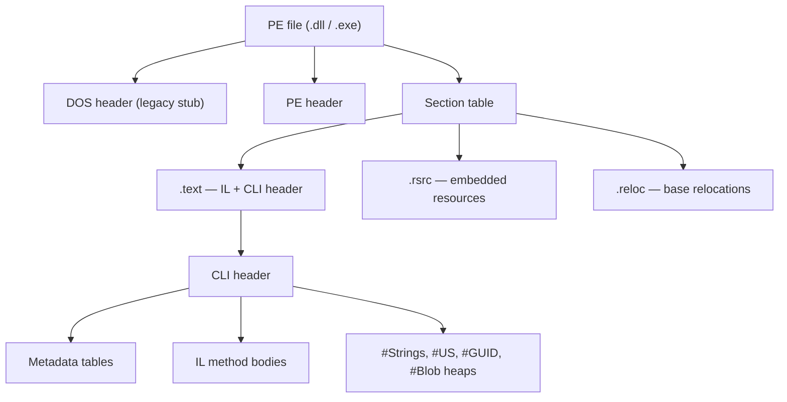

# 04. IL & Metadata

## Table of Contents

1. [What IL Is](#1-what-il-is)
2. [IL as a Stack-Based Virtual Machine](#2-il-as-a-stack-based-virtual-machine)
3. [Why IL Is CPU-Independent](#3-why-il-is-cpu-independent)
4. [Key IL Concepts](#4-key-il-concepts)
5. [Metadata in Assemblies](#5-metadata-in-assemblies)
6. [PE File Structure — Overview](#6-pe-file-structure--overview)
7. [Inspecting IL](#7-inspecting-il)

---

## 1. What IL Is

**Common Intermediate Language (CIL)** — also called **IL** or historically **MSIL (Microsoft Intermediate Language)** — is the CPU-independent bytecode every .NET compiler emits. When you build a C# project, Roslyn does not target x64 or ARM64 directly; it writes IL instructions and embeds complete type descriptions as metadata into a Portable Executable assembly (`.dll` or `.exe`).

The IL grammar and binary encoding are defined by **ECMA-335** (part of the CLI standard described in chapter 02). Any language whose compiler produces valid CLI assemblies can run on any compliant runtime and interoperate with types from other languages.

### IL’s Place in the Pipeline

```
Source code (C#, F#, VB.NET, …)
        ↓  language compiler
Assembly = IL method bodies + metadata (+ optional resources)
        ↓  CLR loader
Verified / type-checked IL in memory
        ↓  RyuJIT (per method, on demand)
Native machine code for current CPU
        ↓
CPU execution
```

JIT compilation, tiered optimization, ReadyToRun, and Native AOT are covered in chapter 03. This chapter focuses on what IL *is*, how the stack machine behaves, and how metadata enables reflection and tooling.

### Comparison With Other Portable Formats

| Property | .NET IL | Java bytecode | WebAssembly |
|---|---|---|---|
| Execution model | Stack-based VM | Stack-based VM | Stack-based VM |
| Specification | ECMA-335 | JVM spec | W3C WASM spec |
| Generics | Reified at runtime | Erased at compile time | No generics |
| Value types | First-class (`struct`) | Primitives only; objects boxed | Numeric types |
| Metadata richness | Full in-assembly reflection | Constant pool + descriptors | Minimal |
| Typical host | CoreCLR / Mono | JVM | Browser / WASI |

---

## 2. IL as a Stack-Based Virtual Machine

The CIL virtual machine is **stack-based**: each method uses an **evaluation stack** (operand stack). Instructions push values onto the stack, pop operands, compute results, and push results back. There are no general-purpose registers in the IL instruction set — the stack holds intermediate values during expression evaluation.

Conceptual evaluation of `result = a + b`:

```
Before loading a:   [ ]
After  loading a:   [ a ]
After  loading b:   [ a | b ]
After  add:         [ (a+b) ]
After  store:       [ ]      ← local variable holds (a+b)
```

The stack is **typed**: the verifier (or JIT) tracks the type of each stack slot at every instruction offset. That property makes static type-safety analysis feasible — the runtime can prove that operations never confuse incompatible types on the stack.

Real CPUs are **register-based**. RyuJIT’s register allocator maps stack slots and locals to physical registers during JIT compilation. The evaluation stack is therefore a compile-time abstraction; it does not exist as a separate runtime data structure in generated native code.

### Why Stack-Based IL Aids Verification

Verification reduces to scanning the instruction stream while maintaining stack depth and slot types. Branches that merge must agree on stack state. Structured control flow (no arbitrary jumps across method boundaries in verifiable code) keeps analysis decidable. Code marked `unsafe` or using unmanaged pointers opts out of full verification — the developer assumes responsibility for memory safety in those regions.

---

## 3. Why IL Is CPU-Independent

IL instructions express operations in a machine-neutral form: load local, add, branch if false, call method, and so on. They do not encode specific x64 or ARM64 encodings. The **same assembly file** built on a developer workstation can run on Linux ARM64 servers, Windows x64 desktops, or macOS Apple Silicon — the JIT on each machine generates code tuned for that CPU.

CPU independence delivers three platform benefits:

1. **Portability** — NuGet packages ship one IL-based assembly per target framework, not per CPU architecture (except where native assets are explicitly included).
2. **Late binding to hardware** — The JIT can use AVX, SSE, or ARM-specific features discovered at runtime rather than chosen only at compile time on a generic target.
3. **Cross-language unity** — All .NET languages emit the same IL format, so libraries compose without binary adapters.

The cost is **JIT work at startup or first call** and the need for a runtime on the target machine (unless Native AOT was used at build time — see chapter 03).

---

## 4. Key IL Concepts

You do not need to memorize opcode tables. Understanding **categories of behavior** and a few instruction families explains how C# maps to runtime behavior.

### Instruction Categories (Conceptual)

| Category | Purpose |
|---|---|
| **Load / store** | Move values among stack, arguments, locals, and fields |
| **Arithmetic** | Add, subtract, multiply, divide; `checked` maps to overflow-aware variants |
| **Branch** | Conditional and unconditional jumps implementing loops and `if` |
| **Method calls** | `call`, `callvirt`, `calli` — dispatch to methods |
| **Object creation** | `newobj`, `newarr` — heap allocations |
| **Type operations** | `box`, `unbox`, `castclass`, `isinst` — conversions and tests |
| **Return** | Exit method; pop return value for non-void methods |

### call Versus callvirt

| Instruction | Typical use | Behavior |
|---|---|---|
| **`call`** | Static methods; instance methods on **value types**; non-virtual calls resolved at compile/JIT time | Direct call — no vtable lookup |
| **`callvirt`** | Virtual methods; interface calls; **instance methods on reference types in C#** | Loads receiver’s method table slot; **null-checks receiver before entering callee** |

C# emits `callvirt` for most instance methods on reference types even when the method is not `virtual`, because `callvirt` throws `NullReferenceException` at the call site if the receiver is null. A plain `call` would allow the method body to start with a null `this` and fail less predictably inside the method.

Virtual dispatch through the method table is described further in chapter 03 (execution engine); value versus reference type semantics appear in chapter 05 (CTS).

### box and unbox

- **`box`** — Takes a value type from the stack, allocates a heap object, copies the value into it, pushes an object reference. **Always a heap allocation.**
- **`unbox` / `unbox.any`** — Takes an object reference, verifies it wraps the expected value type, copies the value out to the stack.

Boxing is explicit in IL. Generics such as `List<int>` avoid boxing element storage; non-generic collections that store `object` box value types on insert. Profiling tools and IL viewers search for `box` to find hidden allocation hot spots. Boxing semantics and performance implications from the type-system perspective are consolidated in chapter 05 — this chapter treats them as IL operations only.

### newobj

**`newobj`** allocates a new instance of a reference type (or boxed value type path via constructor pattern):

1. CLR allocates memory on the managed heap (bump-pointer allocation for small objects).
2. Memory is zero-initialized.
3. Constructor IL runs.
4. Reference to the new object is pushed on the evaluation stack.

**`newarr`** allocates arrays. Compiler-generated patterns (`async`/`await`, `yield return`, lambdas with captures) appear as extra `newobj` calls for state machine and display classes — useful when correlating GC pressure with language features.

---

## 5. Metadata in Assemblies

**Metadata** is structured binary data stored in tables inside the assembly. It describes everything the compiler knew about the program:

| Metadata content | Examples |
|---|---|
| Type definitions | Classes, structs, interfaces, enums, delegates |
| Members | Methods, fields, properties, events, parameters |
| Signatures | Return types, parameter types, generic parameters |
| Custom attributes | `[Obsolete]`, `[Serializable]`, routing attributes |
| Assembly manifest | Name, version, culture, public key token, referenced assemblies |
| Resources | Embedded files linked by name |

### What Metadata Enables

Metadata is the foundation for runtime services and frameworks that discover structure without external configuration files.

| Consumer | Uses metadata to |
|---|---|
| **CLR loader** | Resolve types, validate signatures, lay out fields |
| **JIT** | Resolve call targets, generate correct calling conventions |
| **Reflection** | Inspect and invoke types at runtime (`Type`, `MethodInfo`) |
| **Serializers** | Map JSON/XML to properties by name and type |
| **ORMs (EF Core)** | Map tables to entities from class and property metadata |
| **Dependency injection** | Select constructors and resolve parameters by type |
| **Test runners** | Discover tests from attributes on methods |
| **ASP.NET Core** | Map routes and bind models from attributes and conventions |
| **Decompilers** | Reconstruct readable source from IL + names + relationships |

Metadata survives compilation — decompilers can recover meaningful C# from a third-party DLL because names, types, and relationships remain embedded. IL supplies method bodies; metadata supplies the symbol table.

Custom attributes are themselves metadata records, not magic runtime hooks — retrieving `[Authorize]` or `[Key]` reads attribute tables through the reflection API.

---

## 6. PE File Structure — Overview

A .NET assembly is a **Portable Executable (PE)** file — the same container format used for native Windows executables — extended with a **CLI header** pointing to metadata and IL streams.



At a glance:

- **CLI header** — Entry point token, metadata root, flags (IL-only, 32-bit preferred, etc.).
- **Metadata tables** — `#~` heap with logical tables (TypeDef, MethodDef, MemberRef, AssemblyRef, …).
- **#Strings / #US / #Blob** — Name heap, user-string literals, signature and constant blobs.
- **IL stream** — Method body bytecode referenced from MethodDef rows.
- **Manifest** — Assembly identity and reference list (which other assemblies this one depends on).

Resources (images, embedded JSON, `.resx` output) typically live in the `.rsrc` section or as manifest resource records.

**Full treatment** of PE layout, manifest fields, strong names, versioning, and deployment units appears in **chapter 07 (Assemblies, DLL, and EXE)**. This chapter stops at the conceptual map: IL and metadata live together inside a PE container the VES loads.

---

## 7. Inspecting IL

Developers inspect IL to understand compiler output, third-party libraries, and allocation patterns — not to author production programs in IL.

| Tool | Typical use |
|---|---|
| **SharpLab** | Browser-based C# → IL (and optional JIT disassembly) for quick experiments |
| **ILSpy** | Open-source decompiler and IL viewer for any assembly |
| **dotPeek** | JetBrains decompiler with IL view |
| **ildasm** | SDK disassembler producing textual IL listings |
| **ilasm** | Assembles textual IL back to PE — mainly for tooling and learning |

A productive workflow: take a small C# snippet, view emitted IL, vary `virtual`, struct versus class, `checked`, and generic constraints, and observe changes to `call`/`callvirt`, `box`, and `newobj`. That builds intuition faster than memorizing opcode numbers.

Verification tools (**ilverify**, historical **PEVerify**) analyze assemblies for type-safe IL without executing them. On modern .NET, full-trust code often relies on JIT-time checks rather than load-time verification of entire assemblies — see chapter 03 for the trust model.

---

**Previous →** [03. CLR, JIT, AOT, and Execution Flow](./03.%20CLR%2C%20JIT%2C%20AOT%2C%20and%20Execution%20Flow.md)

**Next →** [05. CTS, CLS, and Cross-Language Interoperability](./05.%20CTS%2C%20CLS%2C%20and%20Cross-Language%20Interoperability.md)
