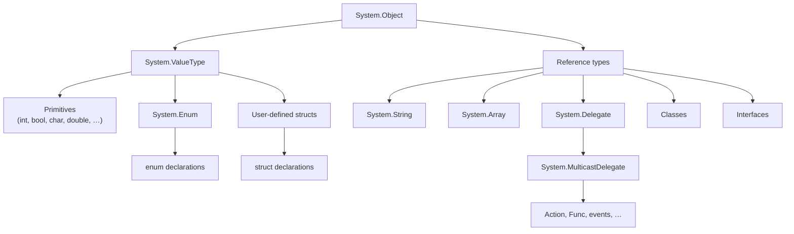
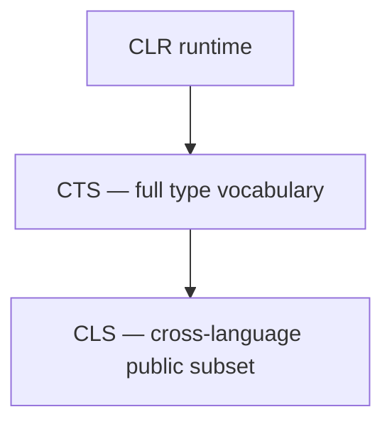
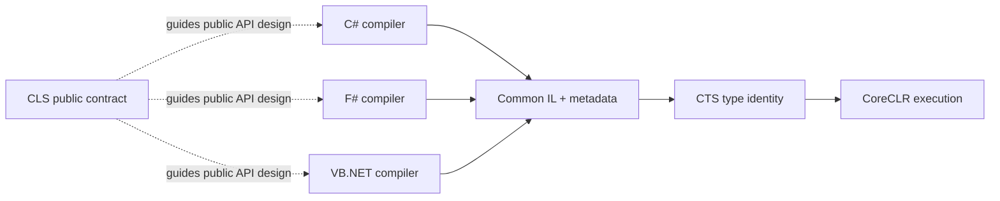

# 05. CTS, CLS, & Cross-Language Interoperability

## Table of Contents

1. [Common Type System](#1-common-type-system)
2. [Type Hierarchy](#2-type-hierarchy)
3. [Value Types vs Reference Types](#3-value-types-vs-reference-types)
4. [Boxing](#4-boxing)
5. [Common Language Specification](#5-common-language-specification)
6. [CLS Compliance Rules](#6-cls-compliance-rules)
7. [Cross-Language Interoperability](#7-cross-language-interoperability)

---

## 1. Common Type System

The **Common Type System (CTS)** is the shared type model that all .NET languages agree on. It defines how types are declared, laid out in memory, inherited, and invoked — so that code from C#, F#, and VB.NET can all work with the same objects at runtime.

Before .NET, each language had its own integer sizes and object models. Calling from one language to another required marshalling layers and fragile conversions. The CTS fixes that by mandating that every language maps to the same canonical types: there's one `System.Int32`, whether you write `int` in C#, `Integer` in VB.NET, or `int32` in F#.

Think of the CTS as the contract that makes the whole multi-language ecosystem work:

| Level | Role |
|---|---|
| **Specification** | Rules for types, inheritance, signatures, and exceptions |
| **IL / metadata** | Compilers emit CTS types into assemblies |
| **Runtime** | CoreCLR allocates objects, builds method tables, enforces casts and dispatch |

Every type ultimately derives from **`System.Object`**, which provides `Equals`, `GetHashCode`, `GetType`, and `ToString`.

---

## 2. Type Hierarchy



Key points:

- **Value types** inherit from `System.ValueType`. They include primitives, enums, and user `struct` types. Value types are implicitly sealed — you can't inherit from a struct.
- **Reference types** include classes, interfaces, delegates, arrays, and `string`. `string` is a sealed reference type with value-like equality semantics (it's immutable and `==` compares content).
- **Enums** are value types backed by an integral type; the named constants live in metadata.
- **Delegates** are reference types — think type-safe function pointers with multicast support.
- **Interfaces** can't be instantiated; they define contracts that classes and structs implement.

---

## 3. Value Types vs Reference Types

This is one of the most fundamental .NET concepts — and one of the most common interview topics.

### The Core Difference

A **value type** stores its data directly in the variable's storage location (stack frame or inline within a containing object). Assigning it copies all the data.

A **reference type** stores its data on the managed heap. The variable holds a reference (a pointer) to that heap object. Assigning it copies the reference — two variables can point to the same object.

### Memory Layout

```
Stack (method frame)          Heap
┌─────────────────────┐       ┌──────────────────────────┐
│ int x = 42          │       │ Object header            │
│ [ 42 ]              │       │ Method table pointer     │
│                     │       │ Field data …             │
│ MyClass obj ────────┼──────►│                          │
│ [ reference ]       │       └──────────────────────────┘
│ struct Point p      │
│ [ X=1 | Y=2 ]       │
└─────────────────────┘
```

### Comparison

| Characteristic | Value types | Reference types |
|---|---|---|
| Examples | `int`, `bool`, `struct`, `enum` | `class`, `interface`, `string`, `array`, `delegate` |
| Storage | Stack or inline in parent object | Heap |
| Default value | Zero / false / empty struct | `null` |
| Assignment | Copies all field data | Copies the reference |
| Nullable | Only via `Nullable<T>` (`T?`) | Inherently nullable |
| Inheritance | Sealed (no struct inheritance) | Single base class + interfaces |
| GC tracking | No (unless boxed) | Yes |
| Default equality | Structural (field-by-field) | Reference identity unless overridden |

### Why It Matters in Practice

- Mutating a **struct** through a copy only affects that copy. Pass with `ref`/`in`/`out` if you need the caller to see the change.
- Mutating a **class instance** through any reference is visible to all other references pointing to the same object.
- Small immutable structs (coordinates, GUIDs, timestamps) avoid heap allocation. Large structs copied frequently can be slower than passing a class reference.
- **`ref struct`** types like `Span<T>` are stack-only and cannot be boxed.

---

## 4. Boxing

**Boxing** is what happens when you treat a value type as an object (or interface reference). The runtime heap-allocates a wrapper, copies the value in, and hands you back a reference.

Steps:
1. Allocate an object on the managed heap.
2. Copy the value type bits into it.
3. Return an `object` or interface reference to that heap object.

**Every box is a GC allocation.** That matters on hot paths.

| Pattern | Boxes? |
|---|---|
| Non-generic collection storing value types (`ArrayList`) | Yes — stored as `object` |
| Generic `List<int>` | No — type parameter is specialized |
| Struct assigned to an interface variable | Often yes |
| Passing a value type to a method that takes `object` | Yes |

Generics eliminate most boxing for collections. `List<int>` stores ints directly with no heap allocation per element.

**`Nullable<T>`** has special rules: boxing a null nullable gives you a null reference; boxing a non-null nullable boxes the inner `T`, not the nullable wrapper itself.

To find boxing in your code: look for `box` instructions in an IL viewer, or use an allocation profiler.

---

## 5. Common Language Specification

The **CLS** is a **subset of the CTS**: the minimum set of type and naming rules that every compliant .NET language can both produce and consume. While the CTS defines everything the runtime can do, the CLS defines what library authors should expose when they want any .NET language to call them cleanly.

### The Problem CLS Solves

All .NET languages compile to IL, so binary interop works at runtime. But surface-syntax differences can make cross-language consumption awkward:

| Feature | Issue |
|---|---|
| Unsigned integers (`uint`, `ulong`) | Not natively supported in all languages |
| Case-only name differences (`Open` vs `open`) | Case-insensitive languages can't distinguish them |
| Pointer types in public signatures | Only C# and C++/CLI support raw pointers in public APIs |
| Operator-only APIs | Some languages can't invoke operators, only methods |

The CLS gives you a contract: if your public API follows these rules, callers in any compliant language can use it without friction.

### CTS vs CLS

| | CTS | CLS |
|---|---|---|
| Scope | The full type system the runtime implements | Minimum subset for cross-language public APIs |
| Audience | Compiler and runtime implementors | Library and API designers |
| Unsigned types in public API | Allowed | Discouraged — use signed types |
| Pointer types in public API | Allowed | Not CLS-compliant |
| Applies to | All code | Public and protected members of shared libraries |



CLS only applies to **public and protected** members of libraries meant for external use. Your private internals can use `uint`, pointers, `unsafe` blocks — no restriction.

The **`[CLSCompliant(true)]`** attribute at assembly level enables compiler warnings (CS3001–CS3024) when your public API breaks CLS rules. Mark deliberate exceptions with `[CLSCompliant(false)]` and provide a compliant overload.

---

## 6. CLS Compliance Rules

### Type Rules

| Rule | Non-compliant example | Compliant alternative |
|---|---|---|
| No unsigned integers in public signatures | `public uint GetCount()` | `public int GetCount()` |
| No pointer types in public signatures | `public void Copy(byte* src, int len)` | `byte[]` or `IntPtr` |
| No `sbyte` in public signatures | `public sbyte GetFlag()` | `public short GetFlag()` |

### Naming Rules

| Rule | Violation |
|---|---|
| Members must not differ only by case | `Open()` and `open()` in the same type |
| Members must not differ only by underscores | `GetValue()` and `Get_Value()` |

### Structural Rules

- Public exception types must derive from **`System.Exception`**.
- Public enum underlying types should be **`int`** (the default).
- If you expose an operator overload publicly, also provide a named method equivalent (`Add` alongside `operator+`) for languages without operator syntax.
- Use `params` arrays instead of varargs in public APIs.

### Who Needs to Care

| Scenario | CLS importance |
|---|---|
| Public NuGet library | High — you don't know who's calling it |
| Single-language app internals | None |
| Enterprise shared library (C# + VB.NET) | High |
| C#-only analyzers or source generators | Low |

Modern development is mostly C#-centric, but CLS compliance is low-cost insurance for widely distributed libraries or mixed-language legacy environments.

---

## 7. Cross-Language Interoperability

.NET cross-language interop doesn't require any source translation or adapter layer. It works because all languages compile to the same IL and metadata, share the same type system, and follow the same runtime rules.



### How the Three Pieces Fit Together

1. **IL and metadata** — Each compiler lowers its language to the same bytecode and type tables. An F# method looks like a normal IL method with a CTS signature to the CLR. C# can call it with no adapter.

2. **CTS** — Shared type identity means `System.Int32` is the same type regardless of which compiler created it. Generics are reified: `List<int>` is a real runtime type with specialized code for value type arguments.

3. **CLS** — Public APIs that follow CLS rules are callable from any compliant language without awkward casts or naming workarounds. Internal code can use the full CTS.

### Real Example

A C# team ships a product catalog library. A VB.NET app consumes it.

| API choice | Result |
|---|---|
| `public uint GetProductCount()` | VB.NET friction — unsigned not natural in older tooling |
| `public int GetProductCount()` | Maps to `Integer` in VB.NET — seamless |
| Methods differing only by case | Compile error in case-insensitive VB.NET |
| Distinct method names, signed types | Works naturally in both languages |

### Limits to Know

- F# discriminated unions compile to IL but produce class hierarchies that feel awkward from C#.
- C# `unsafe` pointers are invisible to languages without pointer syntax.
- `dynamic` in C# uses runtime binding, not a separate IL type.

For **public library surfaces**: design to CLS and stable naming. For **app internals**: use the full power of your primary language.

---

**Previous →** [04. IL and Metadata](./04.%20IL%20and%20Metadata.md)

**Next →** [06. Managed and Unmanaged Code](./06.%20Managed%20and%20Unmanaged%20Code.md)
