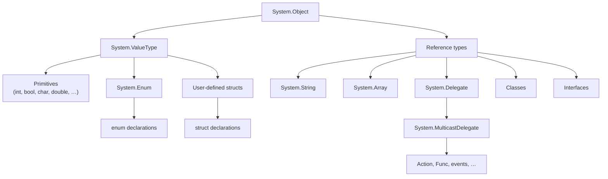
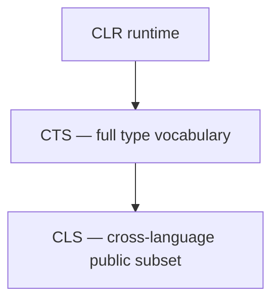
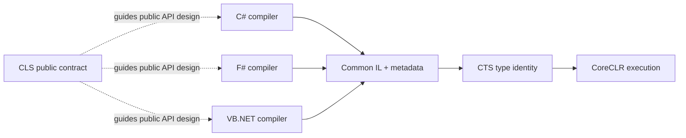

# 05. CTS, CLS, & Cross-Language Interoperability

## Table of Contents

1. [Common Type System](#1-common-type-system)
2. [Type Hierarchy](#2-type-hierarchy)
3. [Value Types Versus Reference Types](#3-value-types-versus-reference-types)
4. [Boxing](#4-boxing)
5. [Common Language Specification](#5-common-language-specification)
6. [CLS Compliance Rules](#6-cls-compliance-rules)
7. [Cross-Language Interoperability](#7-cross-language-interoperability)

---

## 1. Common Type System

The **Common Type System (CTS)** is the formal type model defined by ECMA-335. It specifies how types are declared, laid out in memory, inherited, and invoked so that code from any CLI language shares one runtime type universe.

Before .NET, each language defined its own integer sizes and object models. Inter-language calls required marshalling layers and error-prone conversions. The CTS mandates that every language map its types to canonical CLI types — there is one `System.Int32`, whether the source syntax is C# `int`, VB.NET `Integer`, or F# `int32`.

The CTS operates at three levels:

| Level | Role |
|---|---|
| **Specification** | ECMA-335 rules for types, signatures, inheritance, exceptions |
| **IL / metadata** | Compilers emit CTS types and typed instructions (`newobj`, `box`, …) |
| **Runtime** | CoreCLR allocates objects, builds method tables, enforces casts and virtual dispatch |

Every type derives ultimately from **`System.Object`**, which provides `Equals`, `GetHashCode`, `GetType`, and `ToString`. The CTS defines value versus reference semantics, generic instantiation, delegate types, interface contracts, and visibility rules — the vocabulary chapter 04 assumes when describing IL operations.

---

## 2. Type Hierarchy



Observations:

- **Value types** inherit from `System.ValueType` (which inherits `Object`). They include primitives, enums, and user `struct` types. Value types are implicitly sealed.
- **Reference types** include classes, interfaces, delegates, arrays, and `string`. `string` is a sealed reference type with value-like equality semantics implemented in the library.
- **Enums** are value types backed by an integral underlying type; named constants exist in metadata.
- **Delegates** are reference types (multicast function pointers with type-safe signatures).

Interfaces are reference types in the CTS but cannot be instantiated — they define contracts implemented by classes and structs.

---

## 3. Value Types Versus Reference Types

This distinction governs assignment, nullability, inheritance, performance, and equality behavior.

### Definitions

A **value type** stores its data **directly** in the variable’s storage location (stack frame or inline within a containing object). Assignment **copies all field data**.

A **reference type** stores its data on the **managed heap**. The variable holds a **reference** (managed pointer) to that object. Assignment **copies the reference**, not the object — two variables may alias the same heap instance.

### Memory Layout (Conceptual)

```
Stack (method frame)          Heap
┌─────────────────────┐       ┌──────────────────────────┐
│ int x = 42          │       │ Object header            │
│ [ 42 ]              │       │ Method table pointer     │
│                     │       │ Field data …             │
│ MyClass obj ────────┼──────►│                          │
│ [ reference ]       │       └──────────────────────────┘
│ struct Point p      │
│ [ X=1 | Y=2 ]       │
└─────────────────────┘
```

### Comparison Table

| Characteristic | Value types | Reference types |
|---|---|---|
| Examples | `int`, `bool`, `struct`, `enum` | `class`, `interface`, `string`, `array`, `delegate` |
| Storage | Stack or inline in parent | Heap |
| Default | Zero / false / empty struct | `null` |
| Assignment | Copies data | Copies reference |
| Nullable | Only via `Nullable<T>` (`T?`) | Inherently nullable |
| Inheritance | Sealed (no struct inheritance) | Single base class + interfaces |
| GC tracking | No (unless boxed) | Yes |
| Default equality | Structural (via `ValueType`; override recommended) | Reference identity unless overridden |

### Practical Consequences

- Mutating a **struct** through a copy affects only that copy unless `ref`/`in`/`out` passes by reference.
- Mutating an object through one **reference** variable is visible through all references to the same instance.
- Small immutable structs (coordinates, GUIDs, dates) avoid heap allocation; large structs copied frequently can cost more than passing a reference to a class.
- **`ref struct`** types (e.g., `Span<T>`) are stack-only and cannot be boxed — see advanced memory topics in chapter 10.

IL instructions `ldobj`, `stobj`, `box`, and `newobj` implement these semantics at bytecode level (chapter 04).

---

## 4. Boxing

**Boxing** converts a value type to a reference type by heap-allocating an object wrapper and copying the value into it. **Unboxing** extracts the value back with a runtime type check.

Steps when boxing:

1. Allocate object on managed heap.
2. Copy value type bits into the object.
3. Produce an `object` or interface reference pointing at that heap object.

Every box is a **GC allocation**. Hot paths that treat value types as `object` or store them in non-generic collections cause recurring boxing pressure.

| Pattern | Boxes? |
|---|---|
| Non-generic collection storing value types | Yes — storage is `object` |
| Generic `List<int>` | No — type parameter is `int` |
| Struct assigned to interface-typed variable | Often yes — dispatch may require heap wrapper |
| APIs taking `object` parameters | Value arguments may box |

Generics with reified type parameters (`List<T>`) eliminate most boxing for collections. **`Nullable<T>`** has special boxing rules: boxing a null nullable yields a null reference; boxing a non-null nullable boxes the underlying `T`, not the nullable struct itself.

Detect boxing via IL viewers (search for `box`), allocation profilers, and benchmark memory diagnosers. Chapter 10 expands heap and GC interaction; chapter 04 names the IL instructions.

---

## 5. Common Language Specification

The **Common Language Specification (CLS)** is a **subset of the CTS**: rules for types and naming that **every compliant .NET language can consume and produce** in public APIs. While the CTS defines everything the runtime *can* do, the CLS defines what library authors should expose when they expect callers writing C#, VB.NET, F#, or other CLI languages.

### The Problem CLS Solves

All .NET languages compile to IL, so binary interoperability already works at runtime. Surface-syntax differences still break *source-level* consumption:

| Feature | Issue across languages |
|---|---|
| Unsigned integers (`uint`, `ulong`) | Not natively supported in all languages |
| Case-only name differences (`Open` vs `open`) | Case-insensitive languages cannot distinguish members |
| Pointer types in public signatures | Only C# / C++ / CLI expose pointers in public APIs |
| Operator-only APIs | Some languages cannot invoke operators but can call methods |

Without CLS rules, a C# library could expose public APIs that VB.NET or F# consumers cannot call naturally. The CLS is the **contract for public cross-language surfaces**.

### CLS Versus CTS

| Dimension | CTS | CLS |
|---|---|---|
| Scope | Entire type system the runtime implements | Minimum subset for public cross-language APIs |
| Audience | Compiler and runtime implementors | Library and API designers |
| Unsigned types in public API | Allowed | Discouraged — use signed equivalents |
| Pointer types in public API | Allowed | Not CLS-compliant |
| Applies to | All code | Public and protected members intended for external use |



**Scope rule:** CLS applies to **public and protected** members of libraries meant for broad consumption. Private implementation details and internal types may use any CTS feature — `uint`, pointers, `unsafe` blocks — without CLS restriction.

The **`CLSCompliant`** attribute marks assemblies or members for compiler warnings (CS3001–CS3024 series) when public API surface violates CLS rules. Assembly-level `[assembly: CLSCompliant(true)]` enables checking; `[CLSCompliant(false)]` on specific members documents intentional exceptions paired with compliant overloads.

---

## 6. CLS Compliance Rules

### Type Rules

| Rule | Non-compliant example | Compliant alternative |
|---|---|---|
| No unsigned integers in public signatures | `public uint GetCount()` | `public int GetCount()` |
| No pointer types in public signatures | `public void Copy(byte* src, int len)` | `byte[]` or `IntPtr` |
| No `sbyte` in public signatures | `public sbyte GetFlag()` | `public short GetFlag()` |
| Public arrays are zero-based | N/A (CLR default) | Standard single-dimensional arrays |

### Naming Rules

| Rule | Violation |
|---|---|
| Members must not differ only by case | `Open()` and `open()` in the same type |
| Members must not differ only by underscores | `GetValue()` and `Get_Value()` |
| Identifiers follow Unicode normalized naming | Private-use Unicode in public names |

### Structural Rules

- Public exception types must derive from **`System.Exception`**.
- Public enum underlying types should be **`int`** (default).
- If an operator overload is public, provide a named method equivalent (e.g., `Add` alongside `operator+`) for languages without operator syntax.
- Custom attributes on public members must use CLS-compliant constructor argument types.
- Avoid vararg calling conventions in public APIs — use `params` arrays instead.

### Who Must Care

| Scenario | CLS importance |
|---|---|
| Public NuGet libraries | High — unknown consumer languages |
| Single-language application internals | None |
| Enterprise shared libraries (C# + legacy VB.NET) | High |
| C#-only analyzers / source generators | Low |

Modern development is C#-centric, but CLS compliance remains low-cost insurance for widely distributed libraries and organizations with mixed-language legacy codebases.

---

## 7. Cross-Language Interoperability

Cross-language interop on .NET rests on three cooperating layers — not on source translation between languages.



### How the Pieces Fit

1. **IL and metadata** — Each compiler lowers language-specific syntax to the same bytecode and type tables. A method compiled from F# appears to the CLR as IL with a standard CTS signature; C# can call it with no adapter.

2. **CTS** — Shared type identity ensures `System.Int32` from any compiler is the same runtime type. Generics are reified: `List<int>` is a real runtime type with specialized code paths for value type arguments. Inheritance, interfaces, and exceptions follow common rules.

3. **CLS** — Public APIs that stay within CLS rules are callable from any compliant language without awkward casts or naming conflicts. Internal modules can use full CTS expressiveness.

### Example Scenario

A C# team ships a product catalog library. A VB.NET enterprise application consumes it.

| API choice | Cross-language result |
|---|---|
| `public uint GetProductCount()` | VB.NET friction — unsigned not native in older tooling |
| `public int GetProductCount()` | Natural `Integer` mapping in VB.NET |
| Methods differing only by case | Compile error in case-insensitive VB.NET |
| `public Product Find(long id)` with distinct method names | Seamless consumption |

The CLS-compliant surface uses signed types, distinct method names, and exception types deriving from `System.Exception` — so call sites in any compliant language require no special interop shims.

### Limits of Interoperability

Not every language feature maps elegantly across compilers:

- F# discriminated unions and modules compile to IL but may produce naming patterns awkward from C#.
- C# `unsafe` pointers are invisible to languages without pointer syntax.
- `dynamic` in C# uses runtime binding, not a separate IL type system.

For **library public surfaces**, design to CLS + stable naming; for **application internals**, use the full power of your primary language.

F# and C# can reference each other’s assemblies directly because both emit CLI assemblies — the runtime sees one type system. Language-specific ergonomics differ; binary compatibility is guaranteed by IL + CTS; source-level ergonomics are guaranteed by CLS for public APIs.

---

**Previous →** [04. IL and Metadata](./04.%20IL%20and%20Metadata.md)

**Next →** [06. Managed and Unmanaged Code](./06.%20Managed%20and%20Unmanaged%20Code.md)
