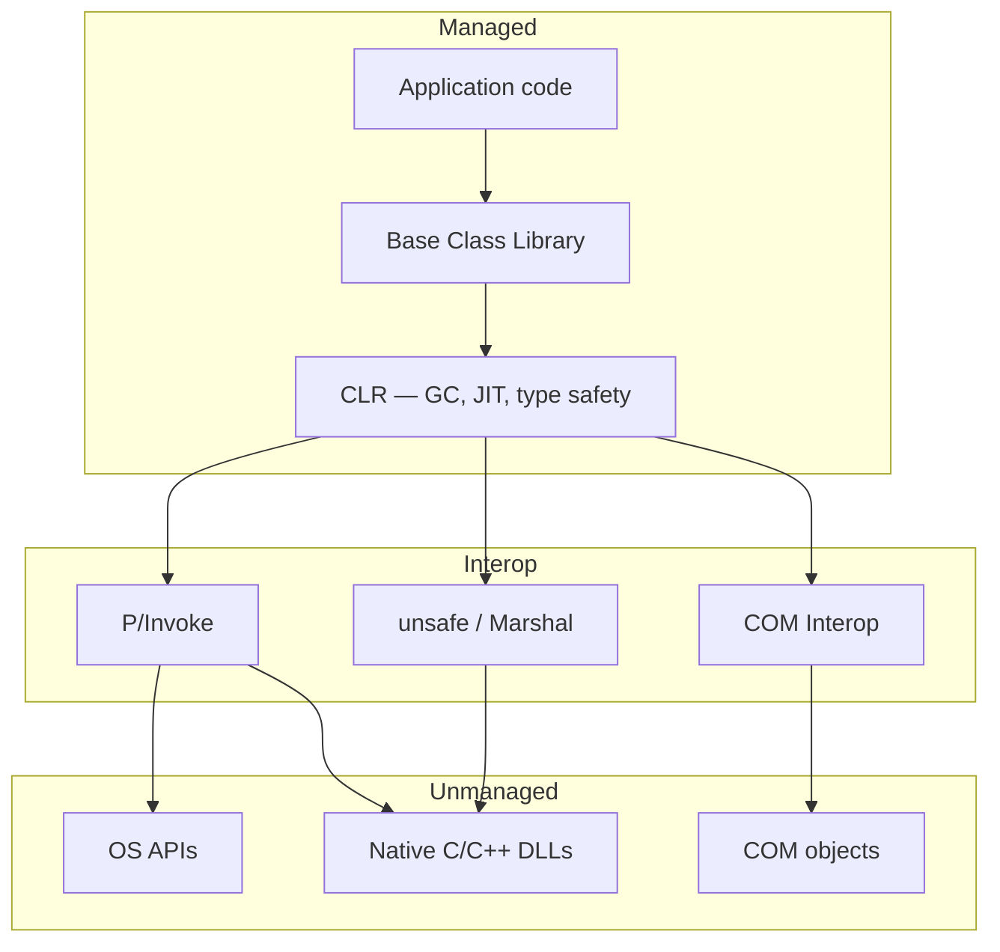

# 06. Managed & Unmanaged Code

Every .NET application lives at the boundary between two worlds: code the CLR supervises, and code that runs directly on the operating system. Knowing that boundary — what each side owns, how crossing it works, and how unmanaged resources get released — comes up in architecture discussions, debugging interop failures, and designing wrappers around native APIs.

---

## Table of Contents

1. [Managed Code](#1-managed-code)
2. [Unmanaged Code](#2-unmanaged-code)
3. [Why Unmanaged Code Still Exists](#3-why-unmanaged-code-still-exists)
4. [Crossing the Boundary — P/Invoke, COM Interop, and unsafe](#4-crossing-the-boundary--pinvoke-com-interop-and-unsafe)
5. [Releasing Unmanaged Resources — IDisposable](#5-releasing-unmanaged-resources--idisposable)
6. [Summary](#6-summary)

---

## 1. Managed Code

**Managed code** is any code that runs under CLR supervision. The CLR allocates objects on the managed heap, tracks which objects are still reachable, reclaims dead ones through the garbage collector, verifies type safety, and provides structured exception handling across all .NET languages.

All C#, F#, and VB.NET code is managed by default. From your perspective as a developer, you never call `malloc` or `free` — you create objects and let the runtime decide when to reclaim memory.

### What the CLR Gives You

| Capability | What it means in practice |
|---|---|
| Automatic memory management | GC frees objects when nothing references them anymore |
| Type safety | Illegal casts and invalid memory accesses are caught before they corrupt the process |
| Bounds checking | Array accesses are validated; out-of-range throws a defined exception |
| Structured exceptions | `try` / `catch` / `finally` is a first-class runtime mechanism |
| Metadata and reflection | Every assembly is self-describing — usable by frameworks at runtime |
| Thread infrastructure | Thread pool, task scheduling, and async state machines are built-in runtime services |

Managed code can't, in normal usage, dereference arbitrary memory addresses or corrupt the heap with a stray pointer. The tradeoff: a small amount of runtime overhead in exchange for safety and productivity.

---

## 2. Unmanaged Code

**Unmanaged code** runs directly on the OS without CLR oversight. You're responsible for everything: allocating memory, freeing it with the right call, and making sure every pointer is valid. There's no garbage collector, no IL verifier, and a bad cast or buffer overrun won't produce a nice .NET exception — it will likely crash the process.

In practice, the unmanaged code you'll encounter most as a .NET developer comes from native C/C++ libraries, Win32 and OS APIs, and COM components.

### Typical Sources

| Source | Examples |
|---|---|
| OS APIs | File handles, process/thread APIs, networking at the native layer |
| Native libraries | Cryptography, compression, image processing, GPU runtimes, database drivers |
| COM components | Office automation, legacy enterprise middleware, Shell extensions |
| Device interfaces | Hardware with a native API surface |

### Managed vs Unmanaged at a Glance

| | Managed | Unmanaged |
|---|---|---|
| Memory | GC on managed heap | Developer-managed (malloc/free, new/delete) |
| Type safety | Enforced by CLR | Developer's responsibility |
| Exception model | CLR structured exceptions | OS-specific (e.g. SEH on Windows) |
| Performance ceiling | Very high with modern JIT | Maximum — direct hardware access |
| Memory corruption risk | Near zero in verified code | High without disciplined coding |
| Primary languages | C#, F#, VB.NET | C, C++, assembly |

---

## 3. Why Unmanaged Code Still Exists

Real applications cross the boundary constantly. Opening a file uses OS handles. Calling a cryptographic library means calling into C. Automating Office means COM. GPU drivers are native. The boundary isn't a legacy corner case — it's a normal part of platform architecture.

A few reasons unmanaged code persists:

- **Performance-critical paths** still benefit from hand-tuned native code, SIMD, and allocation patterns that avoid GC pressure entirely.
- **OS APIs** are native exports — there's no managed wrapper for every Windows or Linux syscall.
- **Legacy investment** — decades of C++ business logic and COM servers is too expensive to rewrite; interop wraps it incrementally.
- **Cross-language shared libraries** — C remains the common denominator that Python, Rust, Java, and .NET can all call through a stable native ABI.

The CLR never lets managed references alias unmanaged memory directly. Every crossing goes through a defined interop mechanism, keeping the managed heap and type system coherent.

---

## 4. Crossing the Boundary — P/Invoke, COM Interop, and unsafe

Three mechanisms let managed code talk to the unmanaged world. The goal here is to understand what each one does and when to use it — not to memorize all the API details.

### P/Invoke

**P/Invoke** is how you call functions exported from native DLLs. You declare a method with `[DllImport]`; at first use, the CLR loads the DLL, finds the export, converts arguments from managed to native layouts (**marshaling**), calls the function, and converts results back.

Marshaling is where most P/Invoke problems live. Simple numeric types often copy directly. Strings become pointers to null-terminated buffers. Structs copy field-by-field or get pinned in place. Getting calling convention, character encoding, or struct layout wrong causes subtle crashes — often far from the call site.

P/Invoke is how .NET talks to Win32, C libraries, and anything with a flat C export table. Modern .NET also supports source-generated interop that shifts marshaling to compile time for better performance.

### COM Interop

**COM** is a binary component standard from the early 1990s, still used by Office, WMI, and much of Windows middleware. COM objects expose interfaces through vtables, use reference counting (`AddRef`/`Release`) for lifetime, and return `HRESULT` codes instead of .NET exceptions.

When managed code calls a COM object, the CLR creates a **Runtime Callable Wrapper (RCW)** — a managed proxy that translates calls into COM vtable dispatches and converts HRESULTs into .NET exceptions.

When a COM client calls a .NET object, the CLR creates a **COM Callable Wrapper (CCW)** that exposes the managed object as a COM server.

COM lifetime is reference-counted, not garbage-collected, so RCW cleanup sometimes needs explicit release rather than waiting for the GC.

### unsafe and Direct Memory Access

The **`unsafe`** keyword allows C# blocks where pointer types, address-of operations, and pointer arithmetic are legal. The CLR still runs this code, but the verifier skips type-safety checks for those regions.

The **`fixed`** statement pins a managed object so the GC can't move it while a native pointer to its interior is live. Useful when passing a managed array's buffer to native code. Pinning has a performance cost because pinned objects block heap compaction.

**`Marshal`** (in `System.Runtime.InteropServices`) provides helpers for allocating/freeing unmanaged memory, copying bytes between managed and unmanaged buffers, and converting strings and structs — without needing `unsafe` blocks.

**`Span<T>`** and **`Memory<T>`** offer safe, efficient views over contiguous memory (including native buffers), which reduces the need for raw pointers in many scenarios.

| Mechanism | Direction | Best for |
|---|---|---|
| P/Invoke | Managed → native C exports | OS APIs, C libraries, flat function tables |
| COM Interop (RCW) | Managed → COM | Office, legacy Windows components |
| COM Interop (CCW) | COM → managed | Exposing .NET types to COM clients |
| unsafe / Marshal | Managed ↔ memory layout | Performance buffers, complex native structures |

---

## 5. Releasing Unmanaged Resources — IDisposable

The GC manages managed memory automatically. It has no awareness of **unmanaged resources** — file handles, sockets, database connections, native memory, COM references, or window handles. If those aren't released explicitly, they leak until the process exits.

**`IDisposable`** is the .NET pattern for **deterministic cleanup**. Implement `Dispose()` to release unmanaged resources as soon as the consumer is done. A `using` statement (or `using` declaration) guarantees `Dispose()` runs even if an exception is thrown.

The full dispose pattern distinguishes two paths:
- **Explicit `Dispose()`**: both managed and unmanaged resources can be released safely.
- **Finalizer only** (when the consumer forgot to dispose): only release unmanaged resources — other managed fields may already be collected by then.

Call **`GC.SuppressFinalize(this)`** after explicit disposal to skip the finalizer for objects that no longer need it.

For OS handles from P/Invoke, use **`SafeHandle`** types from the BCL instead of raw `IntPtr`. `SafeHandle` integrates with the GC so handles aren't collected while a native call is still in progress.

---

## 6. Summary

| Concept | Takeaway |
|---|---|
| Managed code | Runs under CLR — GC, type safety, structured exceptions; all C#/F#/VB.NET by default |
| Unmanaged code | Native binary — developer owns memory; OS APIs, C/C++, COM |
| P/Invoke | Call native DLL exports; marshaling converts types across the boundary |
| COM Interop | RCW wraps COM for .NET; CCW exposes .NET to COM; reference counting, not GC |
| unsafe / Marshal | Direct memory work; `fixed` pins objects for native access; `Span<T>` is the safer alternative |
| IDisposable | Deterministic release of unmanaged resources; full pattern covered in the GC chapter |

The managed/unmanaged boundary is always crossed through a defined interop mechanism — never by treating a native pointer as an ordinary managed reference. That discipline is what lets .NET combine the safety of a managed runtime with full access to the native ecosystem.

---

**Previous →** [05. CTS, CLS, and Cross-Language Interoperability](./05.%20CTS%2C%20CLS%2C%20and%20Cross-Language%20Interoperability.md)

**Next →** [07. Assemblies, Loading, Strong Naming, and GAC](./07.%20Assemblies%2C%20Loading%2C%20Strong%20Naming%2C%20and%20GAC.md)
