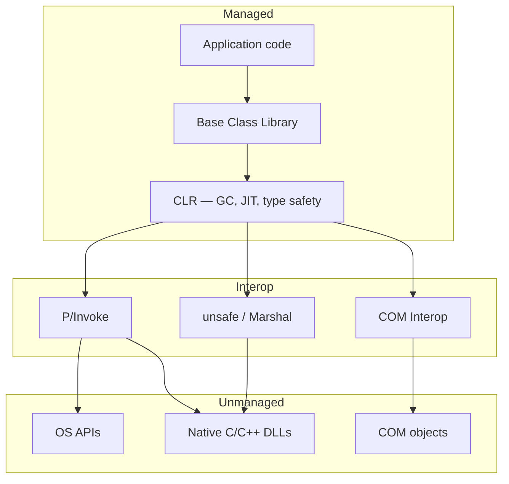

# 06. Managed & Unmanaged Code

Every .NET application lives at the boundary between two worlds: code the Common Language Runtime supervises, and code that runs directly on the operating system. Understanding that boundary — what each side owns, how crossing it works, and how unmanaged resources are released — is essential for reading platform architecture, debugging interop failures, and designing libraries that wrap native APIs.

---

## Table of Contents

1. [Managed Code](#1-managed-code)
2. [Unmanaged Code](#2-unmanaged-code)
3. [Why Unmanaged Code Still Exists](#3-why-unmanaged-code-still-exists)
4. [Crossing the Boundary — P/Invoke, COM Interop, and unsafe](#4-crossing-the-boundary--pinvoke-com-interop-and-unsafe)
5. [Releasing Unmanaged Resources — IDisposable](#5-releasing-unmanaged-resources--idisposable)
6. [Summary](#6-summary)

---

## 1. Managed Code

**Managed code** is any code that executes under the supervision of the Common Language Runtime. The word *managed* does not describe who wrote the code; it describes who owns execution. When the CLR runs your program, it allocates objects on the managed heap, tracks reachability, reclaims dead objects through the garbage collector, verifies type safety before and during execution, and provides structured exception handling that works consistently across all .NET languages.

All code written in C#, F#, and VB.NET is managed by default. Source compiles to Intermediate Language, as described in **Intermediate Language (IL)**, and the CLR JIT-compiles that IL into native machine instructions at runtime, as covered in **CLR and Program Execution**. From the developer's perspective, you never call `malloc` or `free`; you create objects and the runtime decides when memory can be reclaimed.

### What the CLR Provides to Managed Code

| Capability | What it means in practice |
|---|---|
| Automatic memory management | Objects live on the managed heap; the GC frees them when no roots reference them |
| Type safety | Illegal casts, invalid method calls, and many memory errors are caught before they corrupt the process |
| Bounds checking | Array and buffer accesses are validated; out-of-range access throws a defined exception |
| Structured exceptions | `try` / `catch` / `finally` is a first-class CLR mechanism, not an OS add-on |
| Metadata and reflection | Every assembly carries self-describing type information usable by tools at runtime |
| Thread infrastructure | Thread pool, task scheduling, and async state machines are runtime services |

Managed code cannot, in normal usage, dereference arbitrary memory addresses or corrupt the heap through a stray pointer. The runtime either prevents the operation at verification time or throws a well-defined exception at execution time. That tradeoff — a small amount of runtime overhead in exchange for safety and productivity — is the core design decision behind .NET's execution model.

---

## 2. Unmanaged Code

**Unmanaged code** runs directly on the operating system without CLR oversight. The developer is fully responsible for memory: allocation with native allocators, deallocation with matching free operations, and correctness of every pointer. There is no garbage collector, no IL verifier, and no guarantee that a bad cast or buffer overrun will produce a catchable .NET exception — the process may crash with an access violation.

The most common forms of unmanaged code in a .NET developer's world are **native C and C++ libraries**, **Win32 and other OS APIs**, and **COM components** — binary components that predate .NET and still power large parts of the Windows ecosystem.

### Typical Sources of Unmanaged Code

| Source | Examples |
|---|---|
| Operating system APIs | File I/O handles, process and thread APIs, windowing, networking at the native layer |
| Native libraries | Cryptography, compression, image processing, database drivers, GPU runtimes |
| COM components | Office automation, legacy enterprise middleware, Shell extensions |
| Device and driver interfaces | Hardware that exposes a native API surface |

### Managed vs Unmanaged — At a Glance

| Characteristic | Managed | Unmanaged |
|---|---|---|
| Memory | GC on managed heap | Developer-managed (malloc/free, new/delete) |
| Type safety | Enforced by CLR | Developer and compiler responsibility |
| Exception model | CLR structured exceptions | OS-specific mechanisms (e.g. SEH on Windows) |
| GC pauses | Possible during collections | None |
| Performance ceiling | Very high with modern JIT | Maximum direct hardware access |
| Memory corruption risk | Near zero in verified code | High without disciplined coding |
| Primary languages | C#, F#, VB.NET | C, C++, assembly |

---

## 3. Why Unmanaged Code Still Exists

Despite the productivity of managed development, unmanaged code remains everywhere. Real applications cross the boundary constantly — opening files through OS handles, calling cryptographic libraries written in C, automating Office through COM, or invoking GPU drivers. The boundary is not a legacy corner case; it is a normal part of platform architecture.

**Performance-critical paths** still benefit from hand-tuned native code, SIMD, and allocation patterns that avoid GC pressure entirely. **OS APIs** are exposed as native exports; there is no managed wrapper for every Windows or Linux syscall. **Legacy investment** — decades of C++ business logic and COM servers — is too expensive to rewrite wholesale; interop wraps existing binaries incrementally. **Cross-language shared libraries** written in C remain the common denominator that Python, Rust, Java, and .NET can all call through a stable native ABI.

The CLR never allows managed references to alias unmanaged memory directly. Every crossing uses a defined interop mechanism, which keeps the managed heap and type system coherent even when native code runs inside the same process.

---

## 4. Crossing the Boundary — P/Invoke, COM Interop, and unsafe

Three families of mechanisms let managed code interact with the unmanaged world. This section treats them conceptually; the goal is to understand *what* each does and *when* it applies, not to memorize API syntax.

### P/Invoke — Platform Invocation Services

**P/Invoke** is the CLR's built-in way to call functions exported from native DLLs. You declare that a method's implementation lives in an external library; at first use, the runtime loads the DLL, locates the export, converts arguments from managed representations to native layouts (**marshaling**), invokes the function, and converts results back.

Marshaling is the heart of P/Invoke. Simple numeric types often copy directly. Strings become pointers to null-terminated character buffers. Structures may copy field-by-field or pin in place depending on layout. Getting calling convention, character encoding, or structure layout wrong causes subtle crashes or data corruption — often far from the call site.

P/Invoke is how .NET talks to Win32, many cross-platform C libraries, and any API that exposes a flat C export table. Modern .NET also offers source-generated interop that moves marshaling to compile time for better performance and ahead-of-time compatibility; the conceptual model remains the same.

### COM Interop

**COM (Component Object Model)** is a binary component standard from the early 1990s, still used by Office, WMI, and much Windows middleware. COM objects expose interfaces through vtables, use reference counting for lifetime (`AddRef` / `Release`), and return **`HRESULT`** status codes instead of .NET exceptions.

When managed code consumes a COM object, the CLR creates a **Runtime Callable Wrapper (RCW)** — a managed proxy that translates method calls into COM vtable dispatches and converts failures into .NET exceptions. When a COM client must call a .NET object, the CLR creates a **COM Callable Wrapper (CCW)** that exposes the managed object as a COM server. COM lifetime is reference-counted, not garbage-collected, so RCW cleanup sometimes requires explicit release beyond ordinary GC.

COM Interop remains relevant for legacy integration; new greenfield design on Windows typically prefers other approaches, but existing COM servers are still invoked daily from .NET applications.

### The unsafe Keyword and Direct Memory Access

The **`unsafe`** keyword allows C# blocks where pointer types, address-of operations, and pointer arithmetic are permitted. Code in `unsafe` regions is still IL executed by the CLR, but the verifier skips type-safety checks for those regions — similar in spirit to C pointers, with corresponding risk.

The **`fixed`** statement pins a managed object so the GC cannot move it while a native pointer to its interior is live — necessary when passing managed array memory to native code. Pinning has a performance cost because pinned objects block heap compaction.

**`System.Runtime.InteropServices.Marshal`** provides helpers to allocate and free unmanaged memory, copy bytes between managed and unmanaged buffers, and convert strings and structures without writing `unsafe` code. For many scenarios, **`Span<T>`** and **`Memory<T>`** offer safe, efficient views over contiguous memory including native buffers, reducing the need for raw pointers.

| Mechanism | Direction | Best for |
|---|---|---|
| P/Invoke | Managed calls native C exports | OS APIs, C libraries, flat function tables |
| COM Interop (RCW) | Managed calls COM | Office, legacy Windows components |
| COM Interop (CCW) | COM calls managed | Exposing .NET types to COM clients |
| unsafe / Marshal | Managed manipulates memory layout | Performance buffers, complex native structures |

---

## 5. Releasing Unmanaged Resources — IDisposable

The garbage collector manages **managed** object memory automatically. It has no knowledge of **unmanaged resources** — file handles, sockets, database connections, native memory blocks, COM references, or window handles. If those are never released explicitly, they leak until the process exits.

**`IDisposable`** is the .NET pattern for **deterministic cleanup**. A type implements `Dispose()` to release unmanaged resources promptly when the consumer is done — typically through a `using` statement that guarantees `Dispose()` runs even when an exception is thrown.

The full dispose pattern distinguishes two paths: when the consumer calls `Dispose()` explicitly, both managed and unmanaged resources can be released safely; when cleanup happens only from a **finalizer** (destructor) because the consumer forgot, only unmanaged resources should be touched because other managed fields may already be collected. Calling **`GC.SuppressFinalize`** after explicit disposal avoids an extra GC cycle for objects that no longer need finalization.

For OS handles returned from P/Invoke, the Base Class Library provides **`SafeHandle`** types that encapsulate reliable release logic instead of raw pointer values. **`SafeHandle`** integrates with the GC so handles are not collected while a native call is in progress.

Garbage collection mechanics, finalizer behavior, and the interaction between finalizers and `Dispose()` are covered in **Garbage Collection and Memory**. This chapter establishes the boundary: managed memory is the GC's job; unmanaged resources are the application's job through `IDisposable` and related patterns.

---

## 6. Summary

| Concept | Takeaway |
|---|---|
| Managed code | Runs under CLR — GC, type safety, structured exceptions; all C#/F#/VB.NET by default |
| Unmanaged code | Native binary — developer owns memory; OS APIs, C/C++, COM |
| P/Invoke | Call native DLL exports; marshaling converts types across the boundary |
| COM Interop | RCW wraps COM for .NET; CCW exposes .NET to COM; reference counting, not GC |
| unsafe / Marshal | Direct memory work when P/Invoke alone is insufficient; pinning has GC cost |
| IDisposable | Deterministic release of unmanaged resources; full pattern detailed in **Garbage Collection and Memory** |

The managed/unmanaged boundary is crossed only through defined interop — never by treating a native pointer as an ordinary managed reference. That discipline is what lets .NET combine the safety of a managed runtime with access to the entire native ecosystem.

---

**Previous →** [05. CTS, CLS, and Cross-Language Interoperability](./05.%20CTS%2C%20CLS%2C%20and%20Cross-Language%20Interoperability.md)

**Next →** [07. Assemblies, Loading, Strong Naming, and GAC](./07.%20Assemblies%2C%20Loading%2C%20Strong%20Naming%2C%20and%20GAC.md)
