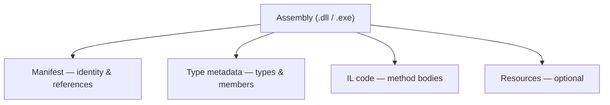

# 07. Assemblies, Loading, Strong Naming, & GAC

An assembly is the fundamental unit of deployment, identity, and loading in .NET. Every project compiles to one or more assemblies; the runtime loads them, resolves dependencies, and uses their embedded metadata to execute your code. This chapter covers what assemblies contain, how they differ from plain DLL files, how .NET Framework shared them through the Global Assembly Cache, and how modern .NET replaces that with private deployment and NuGet.

---

## Table of Contents

1. [What Is an Assembly?](#1-what-is-an-assembly)
2. [Assembly Types](#2-assembly-types)
3. [EXE vs DLL](#3-exe-vs-dll)
4. [Assembly Structure — Manifest and Metadata](#4-assembly-structure--manifest-and-metadata)
5. [Strong Naming](#5-strong-naming)
6. [The Global Assembly Cache (GAC)](#6-the-global-assembly-cache-gac)
7. [Assembly Loading and Binding](#7-assembly-loading-and-binding)
8. [Modern .NET — NuGet and Private Deployment](#8-modern-net--nuget-and-private-deployment)
9. [Summary](#9-summary)

---

## 1. What Is an Assembly?

An assembly is the **smallest deployable unit** the CLR understands. Physically it's a `.dll` or `.exe` on disk, but calling it "just a DLL" undersells what it actually is — an assembly is a **self-describing package**: versioned, named, and bundling your types, resources, and dependency list all in one place.

What makes it self-describing is the combination of:
- a **manifest** (identity + list of referenced assemblies)
- **type metadata** (complete descriptions of every type and member)
- **IL code** (method bodies)
- optionally, **embedded resources** (strings, images, localization data)

Because metadata is embedded, tools like debuggers, serializers, DI containers, and decompilers can inspect compiled output without separate header files. You never ship a `.h` file alongside your `.dll` — the assembly tells the runtime everything it needs.

---

## 2. Assembly Types

### Private Assemblies

A **private assembly** ships inside your application's own folder. Only that application uses it — no machine-wide registration needed. Copying the publish folder is enough. Two apps on the same machine can each carry different versions of the same library with zero conflict, because their copies are isolated in separate folders.

Private deployment is the **default in modern .NET** — every dependency gets copied to your output directory at build time.

### Shared Assemblies (.NET Framework Only)

In **.NET Framework**, a **shared assembly** was installed into the **Global Assembly Cache (GAC)** — a machine-wide store where multiple apps could reference one physical copy. Shared assemblies required strong names so the CLR could tell versions and publishers apart. Useful for saving disk space, but painful for versioning and deployments.

Modern .NET does not use the GAC for application code. This problem is solved.

### Satellite Assemblies

A **satellite assembly** holds **localized resources** — translated strings, images — for a main assembly, linked to a specific culture (e.g. `fr-FR`). The main assembly stays culture-neutral; the resource manager picks the right satellite at runtime based on the user's culture settings.

This lets you add language support without recompiling the core assembly.

### Single-File vs Multi-File Assemblies

| Form | Description | Status |
|---|---|---|
| **Single-file** | One `.dll` or `.exe` containing everything | Standard — what you always produce |
| **Multi-file** | One manifest + separate `.netmodule` files | .NET Framework only; obsolete |

Don't confuse multi-file assemblies with **single-file publish** (`dotnet publish -p:PublishSingleFile=true`) — that bundles many assemblies into one deployment artifact, but each assembly internally still has its own manifest and metadata.

---

## 3. EXE vs DLL

Both `.exe` and `.dll` are **Portable Executable (PE)** files — same format, same structure. The difference is whether the file has an entry point.

| Property | DLL | EXE |
|---|---|---|
| Entry point | None | Has a startup method |
| Launched directly by OS | No | Yes |
| Typical use | Library | Executable |
| Contains IL and metadata | Yes | Yes |

In **modern .NET**, when you publish a console or web app you get `MyApp.dll` (where your actual IL lives) and `MyApp.exe` on Windows — a thin native stub called the **apphost** that finds the runtime and loads the DLL. On Linux, you run `dotnet MyApp.dll` directly. The real assembly is the DLL.

---

## 4. Assembly Structure — Manifest and Metadata

Every assembly has four logical parts:

| Part | Role |
|---|---|
| **Assembly manifest** | Name, version, culture, public key token; list of referenced assemblies with exact versions |
| **Type metadata** | Every type, method, field, property, event, and attribute — fully described |
| **IL code** | Compiled method bodies |
| **Resources** | Embedded images, string tables, other assets (optional) |



### The Manifest

Think of the manifest as the assembly's identity card. It records the **four-part version** (major.minor.build.revision), **culture**, **public key token** (if strong-named), and every external assembly reference the compiler found — including the exact version. When the CLR loads your assembly, it walks this reference list to find your dependencies. If the version on disk doesn't match what the manifest expects, you get a load failure — not silent corruption.

---

## 5. Strong Naming

A **strong name** is a cryptographically backed identity. It combines: simple name + version + culture + **public key token** (an 8-byte hash of the publisher's public key):

```
MyLibrary, Version=2.1.0.0, Culture=neutral, PublicKeyToken=b77a5c561934e089
```

At build time, the compiler signs the assembly's manifest hash with your **private key**. At load time, the CLR re-hashes the manifest and checks the signature — detecting any tampering after the fact.

| Strong naming gives you | Strong naming does NOT give you |
|---|---|
| Globally unique identity (name + version + publisher) | Proof the code is safe or trustworthy to run |
| Tamper detection after signing | Confidentiality — IL is still fully readable |
| Side-by-side GAC installation | OS-level trust (that's Authenticode signing with a CA cert) |

Strong naming is about **identity and integrity**, not trust. It was **mandatory for GAC installation** in .NET Framework and let the CLR refuse to substitute one publisher's assembly for another's even when simple names matched. In modern .NET, strong names are optional for most libraries — NuGet package identity handles dependency resolution instead.

---

## 6. The Global Assembly Cache (GAC)

The GAC was .NET Framework's answer to **DLL Hell** — the Win32 problem where shared DLLs in a flat system directory got overwritten by installers, breaking unrelated apps. The GAC gave the system a **versioned, structured, machine-wide store** for strong-named assemblies.

On Windows, the GAC lives at `C:\Windows\Microsoft.NET\assembly\`. Multiple versions of the same assembly coexist in separate directories — no overwriting each other.

| Property | Effect |
|---|---|
| Machine-wide sharing | One physical copy serves many apps |
| Side-by-side versions | v1.0 and v2.0 of the same assembly can both exist |
| Strong name required | Only strong-named assemblies can be installed |
| Admin installation | Required elevated privileges (`gacutil` or MSI) |
| Probing order | CLR checked GAC before the app directory |

### Binding Redirects

If your app compiled against v1.0 of a library but the machine has v2.0 installed, .NET Framework needed **binding redirects** in `app.config` to map the old reference to the new version. Managing these across large solutions was a constant headache — and a big motivation for the modern private-copy model.

The GAC solved shared-library versioning for its era, but at the cost of non-reproducible machine state and cross-application coupling. Modern .NET deliberately removed it for application dependencies.

---

## 7. Assembly Loading and Binding

When your code references a type from another assembly, the CLR must **find, load, and bind** that assembly — exactly once per load context per identity.

### How .NET Framework Found Assemblies (Fusion)

The old "Fusion" loader followed this sequence for strong-named assemblies:

1. Already loaded in this context? Return the cached instance.
2. Apply version policy (binding redirects, publisher policy, machine policy).
3. Check the **GAC**.
4. Check the app base directory and configured subdirectories.
5. Fail with `FileNotFoundException`.

### How Modern .NET Finds Assemblies

Modern .NET removes runtime GAC probing and redirect negotiation. At build time, NuGet resolves versions; MSBuild emits **`MyApp.deps.json`** — a complete map of every dependency and its path. At startup, the runtime reads this file and loads assemblies from known locations.

| | .NET Framework | Modern .NET |
|---|---|---|
| Dependency map | Manifest refs + binding redirects | `deps.json` generated at build |
| Shared store | GAC | None for app libraries |
| Version conflicts | Runtime redirects | Resolved at build; error if unsatisfiable |
| Config file | `app.config` | `runtimeconfig.json` |

### AssemblyLoadContext

**`AssemblyLoadContext` (ALC)** is modern .NET's isolation primitive for loading assemblies. Each context maintains its own binding view — the same assembly loaded into two different contexts produces **distinct type objects** that are not interchangeable, even if the bytes on disk are identical.

The **default context** holds your main application. **Custom contexts** let you build plugin systems: load a plugin and its private dependencies in isolation, then unload the context when you're done — the GC cleans up the assemblies. This replaces what AppDomains used to handle in .NET Framework.

| Approach | Behavior |
|---|---|
| Load by identity | Uses normal probing via `deps.json` in the current context |
| Load from path into default context | Cached by identity — same assembly identity = one instance |
| Isolated load context | Separate binding namespace; enables plugin unload |

---

## 8. Modern .NET — NuGet and Private Deployment

**NuGet** is the package layer for modern .NET. Your project declares dependencies; restore downloads them to a local cache; build copies the required DLLs to your output folder. Each application carries **private copies** at exactly the versions its dependency graph resolved — no shared system directory another installer can corrupt.

| Old problem | Modern solution |
|---|---|
| Shared flat directory, last writer wins | Each app folder is isolated |
| Admin GAC installs | Ordinary file copy or container image |
| Binding redirect maintenance | Resolved at build; recorded in `deps.json` |
| Non-reproducible machine state | Reproducible via restore + publish |
| Cross-app impact of shared updates | Updates scoped to redeploying that app |

The **.NET runtime itself** still installs side-by-side under `Program Files\dotnet\shared\` (multiple major versions coexist). But your application's own libraries are never placed in anything like a GAC.

**Self-contained publish** takes this further — your app bundle includes the runtime itself, so the target machine needs nothing pre-installed. **Framework-dependent publish** relies on an installed shared runtime but still keeps your application libraries private.

Strong names are **optional** in modern .NET for most libraries. They persist mainly for .NET Framework compatibility, `InternalsVisibleTo` across signed assemblies, and organizational signing policies — not because the loader requires them.

---

## 9. Summary

| Topic | Key point |
|---|---|
| Assembly | Self-describing deployment unit: manifest + metadata + IL + resources |
| Private vs shared | Modern .NET: all app assemblies private; GAC was .NET Framework's shared store |
| Satellite | Culture-specific resources linked to a main assembly |
| EXE vs DLL | Same PE structure; EXE adds an entry point / apphost launcher |
| Strong name | Identity + tamper detection; enabled GAC side-by-side versioning |
| GAC | Machine-wide versioned store; removed for app dependencies in modern .NET |
| Loading | Framework: Fusion + GAC + redirects; Modern: `deps.json` + ALC |
| NuGet | Build-time dependency resolution; private deployment replaces the GAC model |

Understanding assembly loading and identity explains version mismatch errors in legacy Framework apps, and why a modern publish output is just a folder of private DLLs — no machine registration required.

---

**Previous →** [06. Managed and Unmanaged Code](./06.%20Managed%20%26%20Unmanaged%20Code%20-%20Done.md)

**Next →** [08. Garbage Collection and Memory](./08.%20Garbage%20Collection%20%26%20Memory%20-%20Done.md)
