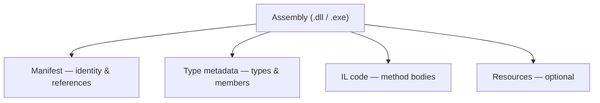

# 07. Assemblies, Loading, Strong Naming, & GAC

An assembly is the fundamental unit of deployment, identity, and loading in .NET. Every project compiles to one or more assemblies; the runtime loads them, resolves dependencies, and uses their embedded metadata to execute code. This chapter explains what assemblies contain, how they differ from plain DLL files, how .NET Framework shared them through the Global Assembly Cache, and how modern .NET replaces that model with private deployment and NuGet.

For IL bytecode and metadata tables in depth, see **Intermediate Language (IL)**. For how the CLR loads and JIT-compiles assemblies at startup, see **CLR and Program Execution**.

---

## Table of Contents

1. [What Is an Assembly?](#1-what-is-an-assembly)
2. [Assembly Types — Private, Shared, Satellite, Single- and Multi-File](#2-assembly-types--private-shared-satellite-single--and-multi-file)
3. [EXE vs DLL](#3-exe-vs-dll)
4. [Assembly Structure — Manifest and Metadata](#4-assembly-structure--manifest-and-metadata)
5. [Strong Naming and Why It Matters](#5-strong-naming-and-why-it-matters)
6. [The Global Assembly Cache in .NET Framework](#6-the-global-assembly-cache-in-net-framework)
7. [Assembly Loading, Binding, and Probing](#7-assembly-loading-binding-and-probing)
8. [Modern .NET — NuGet and Private Deployment](#8-modern-net--nuget-and-private-deployment)
9. [Summary](#9-summary)

---

## 1. What Is an Assembly?

An assembly is the **smallest deployable unit** the CLR understands. It is simultaneously a physical file on disk — a Portable Executable (`.dll` or `.exe`) — and a **logical identity**: a versioned, named package of types, resources, and dependencies that the runtime can load as one coherent whole.

Calling an assembly "a DLL" is imprecise. A DLL is a file format; an assembly is a **self-describing package** that happens to be stored in that format. What makes it an assembly is the combination of a **manifest** (identity and references), **type metadata** (complete descriptions of every type and member), **IL code** (method bodies), and optionally **embedded resources** (strings, images, localization data).

Because metadata is embedded, .NET tools — debuggers, serializers, dependency injection containers, decompilers — can inspect compiled output without separate header files or IDL. IL inside an assembly references types by metadata tokens; the CLR resolves those tokens at load time using the same metadata stream.

---

## 2. Assembly Types — Private, Shared, Satellite, Single- and Multi-File

Assemblies are categorized by **how they are deployed** and **how their physical files are organized**.

### Private Assemblies

A **private assembly** ships inside the application's own directory (or a subdirectory). Only that application uses it. No machine-wide registration is required — copying the publish folder is sufficient. Private assemblies do not require strong names. Two applications on the same machine can each carry a different version of the same library without conflict because their copies are isolated in separate folders.

Private deployment is the **default and only model** in modern .NET. Every dependency resolved at build time is copied into the application output.

### Shared Assemblies (.NET Framework)

In **.NET Framework**, a **shared assembly** was installed into the **Global Assembly Cache (GAC)** — a machine-wide store where multiple applications could reference the same physical copy. Shared assemblies **required strong names** so the CLR could distinguish versions and publishers unambiguously. Shared deployment reduced disk use when many apps needed the same framework library, but introduced operational complexity around versioning and administrator privileges.

Modern .NET does not use the GAC for application dependencies. Framework assemblies live alongside the installed runtime; application libraries are always private.

### Satellite Assemblies

A **satellite assembly** holds **localized resources** — translated strings, images, or other culture-specific content — for a main assembly. It is linked to a **culture** (e.g. `fr-FR`, `de-DE`) in its identity. The main assembly stays culture-neutral; at runtime the resource manager loads the satellite whose culture best matches the user's UI culture.

Satellite assemblies enable localization without recompiling the primary assembly for every language.

### Single-File vs Multi-File Assemblies

| Form | Description | Status |
|---|---|---|
| **Single-file** | One `.dll` or `.exe` contains manifest, metadata, IL, and resources | Standard in all modern development |
| **Multi-file** | One primary module holds the manifest; additional `.netmodule` files hold types linked at build time | .NET Framework only; obsolete in modern .NET |

Multi-file assemblies allowed different modules to be compiled by different language compilers and linked into one logical assembly. The same goals are achieved today through separate assemblies and NuGet packages. Do not confuse multi-file assemblies with **single-file publish**, which bundles many separate assemblies into one deployment artifact — internally each assembly still has its own manifest and metadata.

---

## 3. EXE vs DLL

Both `.exe` and `.dll` files are **Portable Executable (PE)** files. At the PE level the difference is primarily whether the image is marked as an executable with an entry point or as a library loaded by another process.

| Property | DLL | EXE |
|---|---|---|
| Entry point | None — loaded by a host | Has a startup method or top-level entry |
| Launched directly by OS | No | Yes (on Windows via native launcher) |
| Typical project output type | Library | Executable |
| Contains IL and metadata | Yes | Yes |
| Referenced by other projects | Idiomatic | Possible but uncommon |

In **modern .NET**, an executable project's meaningful code usually lives in **`MyApp.dll`**. The accompanying **`MyApp.exe`** on Windows is a thin **apphost** — a native stub that locates the correct runtime and loads the DLL. On Linux, you typically run `dotnet MyApp.dll` without a separate `.exe`. The architectural point remains: **assemblies are DLLs or EXEs; the logical unit is the assembly identity in the manifest, not the file extension alone.**

---

## 4. Assembly Structure — Manifest and Metadata

Every assembly contains four logical parts.

| Part | Role |
|---|---|
| **Assembly manifest** | Name, version, culture, public key token; list of files (multi-file); list of referenced assemblies with exact identities |
| **Type metadata** | Descriptions of every type, method, field, property, event, and custom attribute |
| **IL code** | Compiled method bodies — stack-based bytecode the JIT consumes |
| **Resources** | Embedded binary data — images, `.resx` string tables, other assets |

### The Manifest

The manifest is the assembly's identity card. It records the **four-part version** (major.minor.build.revision), **culture**, **public key token** (if strong-named), and every **external assembly reference** with the exact version and token the compiler recorded. When the CLR loads an assembly, it uses this reference list to locate dependencies. A mismatch between a recorded reference and the assembly actually found on disk produces a load failure rather than silent incompatibility.

### Type Metadata

Metadata tables describe the entire type system of the assembly — classes, structs, interfaces, enums, method signatures, generic parameters, and attributes such as `[Obsolete]` or `[Serializable]`. This is the same metadata stream explored from the IL perspective in **Intermediate Language (IL)**; here the emphasis is on its role as the assembly's self-documentation for loading, binding, and reflection.

---

## 5. Strong Naming and Why It Matters

A **strong name** is a cryptographically backed **assembly identity** consisting of four parts: simple name, version, culture, and **public key token** (an eight-byte fingerprint of the publisher's public key). A fully qualified identity looks conceptually like:

MyLibrary, Version=2.1.0.0, Culture=neutral, PublicKeyToken=b77a5c561934e089

### How Strong Naming Works

At build time, the compiler hashes the assembly manifest and signs the hash with a **private key**. The **public key** and **signature** are embedded in the assembly. At load time, the CLR re-hashes the manifest and verifies the signature — detecting tampering after signing.

| Strong naming guarantees | Strong naming does not guarantee |
|---|---|
| Globally unique identity (name + version + culture + publisher key) | That the code is trustworthy or from a verified publisher |
| Tamper detection if bytes change after signing | Secrecy of IL — assemblies remain inspectable |
| Side-by-side storage of multiple versions (with GAC) | Replacement for Authenticode or OS code-signing trust |

Strong naming is about **identity and integrity**, not security in the sense of "safe to run." For publisher trust at the operating system level, **Authenticode signing** with a certificate from a trusted authority is the separate mechanism.

Strong names were **mandatory for GAC installation** in .NET Framework and enabled the CLR to refuse substituting one publisher's assembly for another's even when simple names matched.

---

## 6. The Global Assembly Cache in .NET Framework

The **Global Assembly Cache (GAC)** was .NET Framework's answer to **DLL Hell** — the Win32 problem where shared native DLLs in a flat system directory were overwritten by installers, breaking unrelated applications. The GAC provided a **versioned, structured, machine-wide repository** for strong-named assemblies.

### Physical Organization

On Windows, the GAC lives under `C:\Windows\Microsoft.NET\assembly\`, organized by processor architecture (`GAC_MSIL`, `GAC_32`, `GAC_64`) and by compound directory names encoding CLR version, assembly version, and public key token. Multiple versions of the same simple name coexist without overwriting each other.

### Role in Architecture

| GAC property | Effect |
|---|---|
| Machine-wide sharing | One physical copy serves many applications |
| Side-by-side versions | v1.0 and v2.0 of the same assembly can both exist |
| Strong name required | Only strongly identified assemblies may be installed |
| Admin installation | Installing required elevated privileges (`gacutil` or MSI) |
| Probing precedence | CLR checked GAC before the application directory for strong-named assemblies |

### Version Policy and Binding Redirects

Applications compiled against one assembly version might find a different version on the machine. .NET Framework used **binding redirects** in `app.config` / `web.config`, **publisher policy** assemblies in the GAC, and **machine.config** rules to map requested versions to available ones. Managing redirects across large solutions was a common source of deployment friction — a motivation for the modern private-copy model.

The GAC solved shared-library versioning for its era but introduced **non-reproducible machine state**, **admin dependency**, and **cross-application coupling** when a GAC assembly was patched. Modern .NET deliberately removed the GAC for application dependencies.

---

## 7. Assembly Loading, Binding, and Probing

When code references a type from another assembly, the CLR must **resolve**, **load**, and **bind** that assembly — exactly once per load context for a given identity.

### Resolution Flow — .NET Framework (Fusion)

.NET Framework's loader, historically associated with the **Fusion** subsystem, followed a defined probe sequence for strong-named assemblies:

1. Check whether the assembly is already loaded in the current context
2. Apply **version policy** (binding redirects, publisher policy, machine policy)
3. Probe the **GAC** for the resolved strong name
4. Probe **DEVPATH** (developer override environment variable) if set
5. Probe the **application base directory** and configured **privatePath** subdirectories
6. Fail with `FileNotFoundException` if not found

Binding meant matching the **requested identity** (from the calling assembly's manifest) to a **physical file** and creating a single loaded instance shared by all code in that load context.

### Resolution Flow — Modern .NET

Modern .NET eliminates runtime GAC probing and binding redirect negotiation for application code. At build time, NuGet resolves dependency versions; MSBuild emits **`MyApp.deps.json`** — a complete map of every dependency, its version, and its path relative to the application. At startup, **hostpolicy** reads this file; the CLR loads assemblies from the paths it specifies.

| Mechanism | .NET Framework | Modern .NET |
|---|---|---|
| Dependency map | Manifest references + binding redirects | `deps.json` from build |
| Shared store | GAC | None for app libraries |
| Version conflicts | Runtime redirects | Build-time resolution; fail at build if unsatisfiable |
| Config | `app.config` probing and redirects | `runtimeconfig.json`, optional `runtimeconfig.dev.json` |

### AssemblyLoadContext

**AssemblyLoadContext (ALC)** is the modern isolation primitive for loading. Each context maintains its own binding view — the same assembly identity loaded into two contexts produces **distinct type objects** that are not interchangeable, even if the bytes on disk are identical.

The **default context** holds the main application and its ordinary dependency graph. **Custom collectible contexts** support plugin architectures: load a plugin and its private dependencies in isolation, then **unload** the context when references drop so assemblies become eligible for GC. ALC replaces much of what .NET Framework used **Application Domains** for regarding assembly isolation; see **Application Domains and Isolation** for the historical comparison.

Programmatic loading differs in behavior:

| Approach | Behavior |
|---|---|
| Load by identity | Uses normal probing / `deps.json` in the current context |
| Load from path into default context | Caches by identity; same assembly identity returns one instance |
| Isolated load context | Separate binding namespace; enables plugin unload |

---

## 8. Modern .NET — NuGet and Private Deployment

**NuGet** is the package manager layer for modern .NET. Project files declare dependencies; restore downloads packages to a local cache; build copies the required DLLs into the output folder. Each application carries **private copies** at the versions its dependency graph resolved — no shared system directory that another installer can overwrite.

### Why This Replaces the GAC

| DLL Hell / GAC problem | Modern approach |
|---|---|
| Shared flat directory, last writer wins | Each app folder is isolated |
| Admin GAC installs | Ordinary file copy or container image |
| Binding redirect maintenance | Resolved at build; recorded in `deps.json` |
| Non-reproducible machine state | Reproducible via restore + publish |
| Cross-app impact of shared updates | Updates scoped to redeploying that application |

The **.NET runtime itself** still installs side-by-side under `Program Files\dotnet\shared\` — multiple major versions coexist. Application libraries, however, are never placed in a GAC equivalent.

**Self-contained publish** goes further: the application bundle includes the runtime and all dependencies, eliminating even the shared runtime prerequisite on the target machine. **Framework-dependent publish** relies on an installed shared runtime but still keeps application libraries private.

Strong naming remains **optional** for most modern libraries. NuGet package identity (package ID + semantic version) drives dependency resolution. Strong names persist mainly for **.NET Framework compatibility**, **`InternalsVisibleTo`** across signed assemblies, and organizational signing policies — not because the modern loader requires them.

---

## 9. Summary

| Topic | Key point |
|---|---|
| Assembly | Versioned, self-describing deployment unit — manifest + metadata + IL + resources |
| Private vs shared | Modern .NET: all app assemblies private; GAC was .NET Framework shared store |
| Satellite | Culture-specific resources linked to a main assembly |
| EXE vs DLL | Same PE/assembly structure; EXE adds entry point / launcher |
| Strong name | Identity + tamper detection; enabled GAC side-by-side |
| GAC | Machine-wide versioned store; removed for app deps in modern .NET |
| Loading | Framework: Fusion + GAC + redirects; Modern: `deps.json` + ALC |
| NuGet | Build-time dependency resolution; private deployment replaces shared GAC model |

Assemblies connect compile-time references to runtime behavior. Understanding their identity, structure, and loading path explains version mismatch errors in legacy Framework apps and why modern publish output is a self-contained folder of private assemblies rather than a machine-wide registry of shared DLLs.

---

**Previous →** [06. Managed and Unmanaged Code](./06.%20Managed%20and%20Unmanaged%20Code.md)

**Next →** [08. Garbage Collection and Memory](./08.%20Garbage%20Collection%20and%20Memory.md)
