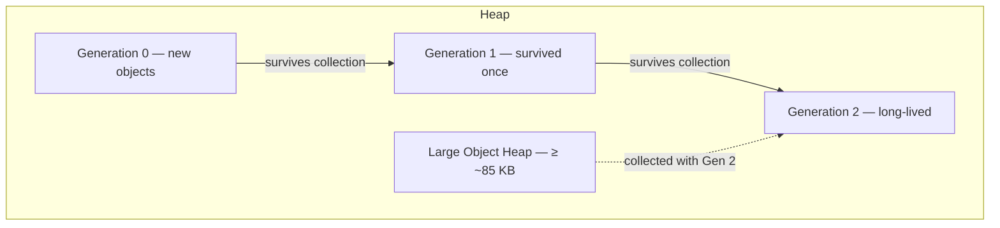

# 08. Garbage Collection & Memory

Memory management is one of the CLR's core jobs. You allocate objects freely; the garbage collector figures out what's no longer reachable and reclaims the memory. This chapter covers where objects live (stack vs heap), how generational collection works, the difference between workstation and server GC modes, and when you need to step in with `IDisposable` vs just letting finalizers handle cleanup.

---

## Table of Contents

1. [Stack vs Managed Heap](#1-stack-vs-managed-heap)
2. [Generational Garbage Collection](#2-generational-garbage-collection)
3. [GC Modes — Workstation and Server](#3-gc-modes--workstation-and-server)
4. [Finalizers vs Dispose](#4-finalizers-vs-dispose)
5. [Summary](#5-summary)

---

## 1. Stack vs Managed Heap

Your .NET process uses two main memory regions: the **stack** and the **managed heap**. They serve different purposes and have very different lifetimes.

| Aspect | Stack | Managed Heap |
|---|---|---|
| Typical contents | Local value-type variables, method parameters, return addresses, reference variables (the pointer, not the object) | Reference-type objects, boxed value types |
| Allocation cost | Near-zero — just move a pointer | Fast bump-pointer; GC cost spread over time |
| Lifetime | Ends when the method returns | Until no GC root holds a reference to the object |
| Size limit | ~1 MB per thread (configurable) | Limited by process address space |
| Thread scope | Each thread has its own stack | Shared across all threads |
| Reclamation | Automatic when stack frame pops | Garbage collector |
| Failure mode | `StackOverflowException` (usually non-recoverable) | `OutOfMemoryException` |

### The Stack

Each method call pushes a **stack frame** containing locals, parameters, and the return address. When the method returns, the frame is gone instantly — no GC involved. A reference-type local stores a **pointer** on the stack; the **object itself** lives on the heap. Value-type locals store their bits directly in the frame.

Deep recursion can exhaust the fixed stack limit and terminate the process — StackOverflowException is usually non-recoverable.

### The Managed Heap

Reference types and boxed values allocate on the **managed heap**. The allocator uses a **bump pointer** — just advance a pointer through a contiguous memory segment. Fast. After a collection, the CLR often **compacts** surviving objects to remove fragmentation and restore fast sequential allocation. Compaction means moving objects, which means updating every reference that pointed to them — which is why pinning memory for native interop complicates GC behavior.

---

## 2. Generational Garbage Collection

The GC is **generational**, based on one key observation: **most objects die young**. Short-lived temporaries — request-scoped buffers, intermediate strings, LINQ iterators — become unreachable quickly. Collecting just those objects often reclaims most of the heap without scanning everything.



### Generation 0 — The Nursery

Every new heap object starts in **Gen 0** (except large objects). Gen 0 collections are **frequent, fast, and brief**. Most objects die here and never make it to Gen 1. Gen 0 is kept small on purpose — scanning a few hundred kilobytes is cheap.

### Generation 1 — The Buffer

**Gen 1** sits between short-lived garbage and long-lived data. Objects that survive Gen 0 land here. If they turn out to be temporary anyway, they're collected in Gen 1 before ever reaching Gen 2. Think of it as a second chance to die young before becoming a long-term resident.

### Generation 2 — Long-Lived Objects

**Gen 2** holds objects that have survived multiple collections — singletons, caches, static fields, application configuration. A **full GC** (Gen 0 + 1 + 2) scans the entire reachable object graph and is the most expensive operation. Keeping objects out of Gen 2 unnecessarily is a key performance goal for high-throughput services.

### Large Object Heap (LOH)

Objects **roughly 85 KB or larger** go straight to the **Large Object Heap**, skipping Gen 0 and Gen 1. The LOH is only collected during full Gen 2 collections. By default the LOH is **not compacted** — moving multi-megabyte arrays would cause too much pause time — so LOH fragmentation is a real concern for applications that repeatedly allocate large buffers.

Common LOH allocations: large `byte[]` arrays, large strings, big value-type arrays.

### GC Roots — What Counts as "Live"

The GC starts from **roots** — references guaranteed to be live — and traces everything reachable from them. Anything it can't reach is eligible for collection.

| Root source | Examples |
|---|---|
| Thread stacks | Local variables and parameters in active frames |
| Static fields | Class-level references |
| GC handles | Explicit interop handles (`GCHandle`) |
| Finalization queue | Objects awaiting finalizer execution |

Managed reference cycles are handled just fine — unlike reference counting, tracing GC walks through cycles and still collects them.

### Background GC

Modern .NET uses **background GC** for full collections: most Gen 2 work runs on a dedicated thread while your app keeps running, with only brief stop-the-world phases. This makes full collections much less visible in production compared to older stop-the-world models.

---

## 3. GC Modes — Workstation and Server

The CLR offers two GC flavors, chosen once per process:

| Feature | Workstation GC | Server GC |
|---|---|---|
| Target workload | Desktop, interactive apps | ASP.NET Core, services, high throughput |
| GC threads | Typically one | One dedicated thread per logical CPU core |
| Heap organization | Single heap | Multiple heaps — reduces contention |
| Throughput | Lower | Higher (parallel collection across cores) |
| Memory use | Lower | Higher (multiple heaps) |
| Default in | Console, WPF, WinForms | ASP.NET Core (auto-detected) |

**Workstation GC** favors responsiveness for a single user. **Server GC** favors multi-core throughput when many threads are allocating simultaneously — exactly what a web server handling concurrent requests does.

Configure via `runtimeconfig.json` (the `System.GC.Server` property) or the `DOTNET_GCServer` environment variable.

Both modes use the same generational algorithm. The difference is parallelism, heap count, and how they balance pause time vs throughput.

---

## 4. Finalizers vs Dispose

The GC handles **managed memory** automatically. **Unmanaged resources** — file handles, native memory, sockets — the GC has no idea about. You need to release those yourself. That's what `IDisposable` and finalizers are for, and they solve different sides of the problem.

### IDisposable — Deterministic Cleanup

When a consumer calls **`Dispose()`** — directly or through a `using` statement — resources are released **immediately** at a known point in code. This is the right approach for any type that wraps an unmanaged handle or a scarce resource.

```csharp
using var conn = new SqlConnection(connStr); // Dispose() called automatically at end of block
```

### Finalizers — Non-Deterministic Safety Net

A **finalizer** (`~MyClass()` in C#) registers the object on the **finalization queue**. When the GC discovers the object is unreachable, it doesn't immediately free it — it promotes the object and queues it for the **finalizer thread**. After the finalizer runs, a *subsequent* GC cycle finally frees the memory.

Finalizers impose real cost:

| Drawback | Detail |
|---|---|
| Delayed reclamation | Object survives at least one extra GC generation |
| Unpredictable timing | You can't know when it runs |
| Single finalizer thread | One slow finalizer blocks all others |
| Limited safety | Finalizer code can't safely touch arbitrary managed objects |

Call **`GC.SuppressFinalize(this)`** at the end of `Dispose()` to remove the object from the finalization queue — no point running the finalizer if you already cleaned up explicitly.

### When to Use Which

| Situation | Approach |
|---|---|
| Type owns an unmanaged handle or scarce resource | Implement `IDisposable`; consumers use `using` |
| Safety net if consumer forgets `Dispose()` | Optional finalizer (or better: `SafeHandle`) |
| Pure managed object | Nothing needed — GC handles it |

**Rule of thumb:** `Dispose()` is the contract. Finalizers are the last resort — not a substitute for disciplined resource management.

---

## 5. Summary

| Topic | Key point |
|---|---|
| Stack vs heap | Stack: fast, frame-scoped locals; heap: objects, GC-managed |
| Generations | Gen 0/1/2 exploit short object lifetimes; LOH for large allocations |
| GC modes | Workstation = responsive; Server = multi-core throughput |
| Roots | Reachability from stacks, statics, and handles determines what survives |
| Dispose vs finalizer | Dispose = deterministic; finalizer = delayed backup |

The GC frees you from manual heap management for managed objects, but its performance depends on your allocation patterns, object lifetimes, and collection frequency. Understanding generations and GC modes helps you diagnose pause spikes, LOH fragmentation, and why explicit disposal still matters for unmanaged resources.

---

**Previous →** [07. Assemblies, Loading, Strong Naming, and GAC](./07.%20Assemblies%2C%20Loading%2C%20Strong%20Naming%2C%20%26%20GAC%20-%20Done.md)

**Next →** [09. Migration from .NET Framework to Modern .NET](./09.%20Migration%20from%20.NET%20Framework%20to%20Modern%20.NET%20-%20Done.md)
