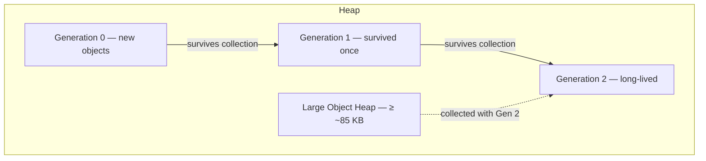

# 08. Garbage Collection & Memory

Memory management is one of the CLR's core responsibilities. Managed developers allocate objects freely; the garbage collector reclaims what is no longer reachable. This chapter explains where objects live, how generational collection works, the difference between workstation and server GC modes, and how deterministic disposal relates to finalization — with unmanaged resource cleanup detailed in **Managed and Unmanaged Code**.

Value types, boxing, and heap-vs-stack placement rules belong to the **Common Type System (CTS)**; this chapter references them only where they affect GC behavior.

---

## Table of Contents

1. [Two Memory Regions — Stack and Managed Heap](#1-two-memory-regions--stack-and-managed-heap)
2. [Generational Garbage Collection](#2-generational-garbage-collection)
3. [GC Modes — Workstation and Server](#3-gc-modes--workstation-and-server)
4. [Finalizers vs Dispose](#4-finalizers-vs-dispose)
5. [Summary](#5-summary)

---

## 1. Two Memory Regions — Stack and Managed Heap

Every .NET process uses two primary regions for managed execution: the **stack** and the **managed heap**. They differ in what they store, how fast allocation is, who reclaims memory, and how long data survives.

| Aspect | Stack | Managed heap |
|---|---|---|
| Typical contents | Local value-type variables, method parameters, return addresses, reference variables (the pointer, not the object) | Reference-type objects, boxed value types, static object graphs |
| Allocation cost | Near-zero — adjust stack pointer | Fast bump-pointer; GC cost amortized over time |
| Lifetime | Ends when the stack frame pops (method returns) | Until no GC root references the object |
| Size limit | ~1 MB per thread by default (configurable) | Limited by process address space |
| Thread scope | Each thread has its own stack | Shared across all threads |
| Reclamation | Automatic when frame pops | Garbage collector traces reachability |
| Failure mode | `StackOverflowException` (often non-recoverable) | `OutOfMemoryException` |

### The Stack in Brief

Each method call pushes a **stack frame** containing locals, parameters, and the return address. When the method returns, the frame is discarded instantly — no GC involved. Reference-type locals hold a **pointer** on the stack; the **object itself** lives on the heap. Value-type locals store their bits directly in the frame unless escaped (e.g. boxed or captured by a closure).

Deep recursion or very large stack allocations can exhaust the fixed stack limit and terminate the process.

### The Managed Heap in Brief

Reference types and boxed values allocate on the **managed heap**. The allocator typically uses a **bump pointer** — advancing through a contiguous segment until a collection is needed. Each object carries a small header (sync block index and type handle) before its fields.

After collection, the CLR often **compacts** surviving objects to remove fragmentation and restore fast sequential allocation. Compaction requires updating every reference that pointed to a moved object — which is why pinning (holding a fixed address for native interop) interferes with compaction and is covered in **Managed and Unmanaged Code**.

---

## 2. Generational Garbage Collection

The CLR uses a **generational** collector based on the observation that **most objects die young**. Short-lived temporaries — request-scoped buffers, intermediate strings, LINQ iterators — become unreachable quickly. Collecting them often reclaims most of the heap without scanning every long-lived object.

### Generation 0

**Generation 0** is the nursery. Every new heap object starts here (except large objects). **Gen 0 collections** are frequent, fast, and typically pause only briefly. Most objects never survive their first collection; those that do are **promoted** to Generation 1.

Default Gen 0 size is on the order of a few hundred kilobytes — small enough that scanning it is cheap.

### Generation 1

**Generation 1** acts as a **buffer** between short-lived garbage and long-lived data. Objects that survive a Gen 0 collection but prove temporary are collected here before promotion to Gen 2. Gen 1 collections occur less often than Gen 0 but more often than full collections.

### Generation 2

**Generation 2** holds objects that have survived multiple collections — static fields, caches, singletons, application configuration. A **full collection** (Gen 0 + 1 + 2) scans the entire reachable object graph and is the most expensive operation. Minimizing unnecessary promotion to Gen 2 is a central performance goal in high-throughput services.

### Large Object Heap (LOH)

Objects **approximately 85,000 bytes or larger** allocate on the **Large Object Heap**, bypassing Gen 0 and Gen 1. LOH is collected only during **Gen 2 / full collections**. By default the LOH is **not compacted** — moving multi-megabyte arrays would cause unacceptable pause times — so LOH fragmentation is a real concern for applications that repeatedly allocate large buffers.

Common LOH allocations include large `byte[]` arrays, large strings, and big value-type arrays. .NET 5+ introduced a **Pinned Object Heap** for frequently pinned buffers so pinning does not fragment the main generations; that interacts with native interop described in **Managed and Unmanaged Code**.

### GC Roots and Reachability

The collector starts from **GC roots** — pointers guaranteed to be live:

| Root source | Examples |
|---|---|
| Thread stacks | Local variables and parameters in active frames |
| Static fields | Class-level references |
| GC handles | Explicit handles for interop (`GCHandle`) |
| Finalization queue | Objects awaiting finalizer execution |
| CPU registers | References held in registers during JIT code |

Any object not reachable from a root is **eligible for collection**. Cycles of only managed references are reclaimed automatically — unlike reference counting alone, tracing GC handles cycles.

### Background / Concurrent Collection

Modern CLR versions use **background GC** for full collections: much of Gen 2 work runs on a dedicated thread while application threads continue, with only brief stop-the-world phases. This reduces the visible pause of full collections compared to a naive stop-the-world model.

---

## 3. GC Modes — Workstation and Server

The CLR offers two primary **GC flavors**, chosen once per process. They trade memory footprint and pause behavior against throughput.

| Feature | Workstation GC | Server GC |
|---|---|---|
| Target workload | Desktop, client, interactive apps | ASP.NET Core, services, high throughput |
| GC threads | Typically one, sharing with app threads | One dedicated GC thread per logical CPU |
| Heap organization | Single heap | Multiple heaps (one per GC thread) — reduces lock contention |
| Throughput | Lower | Higher — parallel collection across cores |
| Pause profile | Shorter individual pauses | Slightly longer pauses; better aggregate throughput |
| Memory use | Lower | Higher (multiple heaps) |
| Default in | Console, WPF, WinForms | ASP.NET Core (auto-detected in hosting) |

**Workstation GC** favors responsiveness for a single user. **Server GC** favors multi-core utilization when many threads allocate simultaneously — typical of web servers processing concurrent requests.

Configuration uses **`runtimeconfig.json`** properties such as `System.GC.Server` and environment variables like `DOTNET_GCServer`. **`DOTNET_GCConserveMemory`** trades larger heap retention for fewer collections — useful in memory-constrained containers.

Neither mode eliminates collections; both use the same generational algorithm. The difference is **parallelism**, **heap count**, and **pause vs throughput** balance. GC behavior is also summarized at a high level in **CLR and Program Execution** as part of the overall execution pipeline.

---

## 4. Finalizers vs Dispose

Managed memory needs no explicit free — the GC handles it. **Unmanaged resources** (file handles, native memory, sockets) require **deterministic** release because the GC does not know they exist. **`IDisposable`** and **finalizers** address different aspects of that problem.

### IDisposable — Deterministic Cleanup

When a consumer calls **`Dispose()`** — directly or through a `using` statement — resources are released **immediately** at a known point. This is the correct path for any type wrapping an unmanaged handle. The full dispose pattern, `SafeHandle`, and interaction with P/Invoke are explained in **Managed and Unmanaged Code**.

### Finalizers — Non-Deterministic Safety Net

A **finalizer** (C# destructor syntax) registers the object on the **finalization queue**. When the GC discovers the object is unreachable, it does **not** reclaim memory immediately — it promotes the object and queues it for the **finalizer thread**. After the finalizer runs, a **subsequent GC cycle** frees the memory.

Finalizers impose cost:

| Drawback | Detail |
|---|---|
| Delayed reclamation | Object survives at least one extra GC generation |
| Unpredictable timing | You cannot know when cleanup runs |
| Single finalizer thread | One slow finalizer blocks others |
| Limited safety | Finalizer code cannot safely touch arbitrary managed objects |

**`GC.SuppressFinalize(this)`** in `Dispose()` removes the object from the finalization queue when explicit cleanup already occurred — avoiding the extra GC cycle.

### When to Use Which

| Situation | Approach |
|---|---|
| Type owns unmanaged handle or scarce resource | Implement `IDisposable`; consumers use `using` |
| Safety net if consumer forgets `Dispose()` | Optional finalizer or (preferably) `SafeHandle` |
| Pure managed object graph | No `IDisposable` or finalizer needed — GC suffices |

**Rule of thumb:** treat **`Dispose()` as the contract** and finalizers as a last-resort backup, not a substitute for disciplined disposal. Boxing and unnecessary heap allocations that increase GC pressure are value-type concerns covered in the **Common Type System (CTS)**.

---

## 5. Summary

| Topic | Key point |
|---|---|
| Stack vs heap | Stack: fast, frame-scoped locals; heap: objects and boxed values, GC-managed |
| Generations | Gen 0/1/2 exploit short object lifetimes; LOH for large allocations |
| GC modes | Workstation = responsive; Server = multi-core throughput |
| Roots | Reachability from stacks, statics, handles determines survival |
| Dispose vs finalizer | Dispose = deterministic; finalizer = delayed backup — see **Managed and Unmanaged Code** |
| CTS cross-ref | Boxing and value-type storage rules affect allocation patterns — see **Common Type System (CTS)** |

The garbage collector frees developers from manual heap management for managed objects while imposing a performance model based on allocation rate, object lifetime, and collection frequency. Understanding generations and GC modes helps interpret pause spikes, LOH fragmentation, and why explicit disposal remains necessary for unmanaged resources.

---

**Previous →** [07. Assemblies, Loading, Strong Naming, and GAC](./07.%20Assemblies%2C%20Loading%2C%20Strong%20Naming%2C%20and%20GAC.md)

**Next →** [09. Application Domains and Isolation](./09.%20Application%20Domains%20and%20Isolation.md)
