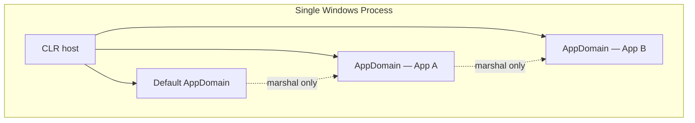

# 09. Application Domains & Isolation

Application Domains were .NET Framework's mechanism for running multiple logical applications inside one operating-system process. They are largely historical — removed from modern .NET — but understanding them clarifies why **AssemblyLoadContext**, process boundaries, and containers exist today, and why assembly loading in **Assemblies, Loading, Strong Naming, and GAC** replaced part of their role without copying all of their guarantees.

---

## Table of Contents

1. [The AppDomain Concept in .NET Framework](#1-the-appdomain-concept-in-net-framework)
2. [Why AppDomains Existed](#2-why-appdomains-existed)
3. [Isolation Features and Limits](#3-isolation-features-and-limits)
4. [Why AppDomains Were Removed in .NET Core](#4-why-appdomains-were-removed-in-net-core)
5. [Modern Alternatives](#5-modern-alternatives)
6. [Summary](#6-summary)

---

## 1. The AppDomain Concept in .NET Framework

An **Application Domain (AppDomain)** is the isolation boundary the .NET Framework CLR used **inside a single OS process**. It sits between the process and individual objects — coarser than a thread, finer than a process.

Every .NET Framework process starts with one **default AppDomain**, created automatically when the CLR initializes. Additional AppDomains could be created programmatically. Each domain owned:

| Owned resource | Purpose |
|---|---|
| Assembly loader state | Which assemblies and versions were loaded |
| Configuration | Application base path, config file, probing paths |
| Security policy | Code Access Security grant sets (historical sandboxing) |
| Logical heap partition | Objects tied to the domain that created them |

Objects were **bound to the AppDomain that created them**. Code in one domain could not directly use an object reference from another domain — the CLR blocked cross-domain pointer use. Communication required **marshaling** (by reference through a proxy, or by value through serialization), built on .NET Remoting infrastructure.

Creating an AppDomain was **cheaper than spawning a new OS process** because the CLR already owned the native process and partitioned it in software rather than requesting a new address space from the kernel.

---

## 2. Why AppDomains Existed

### The Hosting Problem

In the early 2000s, a primary .NET scenario was **IIS hosting many ASP.NET applications** on one server. Running each site in its own `w3wp.exe` process worked but was expensive:

| Process-per-app cost | AppDomain alternative |
|---|---|
| Separate CLR and BCL copy per process | One CLR, shared JIT and framework state |
| Slow cold start and JIT warmup | Faster creation of logical partitions |
| Heavy OS context switches | Lighter in-process boundaries |
| Slow recycle on config change | Unload one domain, recreate, leave others running |

AppDomains offered **memory separation**, **independent assembly loading** (different versions of the same assembly in different domains), **per-domain configuration**, and **unloadability** without killing the entire process — valuable for web hosting and plugin scenarios before containers were mainstream.

### Typical Lifecycle

Configuration set application base and config file → optional security sandbox defined → domain created → code executed via callbacks or `ExecuteAssembly` → domain unloaded when the module or site recycled. **Shadow copying** optionally copied assemblies to a shadow directory so files on disk could be updated while the domain ran.

---

## 3. Isolation Features and Limits

### What AppDomains Isolated

| Feature | Behavior |
|---|---|
| Type identity | Same class loaded in two domains produced non-interchangeable `Type` objects |
| Assembly versions | Different domains could load different versions of the same assembly simultaneously |
| Memory visibility | Direct cross-domain object references forbidden |
| Unload | `AppDomain.Unload()` released all assemblies and objects for that domain |
| Security (CAS) | Per-domain permission sets for partially trusted plugin code |

### What AppDomains Did Not Fully Provide

AppDomains were **logical** isolation, not OS-level isolation. A fatal error in native code, stack overflow in shared native stacks, or corruption outside the CLR's control could still bring down the entire process. They reduced coupling between managed applications but did not replace process or container boundaries for **true fault containment** or **untrusted code**.

Cross-domain calls incurred **remoting overhead** — serialization, proxies, and context transitions — even for local in-process communication.

---

## 4. Why AppDomains Were Removed in .NET Core

When Microsoft rebuilt the runtime as **CoreCLR** for cross-platform use, AppDomains were deliberately omitted.

### Architectural Coupling

AppDomain isolation in .NET Framework was not a thin managed wrapper. It depended on:

- Windows-specific memory protection details inside the CLR
- GC heap partitioning intertwined with domain identity
- **.NET Remoting** (`System.Runtime.Remoting`) for cross-domain calls
- Code Access Security infrastructure deprecated as ineffective for real security boundaries

Reimplementing faithful AppDomains on Linux and macOS would have required rebuilding heap partitioning, type isolation, and remoting — paying complexity and performance cost on **every** managed operation, including programs that never created a second domain.

### Shifting Deployment Model

| Original AppDomain use case | Modern replacement |
|---|---|
| Multi-app IIS on one server | Containers, separate processes, or one app per pod |
| Fast in-process recycle | Container restart, orchestrator rolling updates |
| Plugin sandboxing | OS process isolation, containers, restricted permissions |
| Side-by-side assembly versions in one process | **AssemblyLoadContext** (loading isolation without heap partition) |

The official decision documented in CoreCLR issue tracking: AppDomains would not be ported. Compatibility stubs exist — `AppDomain.CurrentDomain` returns the single default domain — but **`AppDomain.CreateDomain()`** and **`Unload()`** throw **`PlatformNotSupportedException`** on modern .NET.

Properties that still work (`BaseDirectory`, `GetAssemblies()`, `AssemblyResolve`, `UnhandledException`) reflect the single default domain / default load context, not true multi-domain hosting.

---

## 5. Modern Alternatives

Three approaches cover the goals AppDomains pursued, with different tradeoffs.

### AssemblyLoadContext — In-Process Loading Isolation

**AssemblyLoadContext (ALC)** is the direct successor for **assembly loading and unload** scenarios. Each context resolves and loads assemblies independently; a **collectible** context can be unloaded when all references to its types and objects are gone.

| AppDomain capability | ALC equivalent |
|---|---|
| Load different assembly versions in one process | Yes — separate contexts |
| Unload without process exit | Yes — collectible ALC |
| Isolate managed heap | **No** — one shared heap; objects can reference each other across contexts |
| Cross-boundary communication | Direct calls (same heap) — no remoting proxy |
| Platform | Cross-platform |

ALC isolates the **type system and binding graph**, not memory. Plugin hosts load each plugin in its own ALC so dependency versions do not conflict; shared contract interfaces must be loaded from a context both host and plugin share — detailed in **Assemblies, Loading, Strong Naming, and GAC**.

Real-world uses include ASP.NET Core Razor compilation hot-reload, Roslyn scripting, and extensible application plugins.

### Separate OS Processes — True Memory Isolation

When **fault isolation** or **untrusted code** matters, a separate process is the correct boundary. The host launches a child process and communicates via stdin/stdout, named pipes, gRPC, or sockets. A crash in the child does not corrupt the host's address space.

Higher startup cost and IPC complexity buy **real** isolation that AppDomains never fully guaranteed for native failures.

### Containers — Multi-Application Hosting

For running many applications on shared infrastructure, **containers** provide OS-level isolation: independent file systems, network namespaces, resource limits, and independent process trees. Kubernetes rolling updates replace in-process domain recycle for deployment agility.

| Goal | AppDomain (.NET Framework) | Modern approach |
|---|---|---|
| Multi-app on one machine | Multiple domains in one process | One container (or process) per app |
| Independent deploy/restart | Unload domain | Redeploy container |
| Resource limits | Limited | CPU/memory limits via orchestrator |
| True crash isolation | Partial (managed only) | Process or container boundary |

### Comparison Overview

| Feature | AppDomain | AssemblyLoadContext | OS process | Container |
|---|---|---|---|---|
| Isolation strength | Logical (managed) | Loading / types only | Full address space | Full + orchestration |
| Unload assemblies | Yes | Yes (collectible) | Kill process | Stop container |
| Shared CLR instance | Yes | Yes | No | No |
| Cross-platform | Windows-centric | Yes | Yes | Yes |
| Modern .NET support | Stub only | Full | Full | Full |

---

## 6. Summary

| Topic | Key point |
|---|---|
| AppDomain | .NET Framework in-process logical partition — loader, config, marshaled cross-domain calls |
| Motivation | Cheap multi-app hosting and side-by-side assembly versions within one process |
| Removal | Too coupled to Windows, remoting, and CAS; poor fit for cross-platform CoreCLR |
| ALC | Modern replacement for load/unload and version isolation — not heap isolation |
| Process / container | True isolation for faults, untrusted code, and cloud-native multi-tenancy |

AppDomains illustrate an architectural tradeoff: maximum sharing within one process versus isolation guarantees. Modern .NET chose explicit **load-context isolation** plus **heavier but stronger** process and container boundaries rather than porting the full AppDomain model. Recognizing that distinction helps when migrating legacy Framework hosting code or designing plugin systems on current runtimes.

---

**Previous →** [08. Garbage Collection and Memory](./08.%20Garbage%20Collection%20and%20Memory.md)

**Next →** End of **01. .NET Framework Architecture** module — proceed to **[02. C# & LINQ / 01. C# Language Fundamentals](../02.%20C%23%20%26%20LINQ/01.%20C%23%20Language%20Fundamentals/)**
