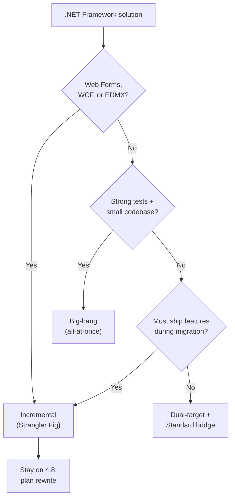
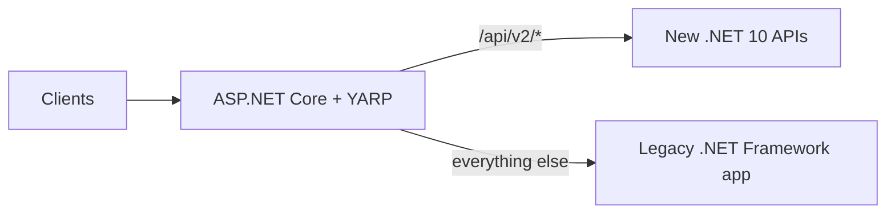

# 09. Migration from .NET Framework to Modern .NET

Most new work targets **.NET 8** or **.NET 10**, but many organizations still run **.NET Framework 4.x** — Web Forms monoliths, WCF services, EF6 data layers, WinForms/WPF desktops tied to Windows and IIS. This chapter covers why to migrate, how to pick a target version, which strategy fits your app shape, and what tooling actually helps.

---

## Table of Contents

1. [Why Migrate](#1-why-migrate)
2. [Choosing a Target Version](#2-choosing-a-target-version)
3. [Assess Before You Touch Code](#3-assess-before-you-touch-code)
4. [Migration Strategies Overview](#4-migration-strategies-overview)
5. [Strategy A — Big-Bang (All-at-Once)](#5-strategy-a--big-bang-all-at-once)
6. [Strategy B — Incremental / Strangler Fig](#6-strategy-b--incremental--strangler-fig)
7. [Strategy C — Dual-Targeting and .NET Standard](#7-strategy-c--dual-targeting-and-net-standard)
8. [Framework-Specific Migration Paths](#8-framework-specific-migration-paths)
9. [Tooling](#9-tooling)
10. [Common Breaking Changes](#10-common-breaking-changes)
11. [Phased Migration Plan](#11-phased-migration-plan)
12. [Summary](#12-summary)

---

## 1. Why Migrate

.NET Framework still gets **security and reliability fixes**, but no new features, no cross-platform runtime, and no modern cloud tooling. Here's the practical comparison:

| Driver | What Framework limits | What modern .NET enables |
|---|---|---|
| **Cloud & containers** | Windows-only runtime | Cross-platform, Linux containers, smaller images |
| **Performance** | Mature but frozen | Generational GC improvements, SIMD, Native AOT |
| **Web** | System.Web + IIS coupling | ASP.NET Core middleware, minimal APIs, gRPC |
| **Security** | Legacy crypto defaults | Modern TLS, data protection APIs |
| **Ecosystem** | Shrinking library support | Active NuGet, current docs and tooling |
| **Cost** | Windows Server + IIS licensing | Linux hosting, serverless, managed platforms |

Migration is a **business and engineering decision**. Some workloads — stable internal WinForms tools, Web Forms apps with no change roadmap — may legitimately stay on Framework 4.8 until end-of-life forces the issue. The strategies below apply when the organization chooses to modernize.

---

## 2. Choosing a Target Version

Modern .NET releases on an **annual cadence**. **Even-numbered** versions are **Long-Term Support (LTS)** — three years of patches. **Odd-numbered** versions are **Standard Term Support (STS)** — shorter support window, newer features sooner.

| Release | Type | Notes |
|---|---|---|
| **.NET 8** | LTS (Nov 2023 – Nov 2026) | Widely deployed in production; safe choice mid-migration |
| **.NET 9** | STS | Feature step; not a stable final destination for conservative teams |
| **.NET 10** | LTS (Nov 2025 – Nov 2028) | Current LTS — right choice for migrations starting in 2026 |

**Practical guidance:**
- **Starting a migration now:** target **.NET 10** (current LTS).
- **Already on .NET 6/8:** plan **in-place version upgrades** (6 → 8 → 10) — don't treat each jump as a Framework-style rewrite.
- **Shared libraries during transition:** multi-target `net481;net10.0` or use `netstandard2.0` when Framework consumers still exist.

Don't target .NET Core 2.x or 3.1 — both are end-of-life.

---

## 3. Assess Before You Touch Code

Don't jump straight into a TFM change. Build evidence first — answer three questions: *Can we move? What will break? What strategy fits our risk tolerance?*

### Compatibility Analysis

| Activity | Purpose |
|---|---|
| Modernization analysis (Copilot agent or Upgrade Assistant) | Lists incompatible APIs, missing packages, project format issues |
| Dependency graph review | Finds transitive packages with no modern equivalent |
| Third-party vendor audit | Confirms commercial controls, ORMs, and reporting tools support modern .NET |
| Test coverage map | Highlights modules with no automated tests — these are the highest-risk areas |

Build a **compatibility matrix** per project:

| Project | TFM today | Blockers | Effort | Strategy hint |
|---|---|---|---|---|
| `MyApp.Web` | `net481` | System.Web, Web Forms | Large | Incremental + rewrite UI |
| `MyApp.Domain` | `net481` | None — pure BCL | Small | Dual-target first |
| `MyApp.WcfHost` | `net481` | WCF bindings | Large | CoreWCF or redesign |

### Architecture Patterns That Inflate Migration Cost

- **Business logic in ASPX code-behind or HTTP modules** — hard to test and port verbatim
- **Shared static state and `HttpContext.Current`** — conflicts with ASP.NET Core's pipeline model
- **EDMX / Database-First EF6 with heavy `.tt` templates** — usually rewritten as EF Core Code First
- **WCF with `net.tcp` / MSMQ bindings** — no direct port; needs contract redesign
- **COM interop** — may work on modern .NET on Windows, but must be validated per call site

The highest-leverage prep step, regardless of which strategy you pick: **extract domain logic into plain class libraries**.

---

## 4. Migration Strategies Overview

No single approach fits every solution. Choose based on your app's **size, test coverage, framework coupling, and delivery pressure**.



| Strategy | Best for | Risk profile | Delivery impact |
|---|---|---|---|
| **Big-bang** | Small apps, strong tests, low coupling | High single-release risk; lower ongoing complexity | Feature freeze during cutover |
| **Incremental (Strangler Fig)** | Large web apps, monoliths, continuous delivery | Lower per-step risk; higher temporary infra complexity | Features ship on both stacks simultaneously |
| **Dual-target bridge** | Shared libraries, phased team migration | Low for libraries; needs API surface discipline | Both runtimes compile until cutover |
| **Rewrite** | Web Forms, heavy WCF, untested legacy | Highest cost; cleanest possible result | Parallel product effort |

---

## 5. Strategy A — Big-Bang (All-at-Once)

**Big-bang** retargets every project in the solution to modern .NET in one effort, validates with tests, and deploys a replacement.

### When it works
- Solution under ~50k LOC with manageable dependency count
- Good automated test coverage on critical paths
- No Web Forms, minimal WCF, no EDMX-generated models
- Team can accept a feature freeze for one release cycle

### Steps
1. Convert projects to **SDK-style** format (`<Project Sdk="Microsoft.NET.Sdk">`).
2. Retarget TFM: `<TargetFramework>net10.0</TargetFramework>`.
3. Replace incompatible NuGet packages with modern equivalents.
4. Swap **System.Web** hosting for **ASP.NET Core** (new `Program.cs`, middleware pipeline).
5. Fix compile errors — API replacements, namespace changes, `web.config` → `appsettings.json`.
6. Run full regression, performance, and integration tests in staging.
7. Cut over; keep the Framework build artifact available for rollback.

### Risks
- Long-running branch diverges from production fixes
- Hidden runtime behavior differences (serialization, culture, threading)
- Undiscovered dependencies surface late in QA

Use big-bang when assessment shows **few blockers** and leadership accepts a **single coordinated release**.

---

## 6. Strategy B — Incremental / Strangler Fig

The **Strangler Fig** pattern gradually replaces the legacy system by routing slices of traffic to a new implementation while the old app keeps serving everything else. Microsoft documents this as the **recommended default** for ASP.NET Framework → ASP.NET Core moves.

### How it works
1. Deploy an **ASP.NET Core host** in front of the legacy IIS app.
2. Use **YARP** to route specific paths to the new service; everything else falls through to the Framework app.
3. Migrate one endpoint, module, or bounded context at a time.
4. Validate under production load; increase the traffic share going to the new stack.
5. Decommission legacy routes until the Framework host can be retired.



| Component | Role |
|---|---|
| **YARP** | Path-based routing, load balancing, request transforms |
| **Microsoft.AspNetCore.SystemWebAdapters** | Bridges session, auth, and shared cookies during dual-stack operation |
| **Shared database or events** | Keeps data consistent while both stacks run |

### Typical timeline (mid-size monolith)

| Phase | Duration | Outcome |
|---|---|---|
| **Foundation** | Weeks 1–8 | YARP deployed, observability live, first route migrated and validated |
| **Main loop** | Months 2–15 | One component per sprint; parallel-run validation between stacks |
| **Decommission** | Months 15–18 | Legacy on monitoring-only; YARP simplified or removed |

Incremental migration costs more infrastructure temporarily, but it preserves product delivery and avoids a catastrophic single cutover.

---

## 7. Strategy C — Dual-Targeting and .NET Standard

When both runtimes need to coexist during the transition, **extract shared logic** into libraries that compile for Framework and modern .NET simultaneously.

### Multi-targeting

```xml
<Project Sdk="Microsoft.NET.Sdk">
  <PropertyGroup>
    <TargetFrameworks>net481;net10.0</TargetFrameworks>
  </PropertyGroup>
</Project>
```

Use `#if` conditionals only when unavoidable:

```csharp
#if NETFRAMEWORK
    // Framework-specific API
#else
    // Modern .NET API
#endif
```

Prefer **interfaces and DI** over `#if` forks wherever possible.

### .NET Standard 2.0 Bridge

Libraries targeting **`netstandard2.0`** run on **.NET Framework 4.6.1+** and **modern .NET** without dual TFM entries — the sweet spot when Framework apps still consume the library. Limitation: you can't use APIs added after the standard was frozen. Once you retire your Framework consumers, retarget directly to `net10.0`.

### Bottom-Up Upgrade Order

1. Migrate **leaf libraries** (no project dependencies) first — to `netstandard2.0` or `net481;net10.0`.
2. Migrate **middle tiers** (services, repositories).
3. Migrate **hosts** (web app, API, desktop shell) last.

This keeps the full solution compiling on Framework while modern hosts gradually reference updated libraries underneath.

---

## 8. Framework-Specific Migration Paths

### Web Forms

| Aspect | Guidance |
|---|---|
| **Portability** | **No supported path** to ASP.NET Core — Web Forms depend on the System.Web page lifecycle |
| **Options** | Rewrite as **Blazor**, **Razor Pages**, **React/Angular + Web API**, or **MAUI** for internal tools |
| **Strategy** | Strangler Fig — replace pages route-by-route; never attempt mechanical conversion |

### ASP.NET MVC / Web API

| Legacy | Modern replacement |
|---|---|
| `Global.asax` | `Program.cs` + `WebApplication.CreateBuilder` |
| `Web.config` | `appsettings.json`, environment variables, secrets |
| `HttpModules` / `HttpHandlers` | Middleware |
| `System.Web.Mvc` | `Microsoft.AspNetCore.Mvc` |
| `ApiController` (Framework) | ASP.NET Core Web API with attribute routing |

Controller actions often port with targeted refactoring; filters and model binders need an API mapping review.

### WCF

| Scenario | Path |
|---|---|
| **HTTP/SOAP services** | **[CoreWCF](https://github.com/CoreWCF/CoreWCF)** — community port for existing contracts on modern .NET |
| **NetTcp / MSMQ / custom bindings** | Redesign as **gRPC**, REST, or messaging (Azure Service Bus) |
| **Greenfield** | Avoid WCF; use ASP.NET Core Web API or gRPC |

### Entity Framework 6

| Approach | Notes |
|---|---|
| **EF Core migration** | Preferred — new DbContext, Code First; data model review required |
| **EF6 on modern .NET** | EF6 6.4+ runs on modern .NET for transitional scenarios — not the long-term target |
| **EDMX / Database First** | Regenerate as EF Core entities or rewrite queries with explicit mappings |

### WinForms and WPF

Both run on **modern .NET for Windows only**. Migration is usually a **TFM retarget** (`net10.0-windows`) plus package updates — not a full rewrite. Validate third-party UI controls, ClickOnce deployment, and COM dependencies.

### Windows Services

Replace with **Worker Service** (`Microsoft.NET.Sdk.Worker`) using the generic host — same DI, configuration, and logging model as ASP.NET Core.

---

## 9. Tooling

Tools **accelerate** migration; they don't eliminate architectural work.

### GitHub Copilot Modernization Agent (Recommended)

Microsoft's current guidance centers on the **`modernize-dotnet`** Copilot agent (VS, VS Code, GitHub Copilot CLI). It handles:

- Assessment → `upgrade-options.md`
- Planning → `plan.md`
- SDK-style conversion, TFM retargeting, package updates, and guided code fixes

Example prompt: *"@modernize-dotnet upgrade this solution to .NET 10"*

Strategies offered: **bottom-up**, **top-down**, **all-at-once** — matching the strategies in this chapter.

### .NET Upgrade Assistant (Legacy)

The standalone Upgrade Assistant CLI is **deprecated** but still useful as a scaffold and report generator. It supports in-place or side-by-side upgrade and analysis reports before you make any changes.

### Other Tools

| Tool | Purpose |
|---|---|
| **`try-convert`** | Converts old-style `.csproj` to SDK-style |
| **Platform compatibility analyzers** | CA1416 flags Windows-only APIs |
| **`dotnet list package --outdated`** | Finds packages needing major-version bumps |

Always commit analysis output and upgrade branches; review diffs like any large refactor.

---

## 10. Common Breaking Changes

| .NET Framework pattern | Modern .NET replacement |
|---|---|
| `System.Web` / `HttpContext.Current` | `Microsoft.AspNetCore.Http.HttpContext` via DI |
| `ConfigurationManager` / `<appSettings>` | `IConfiguration`, options pattern |
| `Global.asax` application events | Middleware + `IHostedService` |
| `BinaryFormatter` | **Removed** — use JSON, protobuf, or explicit serializers |
| `AppDomain` (plugin isolation) | `AssemblyLoadContext` |
| GAC-installed assemblies | NuGet package references, private deployment |
| `System.Data.SqlClient` | `Microsoft.Data.SqlClient` |
| `HttpWebRequest` | `HttpClient` via `IHttpClientFactory` |
| WIF / old JWT handlers | `Microsoft.AspNetCore.Authentication.JwtBearer` |

**Configuration migration deserves a dedicated plan.** Connection strings, custom sections, and encrypted settings in `web.config` map to layered `appsettings.{Environment}.json`, environment variables, Azure Key Vault, or user secrets. Never commit production secrets to source control.

---

## 11. Phased Migration Plan

A practical sequence applicable to most enterprise solutions:

### Phase 1 — Discover (1–3 weeks)
- Run modernization / compatibility analysis on the full solution
- Build compatibility matrix and blocker list
- Agree on target TFM and strategy (big-bang vs incremental)
- Identify a pilot module with clear boundaries

### Phase 2 — Prepare (2–6 weeks)
- Add or improve automated tests on critical paths
- Extract domain logic to portable class libraries
- Introduce a CI build for modern TFM (even if not deployable yet)
- Set up observability (structured logging, Application Insights)

### Phase 3 — Migrate (variable)
- **Incremental:** YARP + first route, then repeat per module
- **Big-bang:** retarget, fix, test, staged deployment
- Update runbooks and internal documentation

### Phase 4 — Validate
- Load, integration, and security testing on the modern host
- Parallel-run comparison (responses, performance, error rates)
- Rehearse the rollback procedure

### Phase 5 — Cutover and Retire
- Shift traffic or swap deployment slot
- Monitor; keep Framework environment read-only for rollback window
- Remove dual-stack routing; decommission legacy infrastructure

---

## 12. Summary

| Topic | Key point |
|---|---|
| **Why migrate** | Framework is maintenance-only; modern .NET enables cloud, performance, and active ecosystem |
| **Target** | Prefer current LTS (.NET 10 as of 2026); plan stepping stones from older modern versions |
| **Assessment** | Compatibility matrix, tests, and vendor support decide strategy — not calendar pressure |
| **Big-bang** | Small, well-tested, low-coupling apps — single cutover |
| **Strangler Fig** | Default for large ASP.NET apps — YARP routes slices to ASP.NET Core while Framework serves the rest |
| **Dual-target** | Move shared logic first (bottom-up); hosts last |
| **Framework stacks** | Web Forms → rewrite; MVC/Web API → ASP.NET Core; WCF → CoreWCF or redesign; EF6 → EF Core |
| **Tooling** | Copilot modernization agent; legacy Upgrade Assistant for scaffolding only |

Migration is **modernization of architecture**, not just a TFM string change. The modular, package-based model of modern .NET exists precisely so you can extract portable logic, stand up new hosts, and retire System.Web-era coupling incrementally — delivering features while the platform evolves.

---

**Previous →** [08. Garbage Collection & Memory](./08.%20Garbage%20Collection%20%26%20Memory%20-%20Done.md)

**Next →** End of **01. .NET Framework Architecture** module — proceed to **[02. C# Language Fundamentals](../02.%20C%23%20Language%20Fundamentals/)**
