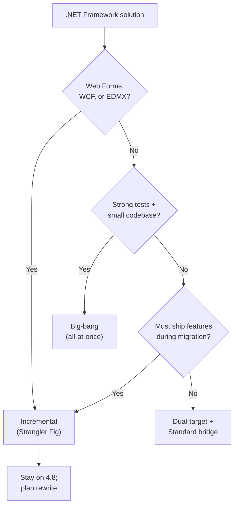
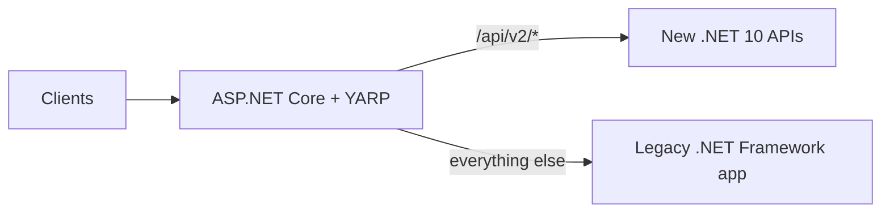

# 10. Migration from .NET Framework to Modern .NET

Most greenfield work targets unified **.NET** (`.NET 8`, `.NET 10`, and later LTS releases), but many organizations still operate on **.NET Framework 4.x** — Web Forms monoliths, WCF services, EF6 data layers, and WinForms/WPF desktops tied to Windows and IIS. This chapter explains **why** to migrate, **how** to choose a target, **which strategies** fit different application shapes, and **what tooling** accelerates the work without pretending migration is a single-button operation.

---

## Table of Contents

1. [Why Migrate](#1-why-migrate)
2. [Choosing a Target — .NET 8, .NET 10, and LTS Policy](#2-choosing-a-target--net-8-net-10-and-lts-policy)
3. [Assessment Before You Change Code](#3-assessment-before-you-change-code)
4. [Migration Strategies Overview](#4-migration-strategies-overview)
5. [Strategy A — Big-Bang (All-at-Once) Migration](#5-strategy-a--big-bang-all-at-once-migration)
6. [Strategy B — Incremental / Strangler Fig Migration](#6-strategy-b--incremental--strangler-fig-migration)
7. [Strategy C — Dual-Targeting and .NET Standard Bridge](#7-strategy-c--dual-targeting-and-net-standard-bridge)
8. [Framework-Specific Migration Paths](#8-framework-specific-migration-paths)
9. [Tooling and Automation](#9-tooling-and-automation)
10. [Common Breaking Changes and Replacements](#10-common-breaking-changes-and-replacements)
11. [Phased Migration Plan](#11-phased-migration-plan)
12. [Summary](#12-summary)

---

## 1. Why Migrate

.NET Framework remains supported with **security and reliability fixes**, but it receives **no new features**, no cross-platform runtime, and no alignment with modern cloud deployment models described in **01. .NET Platform & Evolution**.

| Driver | What Framework limits | What modern .NET enables |
|---|---|---|
| **Cloud & containers** | Windows-only runtime; poor fit for Linux containers | Cross-platform Kestrel, smaller images, side-by-side runtimes |
| **Performance** | Mature but frozen stack | Generational GC improvements, SIMD, Native AOT options |
| **Web architecture** | System.Web + IIS coupling | ASP.NET Core middleware, minimal APIs, gRPC, OpenAPI |
| **Security posture** | Legacy CAS, older crypto defaults | Modern TLS, data protection APIs, Identity integration |
| **Talent & ecosystem** | Shrinking new-library support | Active NuGet ecosystem, current documentation and tooling |
| **Cost** | Windows Server + IIS licensing for many workloads | Linux hosting, serverless, managed platforms |

Migration is a **business and engineering decision**, not a moral obligation. Some workloads — internal WinForms tools, stable Web Forms with no change roadmap — may legitimately stay on Framework 4.8 until end-of-life planning forces a move. The strategies below apply when the organization chooses to modernize.

---

## 2. Choosing a Target — .NET 8, .NET 10, and LTS Policy

Unified .NET releases on an **annual cadence**. **Even-numbered** releases are **Long-Term Support (LTS)** — typically three years of patches. **Odd-numbered** releases are **Standard Term Support (STS)** — shorter support windows for teams that want the newest features sooner.

| Release | Support type | Typical migration target |
|---|---|---|
| **.NET 8** | LTS (Nov 2023 – Nov 2026) | Safe choice mid-migration; widely deployed in production |
| **.NET 9** | STS | Feature-focused; upgrade stepping stone, not final destination for conservative teams |
| **.NET 10** | LTS (Nov 2025 – Nov 2028) | Current LTS for new migrations starting in 2026 |

**Practical guidance:**

- **New migrations today:** target the **current LTS** (`.NET 10` as of 2026) unless organizational policy standardizes on `.NET 8` until the next platform refresh.
- **Already on .NET 6/8:** plan **in-place version upgrades** (6 → 8 → 10) rather than treating each jump as a Framework-style rewrite.
- **Libraries shared during transition:** multi-target `net481;net10.0` or bridge with `netstandard2.0` when Framework consumers still exist (see chapter **01**, section 4).

Avoid targeting **.NET Core 2.x / 3.1** — both are out of support. Skip intermediate "Core" branding unless you inherit a codebase already on those versions.

---

## 3. Assessment Before You Change Code

Successful migrations start with **evidence**, not a deadline-driven TFM change. Inventory answers three questions: *Can we move?* *How much will break?* *Which strategy fits our risk tolerance?*

### 3.1 Compatibility Analysis

Run automated analysis against the full solution:

| Activity | Purpose |
|---|---|
| **Upgrade / modernization analysis** | Lists incompatible APIs, package gaps, and project-format issues |
| **Dependency graph review** | Identifies transitive packages with no modern equivalent |
| **Third-party vendor audit** | Confirms commercial controls, ORM providers, and PDF/reporting libraries support modern .NET |
| **Test coverage map** | Highlights modules with no automated tests — highest migration risk |

Build a **compatibility matrix** per project:

| Project | TFM today | Blockers | Effort (S/M/L) | Strategy hint |
|---|---|---|---|---|
| `MyApp.Web` | `net481` | System.Web, Web Forms | L | Incremental + rewrite UI |
| `MyApp.Domain` | `net481` | None — pure BCL | S | Dual-target first |
| `MyApp.WcfHost` | `net481` | WCF bindings | L | CoreWCF or gRPC redesign |

### 3.2 Architecture Smell Check

Patterns that inflate migration cost:

- **Business logic in ASPX code-behind or HTTP modules** — hard to test and port verbatim
- **Shared static state and `HttpContext.Current`** — blocks ASP.NET Core pipeline model
- **EDMX / Database-First EF6** with heavy `.tt` templates — often rewritten as EF Core Code First
- **WCF with `net.tcp` / MSMQ bindings** — no direct port; needs contract redesign
- **COM interop and P/Invoke** — may work on modern .NET on Windows but must be validated per call site

Extracting **domain logic into plain class libraries** is the highest-leverage preparatory step regardless of strategy.

---

## 4. Migration Strategies Overview

No single approach fits every solution. Choose based on **size**, **test coverage**, **framework coupling**, and **delivery pressure**.



| Strategy | Best for | Risk profile | Delivery impact |
|---|---|---|---|
| **Big-bang (all-at-once)** | Small apps, strong tests, low Framework coupling | High single release; lower ongoing complexity | Feature freeze during cutover |
| **Incremental (Strangler Fig)** | Large web apps, monoliths, continuous delivery | Lower per-step risk; higher temporary infra complexity | Features continue on both stacks |
| **Dual-target bridge** | Shared libraries, phased team migration | Low for libraries; requires discipline on API surface | Both runtimes compile until cutover |
| **Replatform / rewrite** | Web Forms, heavy WCF, untested legacy | Highest cost; cleanest architecture possible | Parallel product effort |

Modern tooling (GitHub Copilot **modernize-dotnet** agent) classifies upgrade order as **bottom-up** (libraries first), **top-down** (host first), or **all-at-once** — aligned with the strategies above.

---

## 5. Strategy A — Big-Bang (All-at-Once) Migration

**Big-bang** retargets every project in the solution to modern .NET in one effort, validates with tests, and deploys a replacement.

### When it works

- Solution under roughly **50k LOC** with manageable dependency count
- **Automated test coverage** on critical paths
- **No Web Forms**, minimal WCF, no EDMX-generated models
- Team can accept a **feature freeze** for one release cycle

### Steps

1. Convert projects to **SDK-style** format (`<Project Sdk="Microsoft.NET.Sdk">`).
2. Retarget TFM: `<TargetFramework>net10.0</TargetFramework>` (or current LTS).
3. Replace incompatible NuGet packages with modern equivalents.
4. Swap **System.Web** hosting for **ASP.NET Core** (new `Program.cs`, middleware pipeline).
5. Fix compile errors — API replacements, namespace changes, configuration migration (`web.config` → `appsettings.json` + options pattern).
6. Run full regression suite; performance and integration test in staging.
7. Cut over DNS / deployment slot; keep rollback artifact of Framework build.

### Risks

- Long-running branch diverges from production fixes
- Hidden runtime behavior differences (serialization, culture, threading)
- Undiscovered dependencies surface late in QA

Use big-bang only when assessment shows **few blockers** and leadership accepts a **single coordinated release**.

---

## 6. Strategy B — Incremental / Strangler Fig Migration

The **Strangler Fig** pattern gradually replaces a legacy system by routing ** slices of traffic** to a new implementation while the old application continues serving everything else. Microsoft documents this as the **recommended default** for ASP.NET Framework → ASP.NET Core moves.

### How it works

1. Deploy an **ASP.NET Core host** in front of the legacy IIS app.
2. Use **YARP (Yet Another Reverse Proxy)** to route matched paths to the new service; unmatched paths fall through to Framework.
3. Migrate **one endpoint, module, or bounded context** at a time.
4. Validate under production load; increase traffic percentage.
5. Decommission legacy routes until the Framework host can be retired.



### Supporting technologies

| Component | Role |
|---|---|
| **YARP** | Path-based routing, load balancing, transforms |
| **Microsoft.AspNetCore.SystemWebAdapters** | Bridges session, auth, and shared cookies during dual-stack operation |
| **Shared database or events** | Keeps data consistent while both stacks run |

### Side-by-side project layout

Tooling can scaffold a **new SDK-style project next to the legacy `.csproj`** without deleting the original. Teams migrate controllers, services, and views module-by-module. This is often called **side-by-side incremental** upgrade.

### Typical timeline (mid-size monolith)

| Phase | Duration | Outcome |
|---|---|---|
| **Foundation** | Weeks 1–8 | YARP deployed, observability live, first route migrated and validated |
| **Main loop** | Months 2–15 | One component per sprint; parallel-run validation between stacks |
| **Decommission** | Months 15–18 | Legacy on monitoring-only duty; YARP simplified or removed |

Incremental migration **costs more infrastructure temporarily** but preserves product delivery and reduces catastrophic cutover risk.

---

## 7. Strategy C — Dual-Targeting and .NET Standard Bridge

When both runtimes must coexist during transition, **extract shared logic** into libraries that compile for Framework **and** modern .NET.

### Multi-targeting

```xml
<Project Sdk="Microsoft.NET.Sdk">
  <PropertyGroup>
    <TargetFrameworks>net481;net10.0</TargetFrameworks>
  </PropertyGroup>
</Project>
```

Use conditional compilation only when unavoidable:

```csharp
#if NETFRAMEWORK
    // Framework-specific API
#else
    // Modern .NET API
#endif
```

Prefer **abstractions** (interfaces + DI) over `#if` forks when possible.

### .NET Standard 2.0 bridge

Libraries targeting **`netstandard2.0`** run on **.NET Framework 4.6.1+** and **modern .NET** without dual TFM entries — the pattern described in **01. .NET Platform & Evolution**, section 4. It is the practical sweet spot when Framework apps still consume the library.

**Limitation:** .NET Standard 2.0 excludes APIs added after the standard was frozen. Once Framework consumers are retired, retarget directly to `net10.0`.

### Bottom-up upgrade order

1. Migrate **leaf libraries** (no project references) to `netstandard2.0` or `net481;net10.0`.
2. Migrate **middle tiers** (services, repositories).
3. Migrate **host** (web app, API, desktop shell) last.

This order keeps the solution compiling on Framework while modern hosts gradually reference updated libraries.

---

## 8. Framework-Specific Migration Paths

### ASP.NET Web Forms

| Aspect | Guidance |
|---|---|
| **Portability** | **No supported path** to ASP.NET Core — Web Forms depend on System.Web page lifecycle |
| **Options** | Rewrite UI as **Blazor**, **Razor Pages**, **React/Angular + Web API**, or **MAUI** for internal tools |
| **Strategy** | Incremental Strangler — replace pages route-by-route; never attempt mechanical conversion |

### ASP.NET MVC / Web API (Framework)

| Legacy | Modern replacement |
|---|---|
| `Global.asax` | `Program.cs` + `WebApplication.CreateBuilder` |
| `Web.config` | `appsettings.json`, environment variables, secrets |
| `HttpModules` / `HttpHandlers` | Middleware |
| `System.Web.Mvc` | `Microsoft.AspNetCore.Mvc` |
| `ApiController` (Framework) | ASP.NET Core Web API with attribute routing |

Controller actions often port with **targeted refactoring**; filters and model binders need API mapping review.

### WCF

| Scenario | Path |
|---|---|
| **HTTP/SOAP services** | **[CoreWCF](https://github.com/CoreWCF/CoreWCF)** — community port for existing contracts on modern .NET |
| **NetTcp / MSMQ / custom bindings** | Redesign as **gRPC**, REST, or **Azure Service Bus** messaging |
| **Greenfield** | Avoid WCF; use ASP.NET Core Web API or gRPC |

### Entity Framework 6

| Approach | Notes |
|---|---|
| **EF Core migration** | Preferred — new DbContext, often Code First; data model review required |
| **EF6 on .NET Core** | EF6 6.4+ runs on modern .NET for transitional scenarios — not the long-term target |
| **EDMX / Database First** | Regenerate as EF Core entities or rewrite queries with explicit mappings |

### WinForms and WPF

Both run on **modern .NET for Windows only**. Migration is usually **TFM retarget** (`net10.0-windows`) plus package updates — not a full rewrite. Validate third-party UI controls, ClickOnce deployment, and COM dependencies.

### Windows Services

Replace with **Worker Service** (`Microsoft.NET.Sdk.Worker`) using the generic host — same DI, configuration, and logging model as ASP.NET Core.

---

## 9. Tooling and Automation

Tools **accelerate** migration; they do **not** eliminate architectural work.

### GitHub Copilot app modernization agent (recommended)

Microsoft's current guidance centers on the **`modernize-dotnet`** Copilot agent (Visual Studio, VS Code, GitHub Copilot CLI). It performs:

- Assessment → **`upgrade-options.md`**
- Planning → **`plan.md`**
- SDK-style conversion, TFM retargeting, package updates, and guided code fixes

Example prompt: *"Upgrade my solution to .NET 10"* or *"@modernize-dotnet upgrade this solution to .NET 10"*.

Strategies offered: **bottom-up**, **top-down**, **all-at-once** — matching section 4 of this chapter.

### .NET Upgrade Assistant (legacy)

The standalone **Upgrade Assistant** CLI is **deprecated** but may remain available in Visual Studio modernization settings for teams that rely on it. It still supports:

- In-place or side-by-side project upgrade
- Side-by-side incremental scaffolding for ASP.NET
- Analysis reports before upgrade

Treat it as a **scaffold and report generator**, not a complete migration.

### Other utilities

| Tool | Purpose |
|---|---|
| **`try-convert`** | Converts non-SDK `.csproj` to SDK-style (Windows-only for some scenarios) |
| **Platform compatibility analyzers** | CA1416 and related diagnostics for Windows-only APIs |
| **`dotnet list package --outdated`** | Finds packages needing major-version bumps |
| **ApiPort / compatibility tools** | Historical API usage reports — still useful for manual matrices |

Always commit analysis output and upgrade branches; review diffs like any large refactor.

---

## 10. Common Breaking Changes and Replacements

| .NET Framework pattern | Modern .NET replacement |
|---|---|
| `System.Web` / `HttpContext.Current` | `Microsoft.AspNetCore.Http.HttpContext` via DI |
| `ConfigurationManager` / `<appSettings>` | `IConfiguration`, options pattern |
| `Global.asax` application events | Middleware + `IHostedService` |
| `BinaryFormatter` | **Removed** — use JSON, protobuf, or explicit serializers |
| `AppDomain` (plugin isolation) | `AssemblyLoadContext` — see **09. Application Domains & Isolation** |
| GAC-installed assemblies | NuGet package references, private deployment |
| `System.Data.SqlClient` | `Microsoft.Data.SqlClient` |
| `HttpWebRequest` | `HttpClient` via `IHttpClientFactory` |
| WIF / old JWT handlers | `Microsoft.AspNetCore.Authentication.JwtBearer` |
| `Assembly.LoadFrom` probing | Explicit load contexts; no Fusion GAC probe — see **07. Assemblies, Loading, Strong Naming, and GAC** |

Configuration migration deserves explicit planning: connection strings, custom sections, and encryption providers in `web.config` map to layered **`appsettings.{Environment}.json`**, environment variables, Azure Key Vault, or user secrets — never commit production secrets to source control.

---

## 11. Phased Migration Plan

A practical sequence applicable to most enterprise solutions:

### Phase 1 — Discover (1–3 weeks)

- Run modernization / compatibility analysis on the full solution
- Build compatibility matrix and blocker list
- Agree on target TFM (LTS) and strategy (big-bang vs incremental)
- Identify pilot module with clear boundaries

### Phase 2 — Prepare (2–6 weeks)

- Add or improve automated tests on critical paths
- Extract domain logic to portable class libraries
- Introduce CI build for modern TFM (even if not deployable yet)
- Stand up observability (Application Insights, structured logging)

### Phase 3 — Migrate (variable)

- **Incremental:** YARP + first route; repeat per module
- **Big-bang:** retarget, fix, test, staged deployment
- Update internal documentation and runbooks

### Phase 4 — Validate

- Load, integration, and security testing on modern host
- Parallel-run comparison (responses, performance, error rates)
- Rollback procedure documented and rehearsed

### Phase 5 — Cutover and Retire

- Shift traffic or swap deployment
- Monitor; keep Framework environment read-only for rollback window
- Remove dual-stack routing; decommission legacy infrastructure

---

## 12. Summary

| Topic | Key point |
|---|---|
| **Why migrate** | Framework is maintenance-only; modern .NET enables cloud, performance, and active ecosystem |
| **Target** | Prefer current **LTS** (.NET 10 as of 2026); plan stepping stones from older modern versions |
| **Assessment** | Compatibility matrix, tests, and vendor support decide strategy — not calendar pressure alone |
| **Big-bang** | Small, well-tested, low-coupling solutions — single cutover |
| **Strangler Fig** | Default for large ASP.NET apps — YARP routes slices to ASP.NET Core while Framework serves the rest |
| **Dual-target / Standard** | Move shared logic first; hosts last |
| **Framework stacks** | Web Forms → rewrite; MVC/Web API → ASP.NET Core; WCF → CoreWCF or redesign; EF6 → EF Core |
| **Tooling** | Copilot modernization agent + analyzers; legacy Upgrade Assistant for scaffolding only |

Migration is **modernization of architecture**, not just a TFM string change. The modular, package-based model from **01. .NET Platform & Evolution** section 7 exists precisely so teams can extract portable logic, stand up new hosts, and retire System.Web-era coupling incrementally — preserving delivery while the platform evolves.

---

**Previous →** [09. Application Domains and Isolation](./09.%20Application%20Domains%20%26%20Isolation.md)

**Next →** End of **01. .NET Framework Architecture** module — proceed to **[02. C# Language Fundamentals](../02.%20C%23%20Language%20Fundamentals/)**
